# CONFERÊNCIA TELA A TELA — Jesus' Corner (82 telas)

Este documento existe para **conferir** o app contra o design, tela por tela. Para cada tela: a imagem de referência, o status, **todos os textos que aparecem na tela** (na ordem em que aparecem), as cores usadas e um checklist. Se um texto da lista não está no app, a tela está incompleta. Se o app mostra um texto que não está na lista, a tela está errada.

Regra de leitura: os textos abaixo foram extraídos do arquivo de design, então são exatos. Nomes e números de exemplo (Diego, Marina, Gênesis 41, 50 capítulos, 18 semanas) são dados; o resto — rótulos, botões, títulos, avisos — é copy final e deve aparecer **letra por letra**.

Cores permitidas em qualquer tela do app: fundo `#EDE8E2` · tinta `#1A1714` · laranja `#F0662B` · areia `#E6DACB` · branco `#fff` · cinza claro de superfície `#F2EEE9` · texto secundário `#6E655C` / `#8B8279` / `#A29A91` (rótulos maiúsculos) · placeholder e chevron `#BDB5AC` · marrom da areia `#7A4A1E` / `#5A4327` / `#3A2A18` / `#9C8B76` / `#7A6A55` · laranja claro de avatar `#FFE3C9` · neutros de divisória, trilho e stepper `#DDD5CC` / `#D6CFC7` / `#DDD6CE` / `#E4DED7` / `#E6E1DA` / `#CFC6BC` / `#B0A79E` · superfície do campo `#FBF9F7` · azul de seleção de trecho `#C9DCEF` / `#7EA6CE` / `#3A4A5C` (só sobre o texto bíblico). Qualquer outra cor é erro — exceto no painel admin (23a–d) e nas telas de marca (16a–c).

Fonte: **Manrope** em todo o app. Pesos 500 (texto), 600/700 (rótulos), 800 (títulos e números).

---

## Leitura livre e grade (rodada 32)

### 32c · Grade de capítulos — toque abre, não marca

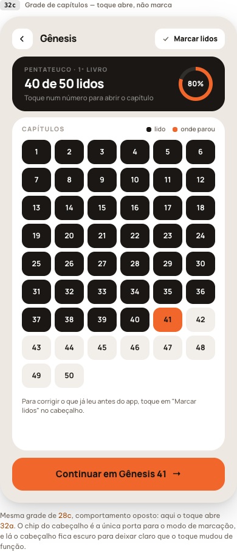

**Status:** CANÔNICA — implementar exatamente assim  
**Imagem:** `screens/32c.png` · **No arquivo de design:** `Jesus Corner Redesign.dc.html#32c`

**Textos da tela, na ordem (61):**

- Gênesis
- Marcar lidos
- Pentateuco · 1º livro
- 40 de 50 lidos
- Toque num número para abrir o capítulo
- 80%
- Capítulos
- lido
- onde parou
- 1
- 2
- 3
- 4
- 5
- 6
- 7
- 8
- 9
- 10
- 11
- 12
- 13
- 14
- 15
- 16
- 17
- 18
- 19
- 20
- 21
- 22
- 23
- 24
- 25
- 26
- 27
- 28
- 29
- 30
- 31
- 32
- 33
- 34
- 35
- 36
- 37
- 38
- 39
- 40
- 41
- 42
- 43
- 44
- 45
- 46
- 47
- 48
- 49
- 50
- Para corrigir o que já leu antes do app, toque em "Marcar lidos" no cabeçalho.
- Continuar em Gênesis 41

**Cores usadas:** #EDE8E2, #FFF, #1A1714, #6E655C, #F0662B, #A29A91, #F2EEE9

**Nota de design:** Mesma grade de 28c , comportamento oposto: aqui o toque abre 32a . O chip do cabeçalho é a única porta para o modo de marcação, e lá o cabeçalho fica escuro para deixar claro que o toque mudou de função.

   

   Varredura de identidade que fiz junto: as telas de leitura que ainda estavam no sistema antigo eram  4a  (leitura livre) e o seletor de versão.  32a  resolve a primeira; o seletor eu refaço no mesmo padrão de folha assim que você aprovar estas três. Todo o resto do app — Início, Plano, Bíblia, Comunidade, Perfil, Oração, Reflexão, Estudos, Métricas e Resumo — já está na identidade Bento.

**Checklist:**
- [ ] Todos os textos acima aparecem, letra por letra (exceto dados de exemplo)
- [ ] Ordem dos blocos igual à imagem
- [ ] Só as cores listadas; Manrope em tudo
- [ ] Nenhum texto cortado; rolagem termina acima da barra de abas
- [ ] Toque mínimo 44px; um só elemento laranja de ação
- [ ] Estado vazio e esqueleto de carregamento existem

---

### 32a · Leitura livre — começo do capítulo

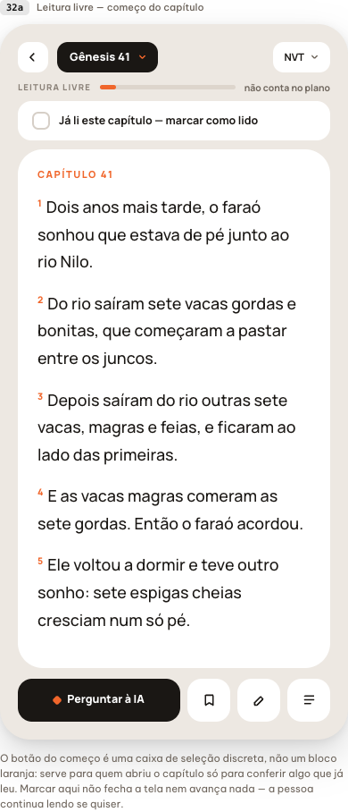

**Status:** CANÔNICA — implementar exatamente assim  
**Imagem:** `screens/32a.png` · **No arquivo de design:** `Jesus Corner Redesign.dc.html#32a`

**Textos da tela, na ordem (17):**

- Gênesis 41
- NVT
- Leitura livre
- não conta no plano
- Já li este capítulo — marcar como lido
- Capítulo 41
- 1
- Dois anos mais tarde, o faraó sonhou que estava de pé junto ao rio Nilo.
- 2
- Do rio saíram sete vacas gordas e bonitas, que começaram a pastar entre os juncos.
- 3
- Depois saíram do rio outras sete vacas, magras e feias, e ficaram ao lado das primeiras.
- 4
- E as vacas magras comeram as sete gordas. Então o faraó acordou.
- 5
- Ele voltou a dormir e teve outro sonho: sete espigas cheias cresciam num só pé.
- Perguntar à IA

**Cores usadas:** #EDE8E2, #FFF, #1A1714, #F0662B, #6E655C, #8B8279, #DDD5CC, #D6CFC7  

**Nota de design:** O botão do começo é uma caixa de seleção discreta, não um bloco laranja: serve para quem abriu o capítulo só para conferir algo que já leu. Marcar aqui não fecha a tela nem avança nada — a pessoa continua lendo se quiser.

**Checklist:**
- [ ] Todos os textos acima aparecem, letra por letra (exceto dados de exemplo)
- [ ] Ordem dos blocos igual à imagem
- [ ] Só as cores listadas; Manrope em tudo
- [ ] Nenhum texto cortado; rolagem termina acima da barra de abas
- [ ] Toque mínimo 44px; um só elemento laranja de ação
- [ ] Estado vazio e esqueleto de carregamento existem

---

### 32b · Fim do capítulo — a pergunta que importa

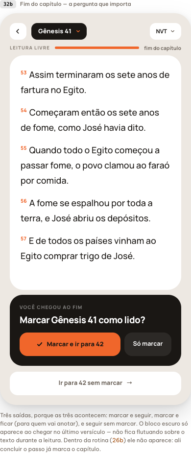

**Status:** CANÔNICA — implementar exatamente assim  
**Imagem:** `screens/32b.png` · **No arquivo de design:** `Jesus Corner Redesign.dc.html#32b`

**Textos da tela, na ordem (19):**

- Gênesis 41
- NVT
- Leitura livre
- fim do capítulo
- 53
- Assim terminaram os sete anos de fartura no Egito.
- 54
- Começaram então os sete anos de fome, como José havia dito.
- 55
- Quando todo o Egito começou a passar fome, o povo clamou ao faraó por comida.
- 56
- A fome se espalhou por toda a terra, e José abriu os depósitos.
- 57
- E de todos os países vinham ao Egito comprar trigo de José.
- Você chegou ao fim
- Marcar Gênesis 41 como lido?
- Marcar e ir para 42
- Só marcar
- Ir para 42 sem marcar

**Cores usadas:** #EDE8E2, #FFF, #1A1714, #F0662B, #6E655C, #8B8279, #DDD5CC  

**Nota de design:** Três saídas, porque as três acontecem: marcar e seguir, marcar e ficar (para quem vai anotar), e seguir sem marcar. O bloco escuro só aparece ao chegar no último versículo — não fica flutuando sobre o texto durante a leitura. Dentro da rotina ( 26b ) ele não aparece: ali concluir o passo já marca o capítulo.

**Checklist:**
- [ ] Todos os textos acima aparecem, letra por letra (exceto dados de exemplo)
- [ ] Ordem dos blocos igual à imagem
- [ ] Só as cores listadas; Manrope em tudo
- [ ] Nenhum texto cortado; rolagem termina acima da barra de abas
- [ ] Toque mínimo 44px; um só elemento laranja de ação
- [ ] Estado vazio e esqueleto de carregamento existem

---

## Resumo semanal (rodada 31)

### 31a · Os números da semana

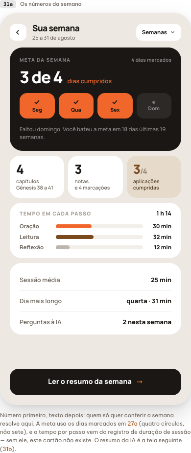

**Status:** CANÔNICA — implementar exatamente assim  
**Imagem:** `screens/31a.png` · **No arquivo de design:** `Jesus Corner Redesign.dc.html#31a`

**Textos da tela, na ordem (37):**

- Sua semana
- 25 a 31 de agosto
- Semanas
- Meta da semana
- 4 dias marcados
- 3 de 4
- dias cumpridos
- Seg
- Qua
- Sex
- Dom
- Faltou domingo. Você bateu a meta em 18 das últimas 19 semanas.
- 4
- capítulos
- Gênesis 38 a 41
- 3
- notas
- e 4 marcações
- 3
- /4
- aplicações
- cumpridas
- Tempo em cada passo
- 1 h 14
- Oração
- 30 min
- Leitura
- 32 min
- Reflexão
- 12 min
- Sessão média
- 25 min
- Dia mais longo
- quarta · 31 min
- Perguntas à IA
- 2 nesta semana
- Ler o resumo da semana

**Cores usadas:** #EDE8E2, #FFF, #1A1714, #6E655C, #F0662B, #E6DACB, #7A4A1E, #9C8B76, #5A4327, #A29A91, #F2EEE9, #BDB5AC

**Nota de design:** Número primeiro, texto depois: quem só quer conferir a semana resolve aqui. A meta usa os dias marcados em 27a (quatro círculos, não sete), e o tempo por passo vem do registro de duração de sessão — sem ele, este cartão não existe. O resumo da IA é a tela seguinte ( 31b ).

**Checklist:**
- [ ] Todos os textos acima aparecem, letra por letra (exceto dados de exemplo)
- [ ] Ordem dos blocos igual à imagem
- [ ] Só as cores listadas; Manrope em tudo
- [ ] Nenhum texto cortado; rolagem termina acima da barra de abas
- [ ] Toque mínimo 44px; um só elemento laranja de ação
- [ ] Estado vazio e esqueleto de carregamento existem

---

### 31b · O resumo escrito pela IA

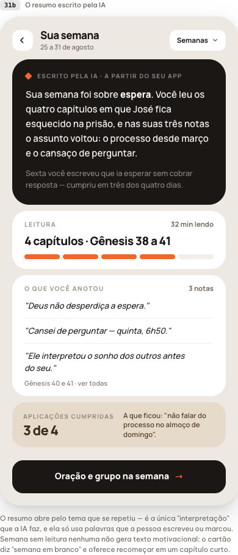

**Status:** CANÔNICA — implementar exatamente assim  
**Imagem:** `screens/31b.png` · **No arquivo de design:** `Jesus Corner Redesign.dc.html#31b`

**Textos da tela, na ordem (21):**

- Sua semana
- 25 a 31 de agosto
- Semanas
- Escrito pela IA · a partir do seu app
- Sua semana foi sobre
- espera
- . Você leu os quatro capítulos em que José fica esquecido na prisão, e nas suas três notas o assunto voltou: o processo desde março e o cansaço de perguntar.
- Sexta você escreveu que ia esperar sem cobrar resposta — cumpriu em três dos quatro dias.
- Leitura
- 32 min lendo
- 4 capítulos · Gênesis 38 a 41
- O que você anotou
- 3 notas
- "Deus não desperdiça a espera."
- "Cansei de perguntar — quinta, 6h50."
- "Ele interpretou o sonho dos outros antes do seu."
- Gênesis 40 e 41 · ver todas
- Aplicações cumpridas
- 3 de 4
- A que ficou: "não falar do processo no almoço de domingo".
- Oração e grupo na semana

**Cores usadas:** #EDE8E2, #FFF, #1A1714, #6E655C, #F0662B, #A29A91, #F2EEE9, #8B8279, #E6DACB, #9C8B76, #3A2A18, #5A4327

**Nota de design:** O resumo abre pelo tema que se repetiu — é a única "interpretação" que a IA faz, e ela só usa palavras que a pessoa escreveu ou marcou. Semana sem leitura nenhuma não gera texto motivacional: o cartão diz "semana em branco" e oferece recomeçar em um capítulo curto.

**Checklist:**
- [ ] Todos os textos acima aparecem, letra por letra (exceto dados de exemplo)
- [ ] Ordem dos blocos igual à imagem
- [ ] Só as cores listadas; Manrope em tudo
- [ ] Nenhum texto cortado; rolagem termina acima da barra de abas
- [ ] Toque mínimo 44px; um só elemento laranja de ação
- [ ] Estado vazio e esqueleto de carregamento existem

---

### 31c · A semana em oração e no grupo

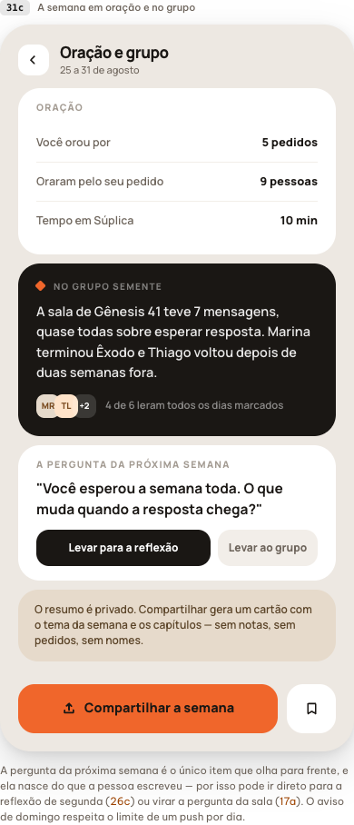

**Status:** CANÔNICA — implementar exatamente assim  
**Imagem:** `screens/31c.png` · **No arquivo de design:** `Jesus Corner Redesign.dc.html#31c`

**Textos da tela, na ordem (21):**

- Oração e grupo
- 25 a 31 de agosto
- Oração
- Você orou por
- 5 pedidos
- Oraram pelo seu pedido
- 9 pessoas
- Tempo em Súplica
- 10 min
- No Grupo Semente
- A sala de Gênesis 41 teve 7 mensagens, quase todas sobre esperar resposta. Marina terminou Êxodo e Thiago voltou depois de duas semanas fora.
- MR
- TL
- +2
- 4 de 6 leram todos os dias marcados
- A pergunta da próxima semana
- "Você esperou a semana toda. O que muda quando a resposta chega?"
- Levar para a reflexão
- Levar ao grupo
- O resumo é privado. Compartilhar gera um cartão com o tema da semana e os capítulos — sem notas, sem pedidos, sem nomes.
- Compartilhar a semana

**Cores usadas:** #EDE8E2, #FFF, #1A1714, #6E655C, #A29A91, #F2EEE9, #F0662B, #E6DACB, #7A4A1E, #FFE3C9, #5A4327

**Nota de design:** A pergunta da próxima semana é o único item que olha para frente, e ela nasce do que a pessoa escreveu — por isso pode ir direto para a reflexão de segunda ( 26c ) ou virar a pergunta da sala ( 17a ). O aviso de domingo respeita o limite de um push por dia.

   

   Entradas: um cartão no Início na segunda ("sua semana está pronta"), a linha "Resumo semanal" nas métricas ( 30b ) e o push de domingo às 20h. A retrospectiva mensal ( 17b ) continua existindo e passa a ser a soma de quatro resumos — mesmo texto, escala maior. Custo de IA: um resumo por pessoa por semana, o que cabe no orçamento que aparece no painel ( 23a ).

**Checklist:**
- [ ] Todos os textos acima aparecem, letra por letra (exceto dados de exemplo)
- [ ] Ordem dos blocos igual à imagem
- [ ] Só as cores listadas; Manrope em tudo
- [ ] Nenhum texto cortado; rolagem termina acima da barra de abas
- [ ] Toque mínimo 44px; um só elemento laranja de ação
- [ ] Estado vazio e esqueleto de carregamento existem

---

## Início e métricas (rodadas 29–30)

### 29a · Início — versículo, último texto, aplicação

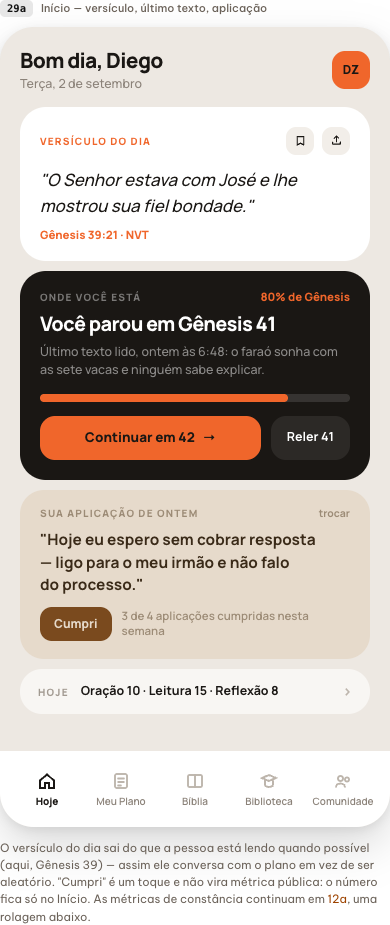

**Status:** CANÔNICA — implementar exatamente assim  
**Imagem:** `screens/29a.png` · **No arquivo de design:** `Jesus Corner Redesign.dc.html#29a`

**Textos da tela, na ordem (24):**

- Bom dia, Diego
- Terça, 2 de setembro
- DZ
- Versículo do dia
- "O Senhor estava com José e lhe mostrou sua fiel bondade."
- Gênesis 39:21 · NVT
- Onde você está
- 80% de Gênesis
- Você parou em Gênesis 41
- Último texto lido, ontem às 6:48: o faraó sonha com as sete vacas e ninguém sabe explicar.
- Continuar em 42
- Reler 41
- Sua aplicação de ontem
- trocar
- "Hoje eu espero sem cobrar resposta — ligo para o meu irmão e não falo do processo."
- Cumpri
- 3 de 4 aplicações cumpridas nesta semana
- Hoje
- Oração 10 · Leitura 15 · Reflexão 8
- Hoje
- Meu Plano
- Bíblia
- Biblioteca
- Comunidade

**Cores usadas:** #EDE8E2, #1A1714, #8B8279, #F0662B, #FFF, #F2EEE9, #E6DACB, #9C8B76, #3A2A18, #7A4A1E, #A29A91, #BDB5AC

**Nota de design:** O versículo do dia sai do que a pessoa está lendo quando possível (aqui, Gênesis 39) — assim ele conversa com o plano em vez de ser aleatório. "Cumpri" é um toque e não vira métrica pública: o número fica só no Início. As métricas de constância continuam em 12a , uma rolagem abaixo.

**Checklist:**
- [ ] Todos os textos acima aparecem, letra por letra (exceto dados de exemplo)
- [ ] Ordem dos blocos igual à imagem
- [ ] Só as cores listadas; Manrope em tudo
- [ ] Nenhum texto cortado; rolagem termina acima da barra de abas
- [ ] Toque mínimo 44px; um só elemento laranja de ação
- [ ] Estado vazio e esqueleto de carregamento existem

---

### 30a · Início, rolando — constância depois de hoje

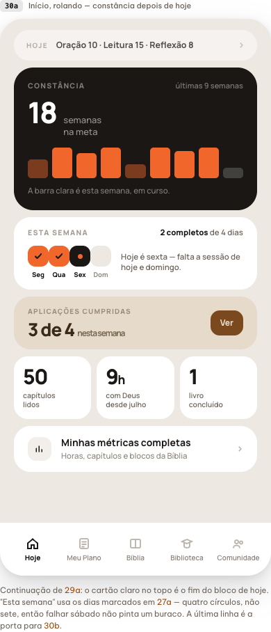

**Status:** CANÔNICA — implementar exatamente assim  
**Imagem:** `screens/30a.png` · **No arquivo de design:** `Jesus Corner Redesign.dc.html#30a`

**Textos da tela, na ordem (37):**

- Hoje
- Oração 10 · Leitura 15 · Reflexão 8
- Constância
- últimas 9 semanas
- 18
- semanas
- na meta
- A barra clara é esta semana, em curso.
- Esta semana
- 2 completos
- de 4 dias
- Seg
- Qua
- Sex
- Dom
- Hoje é sexta — falta a sessão de hoje e domingo.
- Aplicações cumpridas
- 3 de 4
- nesta semana
- Ver
- 50
- capítulos
- lidos
- 9
- h
- com Deus
- desde julho
- 1
- livro
- concluído
- Minhas métricas completas
- Horas, capítulos e blocos da Bíblia
- Hoje
- Meu Plano
- Bíblia
- Biblioteca
- Comunidade

**Cores usadas:** #EDE8E2, #A29A91, #1A1714, #BDB5AC, #FFF, #F0662B, #6E655C, #8B8279, #E6DACB, #9C8B76, #3A2A18, #7A6A55, #7A4A1E, #F2EEE9  

**Nota de design:** Continuação de 29a : o cartão claro no topo é o fim do bloco de hoje. "Esta semana" usa os dias marcados em 27a — quatro círculos, não sete, então falhar sábado não pinta um buraco. A última linha é a porta para 30b .

**Checklist:**
- [ ] Todos os textos acima aparecem, letra por letra (exceto dados de exemplo)
- [ ] Ordem dos blocos igual à imagem
- [ ] Só as cores listadas; Manrope em tudo
- [ ] Nenhum texto cortado; rolagem termina acima da barra de abas
- [ ] Toque mínimo 44px; um só elemento laranja de ação
- [ ] Estado vazio e esqueleto de carregamento existem

---

### 30b · Métricas — tempo e capítulos

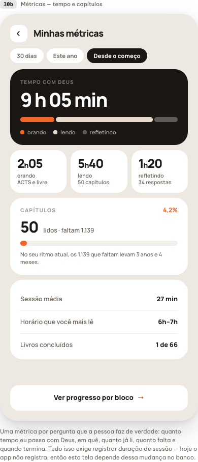

**Status:** CANÔNICA — implementar exatamente assim  
**Imagem:** `screens/30b.png` · **No arquivo de design:** `Jesus Corner Redesign.dc.html#30b`

**Textos da tela, na ordem (36):**

- Minhas métricas
- 30 dias
- Este ano
- Desde o começo
- Tempo com Deus
- 9 h 05 min
- orando
- lendo
- refletindo
- 2
- h
- 05
- orando
- ACTS e livre
- 5
- h
- 40
- lendo
- 50 capítulos
- 1
- h
- 20
- refletindo
- 34 respostas
- Capítulos
- 4,2%
- 50
- lidos · faltam 1.139
- No seu ritmo atual, os 1.139 que faltam levam 3 anos e 4 meses.
- Sessão média
- 27 min
- Horário que você mais lê
- 6h–7h
- Livros concluídos
- 1 de 66
- Ver progresso por bloco

**Cores usadas:** #EDE8E2, #FFF, #1A1714, #6E655C, #F0662B, #E6DACB, #A29A91, #F2EEE9

**Nota de design:** Uma métrica por pergunta que a pessoa faz de verdade: quanto tempo eu passo com Deus, em quê, quanto já li, quanto falta e quando termina. Tudo isso exige registrar duração de sessão — hoje o app não registra, então esta tela depende dessa mudança no banco.

**Checklist:**
- [ ] Todos os textos acima aparecem, letra por letra (exceto dados de exemplo)
- [ ] Ordem dos blocos igual à imagem
- [ ] Só as cores listadas; Manrope em tudo
- [ ] Nenhum texto cortado; rolagem termina acima da barra de abas
- [ ] Toque mínimo 44px; um só elemento laranja de ação
- [ ] Estado vazio e esqueleto de carregamento existem

---

### 30c · Métricas — quanto de cada bloco

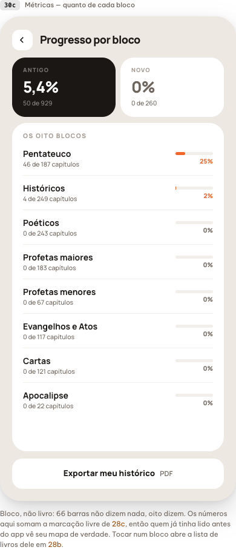

**Status:** CANÔNICA — implementar exatamente assim  
**Imagem:** `screens/30c.png` · **No arquivo de design:** `Jesus Corner Redesign.dc.html#30c`

**Textos da tela, na ordem (34):**

- Progresso por bloco
- Antigo
- 5,4%
- 50 de 929
- Novo
- 0%
- 0 de 260
- Os oito blocos
- Pentateuco
- 46 de 187 capítulos
- 25%
- Históricos
- 4 de 249 capítulos
- 2%
- Poéticos
- 0 de 243 capítulos
- 0%
- Profetas maiores
- 0 de 183 capítulos
- 0%
- Profetas menores
- 0 de 67 capítulos
- 0%
- Evangelhos e Atos
- 0 de 117 capítulos
- 0%
- Cartas
- 0 de 121 capítulos
- 0%
- Apocalipse
- 0 de 22 capítulos
- 0%
- Exportar meu histórico
- PDF

**Cores usadas:** #EDE8E2, #FFF, #1A1714, #A29A91, #6E655C, #F2EEE9, #F0662B

**Nota de design:** Bloco, não livro: 66 barras não dizem nada, oito dizem. Os números aqui somam a marcação livre de 28c , então quem já tinha lido antes do app vê seu mapa de verdade. Tocar num bloco abre a lista de livros dele em 28b .

   

   No Perfil ( 19a ) entra a linha "Minhas métricas" acima de conta e preferências, apontando para  30b . Se você quiser, faço também a versão por ano (mapa de 12 meses com dias cumpridos) — é a única métrica que ainda falta e vale como imagem de retrospectiva.

**Checklist:**
- [ ] Todos os textos acima aparecem, letra por letra (exceto dados de exemplo)
- [ ] Ordem dos blocos igual à imagem
- [ ] Só as cores listadas; Manrope em tudo
- [ ] Nenhum texto cortado; rolagem termina acima da barra de abas
- [ ] Toque mínimo 44px; um só elemento laranja de ação
- [ ] Estado vazio e esqueleto de carregamento existem

---

### 3c · Bento — blocos generosos, números grandes

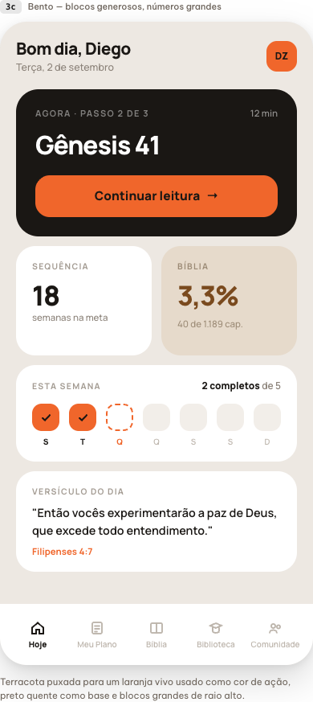

**Status:** REFERÊNCIA — Início nos primeiros 7 dias / painel zerado  
**Imagem:** `screens/3c.png` · **No arquivo de design:** `Jesus Corner Redesign.dc.html#3c`

**Textos da tela, na ordem (29):**

- Bom dia, Diego
- Terça, 2 de setembro
- DZ
- Agora · passo 2 de 3
- 12 min
- Gênesis 41
- Continuar leitura
- Sequência
- 18
- semanas na meta
- Bíblia
- 3,3%
- 40 de 1.189 cap.
- Esta semana
- 2 completos
- de 5
- S
- T
- Q
- S
- D
- Versículo do dia
- "Então vocês experimentarão a paz de Deus, que excede todo entendimento."
- Filipenses 4:7
- Hoje
- Meu Plano
- Bíblia
- Biblioteca
- Comunidade

**Cores usadas:** #EDE8E2, #1A1714, #8B8279, #F0662B, #FFF, #A29A91, #E6DACB, #9C8B76, #7A4A1E, #F2EEE9, #BDB5AC

**Nota de design:** Terracota puxada para um laranja vivo usado como cor de ação, preto quente como base e blocos grandes de raio alto.

**Checklist:**
- [ ] Todos os textos acima aparecem, letra por letra (exceto dados de exemplo)
- [ ] Ordem dos blocos igual à imagem
- [ ] Só as cores listadas; Manrope em tudo
- [ ] Nenhum texto cortado; rolagem termina acima da barra de abas
- [ ] Toque mínimo 44px; um só elemento laranja de ação
- [ ] Estado vazio e esqueleto de carregamento existem

---

### 12a · Painel primeiro, ação fixa no rodapé

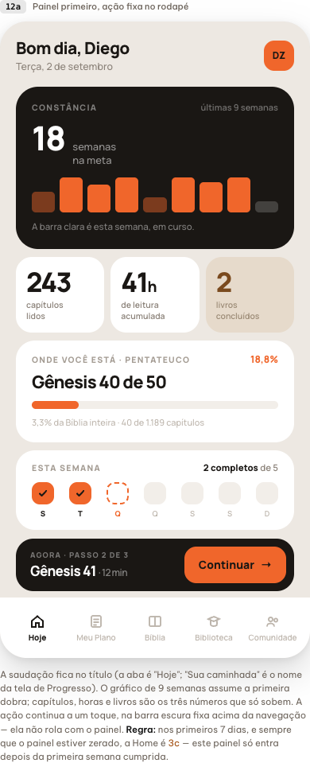

**Status:** SUPERSEDIDA — implemente 29a + 30a  
**Imagem:** `screens/12a.png` · **No arquivo de design:** `Jesus Corner Redesign.dc.html#12a`

**Nota de design:** A saudação fica no título (a aba é "Hoje"; "Sua caminhada" é o nome da tela de Progresso). O gráfico de 9 semanas assume a primeira dobra; capítulos, horas e livros são os três números que só sobem. A ação continua a um toque, na barra escura fixa acima da navegação — ela não rola com o painel. Regra: nos primeiros 7 dias, e sempre que o painel estiver zerado, a Home é 3c — este painel só entra depois da primeira semana cumprida.

   

   Duas coisas que preciso de você: (1) "41h de leitura acumulada" exige registrar tempo de sessão, que hoje o app não guarda — se não quiser esse trabalho agora, troco por "média de 4 capítulos por semana"; (2) esta versão empurra o versículo do dia para fora da Home. Ele volta como bloco entre "Onde você está" e "Esta semana" se você preferir, mas aí a barra de ação passa a rolar junto.

_Não implementar como está — ver status acima._

---

### 5b · Caminhada — as métricas completas

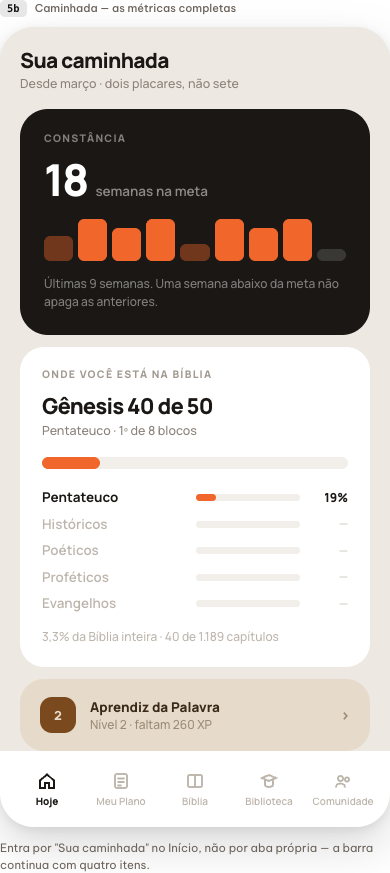

**Status:** SUPERSEDIDA — implemente 30b + 30c  
**Imagem:** `screens/5b.png` · **No arquivo de design:** `Jesus Corner Redesign.dc.html#5b`

**Nota de design:** Entra por "Sua caminhada" no Início, não por aba própria — a barra continua com quatro itens.

_Não implementar como está — ver status acima._

---

## Reflexão — aplicação (rodada 29)

### 29b · Reflexão — a frase de aplicação

**Status:** CANÔNICA — implementar exatamente assim  
**Imagem:** `screens/29b.png` · **No arquivo de design:** `Jesus Corner Redesign.dc.html#29b`

**Textos da tela, na ordem (16):**

- Reflexão
- 3 de 3
- 2 min
- Último passo · a aplicação
- Aplicação · Gênesis 41
- Em uma frase: o que você vai fazer hoje com isso?
- Uma ação de hoje, não uma intenção geral. Aparece amanhã no seu Início.
- Hoje eu espero sem cobrar resposta — ligo para o meu irmão e não falo do processo.
- |
- Me ajuda a escrever
- Mais curta
- Falar
- Me lembrar às 18h
- Um aviso, no fim do dia, com esta frase
- A frase é sua e privada — só entra no grupo se você compartilhar de propósito.
- Salvar e concluir o dia

**Cores usadas:** #EDE8E2, #FFF, #1A1714, #F0662B, #7A4A1E, #8B8279, #F2EEE9, #E6DACB, #5A4327

**Nota de design:** Vem depois das três perguntas de 26c : as barras viram quatro, e a última é sempre a aplicação. "Me ajuda a escrever" transforma o que a pessoa respondeu nas perguntas anteriores em uma frase de ação — proposta, nunca salva sozinha. O lembrete das 18h usa o mesmo limite de um push por dia.

   

   Encaixes:  12a  mantém constância e métricas, mas seu topo passa a ser  29a ; o fechamento do dia ( 21c ) mostra a frase salva como último item; e a retrospectiva mensal ( 17b ) ganha a linha "aplicações cumpridas", que é o número mais honesto de mudança de vida que o app consegue medir.

**Checklist:**
- [ ] Todos os textos acima aparecem, letra por letra (exceto dados de exemplo)
- [ ] Ordem dos blocos igual à imagem
- [ ] Só as cores listadas; Manrope em tudo
- [ ] Nenhum texto cortado; rolagem termina acima da barra de abas
- [ ] Toque mínimo 44px; um só elemento laranja de ação
- [ ] Estado vazio e esqueleto de carregamento existem

---

## Bíblia e onde começar (rodada 28)

### 28a · Bíblia — os dois testamentos

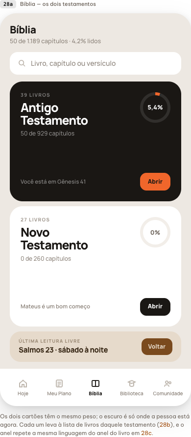

**Status:** CANÔNICA — implementar exatamente assim  
**Imagem:** `screens/28a.png` · **No arquivo de design:** `Jesus Corner Redesign.dc.html#28a`

**Textos da tela, na ordem (25):**

- Bíblia
- 50 de 1.189 capítulos · 4,2% lidos
- Livro, capítulo ou versículo
- 39 livros
- Antigo
- Testamento
- 50 de 929 capítulos
- 5,4%
- Você está em Gênesis 41
- Abrir
- 27 livros
- Novo
- Testamento
- 0 de 260 capítulos
- 0%
- Mateus é um bom começo
- Abrir
- Última leitura livre
- Salmos 23 · sábado à noite
- Voltar
- Hoje
- Meu Plano
- Bíblia
- Biblioteca
- Comunidade

**Cores usadas:** #EDE8E2, #1A1714, #8B8279, #FFF, #BDB5AC, #F0662B, #A29A91, #F2EEE9, #6E655C, #E6DACB, #9C8B76, #3A2A18, #7A4A1E

**Nota de design:** Os dois cartões têm o mesmo peso; o escuro é só onde a pessoa está agora. Cada um leva à lista de livros daquele testamento ( 28b ), e o anel repete a mesma linguagem do anel do livro em 28c .

**Checklist:**
- [ ] Todos os textos acima aparecem, letra por letra (exceto dados de exemplo)
- [ ] Ordem dos blocos igual à imagem
- [ ] Só as cores listadas; Manrope em tudo
- [ ] Nenhum texto cortado; rolagem termina acima da barra de abas
- [ ] Toque mínimo 44px; um só elemento laranja de ação
- [ ] Estado vazio e esqueleto de carregamento existem

---

### 28b · Antigo Testamento — métrica por livro

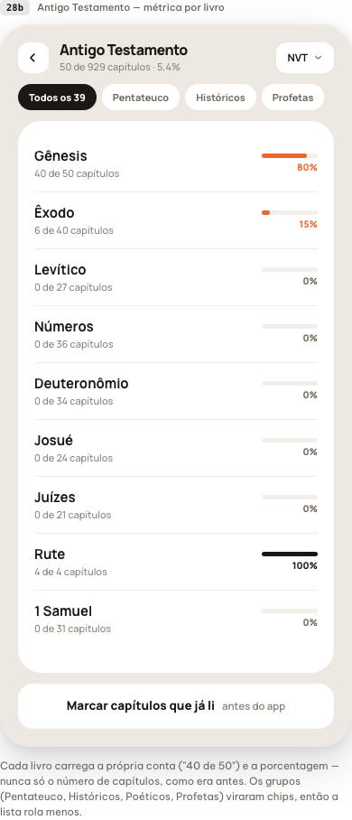

**Status:** CANÔNICA — implementar exatamente assim  
**Imagem:** `screens/28b.png` · **No arquivo de design:** `Jesus Corner Redesign.dc.html#28b`

**Textos da tela, na ordem (36):**

- Antigo Testamento
- 50 de 929 capítulos · 5,4%
- NVT
- Todos os 39
- Pentateuco
- Históricos
- Profetas
- Gênesis
- 40 de 50 capítulos
- 80%
- Êxodo
- 6 de 40 capítulos
- 15%
- Levítico
- 0 de 27 capítulos
- 0%
- Números
- 0 de 36 capítulos
- 0%
- Deuteronômio
- 0 de 34 capítulos
- 0%
- Josué
- 0 de 24 capítulos
- 0%
- Juízes
- 0 de 21 capítulos
- 0%
- Rute
- 4 de 4 capítulos
- 100%
- 1 Samuel
- 0 de 31 capítulos
- 0%
- Marcar capítulos que já li
- antes do app

**Cores usadas:** #EDE8E2, #FFF, #1A1714, #8B8279, #6E655C, #F2EEE9, #F0662B

**Nota de design:** Cada livro carrega a própria conta ("40 de 50") e a porcentagem — nunca só o número de capítulos, como era antes. Os grupos (Pentateuco, Históricos, Poéticos, Profetas) viraram chips, então a lista rola menos.

**Checklist:**
- [ ] Todos os textos acima aparecem, letra por letra (exceto dados de exemplo)
- [ ] Ordem dos blocos igual à imagem
- [ ] Só as cores listadas; Manrope em tudo
- [ ] Nenhum texto cortado; rolagem termina acima da barra de abas
- [ ] Toque mínimo 44px; um só elemento laranja de ação
- [ ] Estado vazio e esqueleto de carregamento existem

---

### 28c · Marcar capítulos lidos, na mão

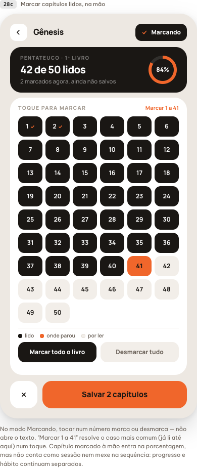

**Status:** CANÔNICA — implementar exatamente assim  
**Imagem:** `screens/28c.png` · **No arquivo de design:** `Jesus Corner Redesign.dc.html#28c`

**Textos da tela, na ordem (64):**

- Gênesis
- Marcando
- Pentateuco · 1º livro
- 42 de 50 lidos
- 2 marcados agora, ainda não salvos
- 84%
- Toque para marcar
- Marcar 1 a 41
- 1
- 2
- 3
- 4
- 5
- 6
- 7
- 8
- 9
- 10
- 11
- 12
- 13
- 14
- 15
- 16
- 17
- 18
- 19
- 20
- 21
- 22
- 23
- 24
- 25
- 26
- 27
- 28
- 29
- 30
- 31
- 32
- 33
- 34
- 35
- 36
- 37
- 38
- 39
- 40
- 41
- 42
- 43
- 44
- 45
- 46
- 47
- 48
- 49
- 50
- lido
- onde parou
- por ler
- Marcar todo o livro
- Desmarcar tudo
- Salvar 2 capítulos

**Cores usadas:** #EDE8E2, #FFF, #1A1714, #F0662B, #A29A91, #F2EEE9, #6E655C, #E4DED7  

**Nota de design:** No modo Marcando, tocar num número marca ou desmarca — não abre o texto. "Marcar 1 a 41" resolve o caso mais comum (já li até aqui) num toque. Capítulo marcado à mão entra na porcentagem, mas não conta como sessão nem mexe na sequência: progresso e hábito continuam separados.

**Checklist:**
- [ ] Todos os textos acima aparecem, letra por letra (exceto dados de exemplo)
- [ ] Ordem dos blocos igual à imagem
- [ ] Só as cores listadas; Manrope em tudo
- [ ] Nenhum texto cortado; rolagem termina acima da barra de abas
- [ ] Toque mínimo 44px; um só elemento laranja de ação
- [ ] Estado vazio e esqueleto de carregamento existem

---

### 28d · Plano — por onde começar

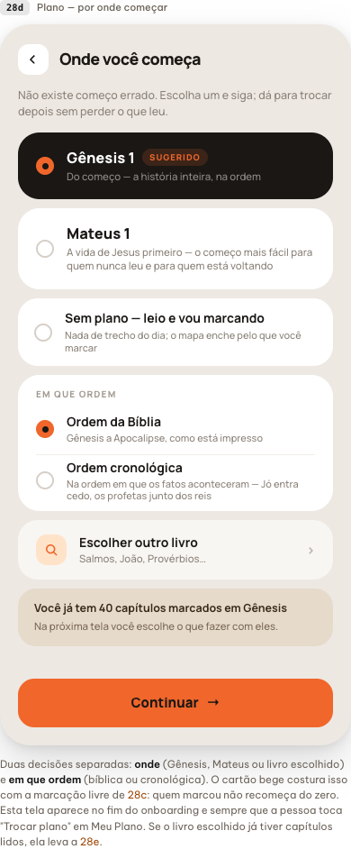

**Status:** CANÔNICA — implementar exatamente assim  
**Imagem:** `screens/28d.png` · **No arquivo de design:** `Jesus Corner Redesign.dc.html#28d`

**Textos da tela, na ordem (19):**

- Onde você começa
- Não existe começo errado. Escolha um e siga; dá para trocar depois sem perder o que leu.
- Gênesis 1
- sugerido
- Do começo — a história inteira, na ordem
- Mateus 1
- A vida de Jesus primeiro — o começo mais fácil para quem nunca leu e para quem está voltando
- Sem plano — leio e vou marcando
- Nada de trecho do dia; o mapa enche pelo que você marcar
- Em que ordem
- Ordem da Bíblia
- Gênesis a Apocalipse, como está impresso
- Ordem cronológica
- Na ordem em que os fatos aconteceram — Jó entra cedo, os profetas junto dos reis
- Escolher outro livro
- Salmos, João, Provérbios…
- Você já tem 40 capítulos marcados em Gênesis
- Na próxima tela você escolhe o que fazer com eles.
- Continuar

**Cores usadas:** #EDE8E2, #FFF, #1A1714, #8B8279, #F0662B, #D6CFC7, #A29A91, #F2EEE9, #FFE3C9, #BDB5AC, #E6DACB, #3A2A18, #7A6A55  

**Nota de design:** Duas decisões separadas: onde (Gênesis, Mateus ou livro escolhido) e em que ordem (bíblica ou cronológica). O cartão bege costura isso com a marcação livre de 28c : quem marcou não recomeça do zero. Esta tela aparece no fim do onboarding e sempre que a pessoa toca "Trocar plano" em Meu Plano. Se o livro escolhido já tiver capítulos lidos, ela leva a 28e .

**Checklist:**
- [ ] Todos os textos acima aparecem, letra por letra (exceto dados de exemplo)
- [ ] Ordem dos blocos igual à imagem
- [ ] Só as cores listadas; Manrope em tudo
- [ ] Nenhum texto cortado; rolagem termina acima da barra de abas
- [ ] Toque mínimo 44px; um só elemento laranja de ação
- [ ] Estado vazio e esqueleto de carregamento existem

---

### 28e · Já leu parte do livro — o que fazer

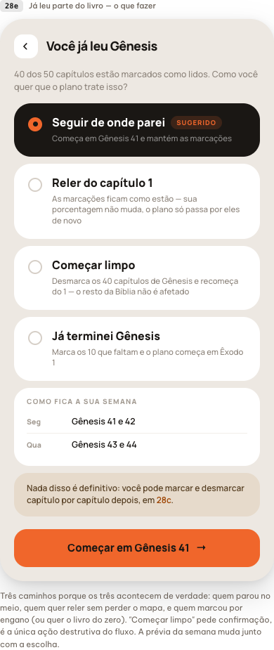

**Status:** CANÔNICA — implementar exatamente assim  
**Imagem:** `screens/28e.png` · **No arquivo de design:** `Jesus Corner Redesign.dc.html#28e`

**Textos da tela, na ordem (20):**

- Você já leu Gênesis
- 40 dos 50 capítulos estão marcados como lidos. Como você quer que o plano trate isso?
- Seguir de onde parei
- sugerido
- Começa em Gênesis 41 e mantém as marcações
- Reler do capítulo 1
- As marcações ficam como estão — sua porcentagem não muda, o plano só passa por eles de novo
- Começar limpo
- Desmarca os 40 capítulos de Gênesis e recomeça do 1 — o resto da Bíblia não é afetado
- Já terminei Gênesis
- Marca os 10 que faltam e o plano começa em Êxodo 1
- Como fica a sua semana
- Seg
- Gênesis 41 e 42
- Qua
- Gênesis 43 e 44
- Nada disso é definitivo: você pode marcar e desmarcar capítulo por capítulo depois, em
- 28c
- .
- Começar em Gênesis 41

**Cores usadas:** #EDE8E2, #FFF, #1A1714, #8B8279, #F0662B, #D6CFC7, #A29A91, #F2EEE9, #E6DACB, #5A4327  

**Nota de design:** Três caminhos porque os três acontecem de verdade: quem parou no meio, quem quer reler sem perder o mapa, e quem marcou por engano (ou quer o livro do zero). "Começar limpo" pede confirmação, é a única ação destrutiva do fluxo. A prévia da semana muda junto com a escolha.

   

   Consequências:  5f  é substituída por  28a ; a página do livro ( 18a ) ganha o chip "Marcando" que a transforma em  28c ; e a ordem cronológica precisa de uma tabela de sequência de capítulos no banco — se você não tiver uma, eu proponho a lista e você revisa com alguém da liderança antes de virar código.

**Checklist:**
- [ ] Todos os textos acima aparecem, letra por letra (exceto dados de exemplo)
- [ ] Ordem dos blocos igual à imagem
- [ ] Só as cores listadas; Manrope em tudo
- [ ] Nenhum texto cortado; rolagem termina acima da barra de abas
- [ ] Toque mínimo 44px; um só elemento laranja de ação
- [ ] Estado vazio e esqueleto de carregamento existem

---

### 18a · Página do livro — capítulos

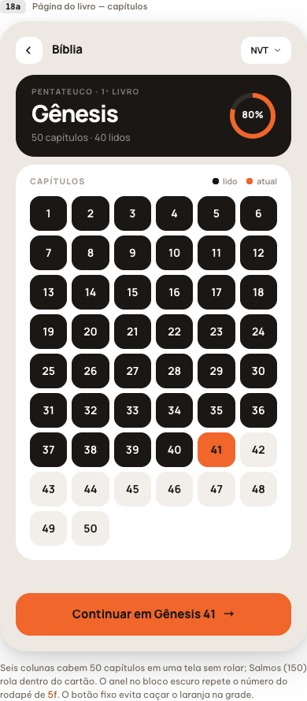

**Status:** SUPERSEDIDA — implemente 32c  
**Imagem:** `screens/18a.png` · **No arquivo de design:** `Jesus Corner Redesign.dc.html#18a`

**Nota de design:** Seis colunas cabem 50 capítulos em uma tela sem rolar; Salmos (150) rola dentro do cartão. O anel no bloco escuro repete o número do rodapé de 5f . O botão fixo evita caçar o laranja na grade.

_Não implementar como está — ver status acima._

---

### 5f · Bíblia — leitura livre, livros por nome

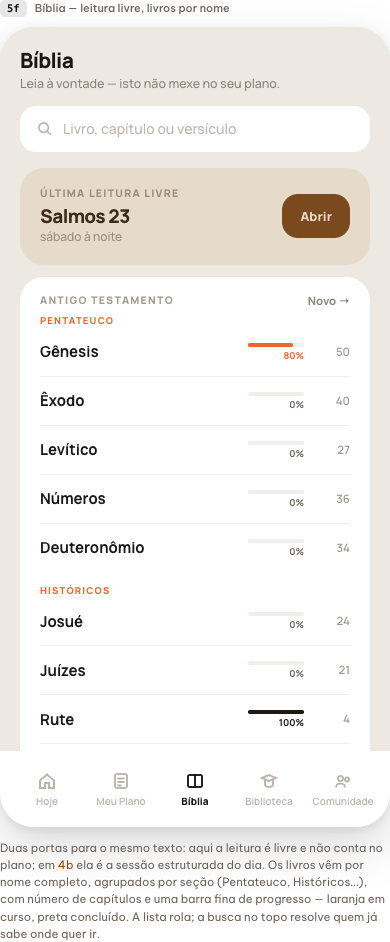

**Status:** SUPERSEDIDA — implemente 28a + 28b  
**Imagem:** `screens/5f.png` · **No arquivo de design:** `Jesus Corner Redesign.dc.html#5f`

**Nota de design:** Duas portas para o mesmo texto: aqui a leitura é livre e não conta no plano; em 4b ela é a sessão estruturada do dia. Os livros vêm por nome completo, agrupados por seção (Pentateuco, Históricos…), com número de capítulos e uma barra fina de progresso — laranja em curso, preta concluído. A lista rola; a busca no topo resolve quem já sabe onde quer ir.

   

   App fechado na nova identidade — as telas que faltavam estão todas no mesmo sistema.

_Não implementar como está — ver status acima._

---

## Onboarding (rodadas 13–15, 27)

### 13a · Boas-vindas — ler antes de cadastrar

**Status:** CANÔNICA — implementar exatamente assim  
**Imagem:** `screens/13a.png` · **No arquivo de design:** `Jesus Corner Redesign.dc.html#13a`

**Textos da tela, na ordem (11):**

- Jesus'
- Corner
- leitura diária
- A Bíblia inteira, um dia por vez.
- Do primeiro ao último livro, com um plano que cabe na sua rotina. Você diz quanto tempo tem — eu organizo o caminho.
- Oração, leitura e reflexão, no seu ritmo
- Pergunte sobre o texto enquanto lê
- Meta semanal — um dia perdido não zera nada
- Começar a ler
- Já tenho conta
- Sem cadastro agora. A conta entra quando você quiser salvar.

**Cores usadas:** #1A1714, #EDE8E2, #A29A91, #F0662B, #FFF

**Nota de design:** Fundo escuro porque é a única tela do app que pode ser uma capa. As três linhas são as três promessas reais do produto, não adjetivos. "Começar a ler" leva direto à pergunta única de 15f — não a um cadastro.

**Checklist:**
- [ ] Todos os textos acima aparecem, letra por letra (exceto dados de exemplo)
- [ ] Ordem dos blocos igual à imagem
- [ ] Só as cores listadas; Manrope em tudo
- [ ] Nenhum texto cortado; rolagem termina acima da barra de abas
- [ ] Toque mínimo 44px; um só elemento laranja de ação
- [ ] Estado vazio e esqueleto de carregamento existem

---

### 13b · Entrar

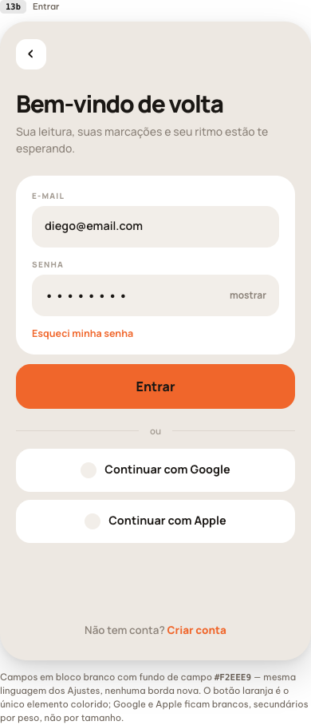

**Status:** CANÔNICA — implementar exatamente assim  
**Imagem:** `screens/13b.png` · **No arquivo de design:** `Jesus Corner Redesign.dc.html#13b`

**Textos da tela, na ordem (14):**

- Bem-vindo de volta
- Sua leitura, suas marcações e seu ritmo estão te esperando.
- E-mail
- diego@email.com
- Senha
- ••••••••
- mostrar
- Esqueci minha senha
- Entrar
- ou
- Continuar com Google
- Continuar com Apple
- Não tem conta?
- Criar conta

**Cores usadas:** #EDE8E2, #FFF, #1A1714, #8B8279, #A29A91, #F2EEE9, #F0662B, #DDD6CE  

**Nota de design:** Campos em bloco branco com fundo de campo #F2EEE9 — mesma linguagem dos Ajustes, nenhuma borda nova. O botão laranja é o único elemento colorido; Google e Apple ficam brancos, secundários por peso, não por tamanho.

**Checklist:**
- [ ] Todos os textos acima aparecem, letra por letra (exceto dados de exemplo)
- [ ] Ordem dos blocos igual à imagem
- [ ] Só as cores listadas; Manrope em tudo
- [ ] Nenhum texto cortado; rolagem termina acima da barra de abas
- [ ] Toque mínimo 44px; um só elemento laranja de ação
- [ ] Estado vazio e esqueleto de carregamento existem

---

### 13c · Criar conta — depois de já ter lido

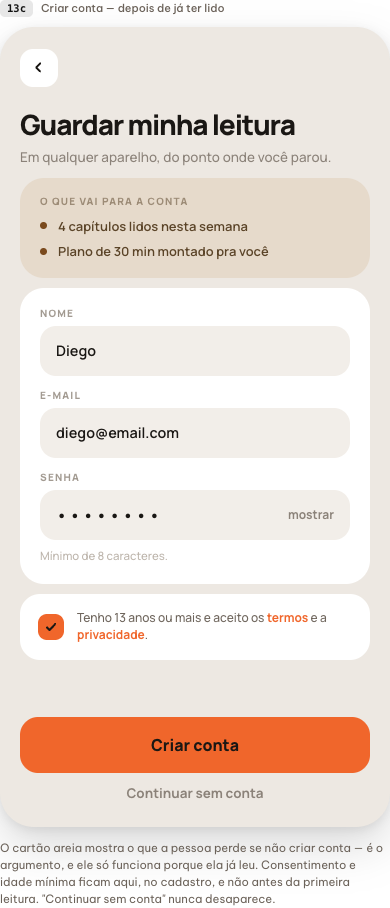

**Status:** CANÔNICA — implementar exatamente assim  
**Imagem:** `screens/13c.png` · **No arquivo de design:** `Jesus Corner Redesign.dc.html#13c`

**Textos da tela, na ordem (20):**

- Guardar minha leitura
- Em qualquer aparelho, do ponto onde você parou.
- O que vai para a conta
- 4 capítulos lidos nesta semana
- Plano de 30 min montado pra você
- Nome
- Diego
- E-mail
- diego@email.com
- Senha
- ••••••••
- mostrar
- Mínimo de 8 caracteres.
- Tenho 13 anos ou mais e aceito os
- termos
- e a
- privacidade
- .
- Criar conta
- Continuar sem conta

**Cores usadas:** #EDE8E2, #FFF, #1A1714, #8B8279, #E6DACB, #9C8B76, #7A4A1E, #5A4327, #A29A91, #F2EEE9, #BDB5AC, #F0662B, #6E655C

**Nota de design:** O cartão areia mostra o que a pessoa perde se não criar conta — é o argumento, e ele só funciona porque ela já leu. Consentimento e idade mínima ficam aqui, no cadastro, e não antes da primeira leitura. "Continuar sem conta" nunca desaparece.

**Checklist:**
- [ ] Todos os textos acima aparecem, letra por letra (exceto dados de exemplo)
- [ ] Ordem dos blocos igual à imagem
- [ ] Só as cores listadas; Manrope em tudo
- [ ] Nenhum texto cortado; rolagem termina acima da barra de abas
- [ ] Toque mínimo 44px; um só elemento laranja de ação
- [ ] Estado vazio e esqueleto de carregamento existem

---

### 13d · Recuperar senha — pedido e confirmação

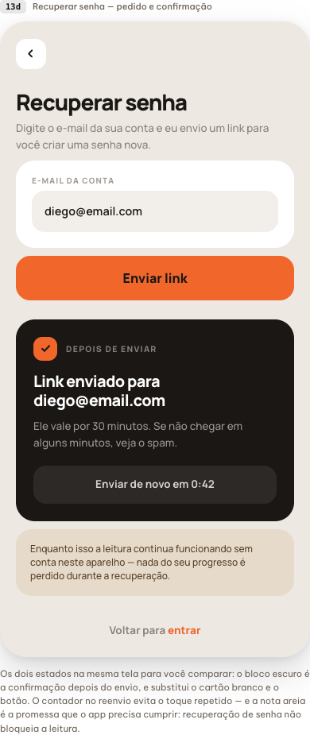

**Status:** CANÔNICA — implementar exatamente assim  
**Imagem:** `screens/13d.png` · **No arquivo de design:** `Jesus Corner Redesign.dc.html#13d`

**Textos da tela, na ordem (12):**

- Recuperar senha
- Digite o e-mail da sua conta e eu envio um link para você criar uma senha nova.
- E-mail da conta
- diego@email.com
- Enviar link
- Depois de enviar
- Link enviado para diego@email.com
- Ele vale por 30 minutos. Se não chegar em alguns minutos, veja o spam.
- Enviar de novo em 0:42
- Enquanto isso a leitura continua funcionando sem conta neste aparelho — nada do seu progresso é perdido durante a recuperação.
- Voltar para
- entrar

**Cores usadas:** #EDE8E2, #FFF, #1A1714, #8B8279, #A29A91, #F2EEE9, #F0662B, #E6DACB, #5A4327

**Nota de design:** Os dois estados na mesma tela para você comparar: o bloco escuro é a confirmação depois do envio, e substitui o cartão branco e o botão. O contador no reenvio evita o toque repetido — e a nota areia é a promessa que o app precisa cumprir: recuperação de senha não bloqueia a leitura.

   

   Faltam os estados de erro, que eu desenho no mesmo padrão se você quiser: e-mail inválido, senha errada (com aviso de tentativas), conta já existente com esse e-mail, e a fusão de dados quando alguém lê sem conta neste aparelho e depois entra numa conta que já tem progresso — este último é o único caso que exige uma decisão de produto, não só uma tela.

**Checklist:**
- [ ] Todos os textos acima aparecem, letra por letra (exceto dados de exemplo)
- [ ] Ordem dos blocos igual à imagem
- [ ] Só as cores listadas; Manrope em tudo
- [ ] Nenhum texto cortado; rolagem termina acima da barra de abas
- [ ] Toque mínimo 44px; um só elemento laranja de ação
- [ ] Estado vazio e esqueleto de carregamento existem

---

### 15a · Pergunta 1 — o histórico

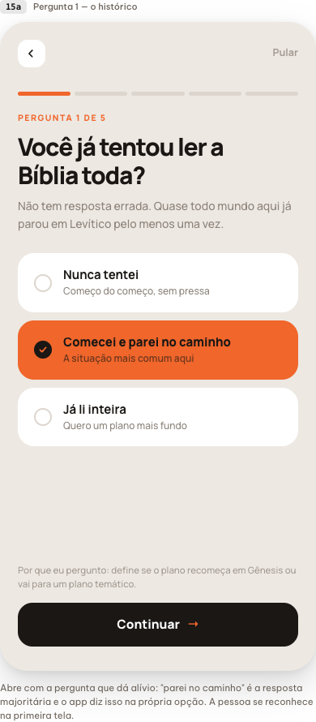

**Status:** CANÔNICA — implementar exatamente assim  
**Imagem:** `screens/15a.png` · **No arquivo de design:** `Jesus Corner Redesign.dc.html#15a`

**Textos da tela, na ordem (12):**

- Pular
- Pergunta 1 de 5
- Você já tentou ler a Bíblia toda?
- Não tem resposta errada. Quase todo mundo aqui já parou em Levítico pelo menos uma vez.
- Nunca tentei
- Começo do começo, sem pressa
- Comecei e parei no caminho
- A situação mais comum aqui
- Já li inteira
- Quero um plano mais fundo
- Por que eu pergunto: define se o plano recomeça em Gênesis ou vai para um plano temático.
- Continuar

**Cores usadas:** #EDE8E2, #FFF, #1A1714, #A29A91, #F0662B, #DDD6CE, #8B8279  

**Nota de design:** Abre com a pergunta que dá alívio: "parei no caminho" é a resposta majoritária e o app diz isso na própria opção. A pessoa se reconhece na primeira tela.

**Checklist:**
- [ ] Todos os textos acima aparecem, letra por letra (exceto dados de exemplo)
- [ ] Ordem dos blocos igual à imagem
- [ ] Só as cores listadas; Manrope em tudo
- [ ] Nenhum texto cortado; rolagem termina acima da barra de abas
- [ ] Toque mínimo 44px; um só elemento laranja de ação
- [ ] Estado vazio e esqueleto de carregamento existem

---

### 15b · Pergunta 2 — a dor, que escolhe a tela seguinte

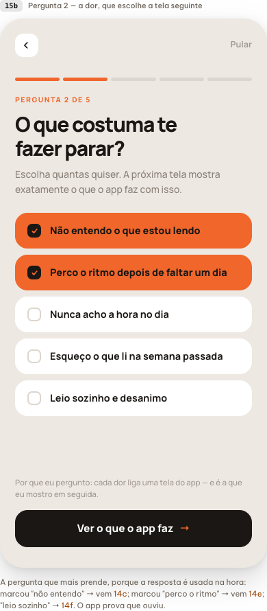

**Status:** CANÔNICA — implementar exatamente assim  
**Imagem:** `screens/15b.png` · **No arquivo de design:** `Jesus Corner Redesign.dc.html#15b`

**Textos da tela, na ordem (11):**

- Pular
- Pergunta 2 de 5
- O que costuma te fazer parar?
- Escolha quantas quiser. A próxima tela mostra exatamente o que o app faz com isso.
- Não entendo o que estou lendo
- Perco o ritmo depois de faltar um dia
- Nunca acho a hora no dia
- Esqueço o que li na semana passada
- Leio sozinho e desanimo
- Por que eu pergunto: cada dor liga uma tela do app — e é a que eu mostro em seguida.
- Ver o que o app faz

**Cores usadas:** #EDE8E2, #FFF, #1A1714, #A29A91, #F0662B, #DDD6CE, #8B8279  

**Nota de design:** A pergunta que mais prende, porque a resposta é usada na hora: marcou "não entendo" → vem 14c ; marcou "perco o ritmo" → vem 14e ; "leio sozinho" → 14f . O app prova que ouviu.

**Checklist:**
- [ ] Todos os textos acima aparecem, letra por letra (exceto dados de exemplo)
- [ ] Ordem dos blocos igual à imagem
- [ ] Só as cores listadas; Manrope em tudo
- [ ] Nenhum texto cortado; rolagem termina acima da barra de abas
- [ ] Toque mínimo 44px; um só elemento laranja de ação
- [ ] Estado vazio e esqueleto de carregamento existem

---

### 14b · Demonstração — a tela de leitura

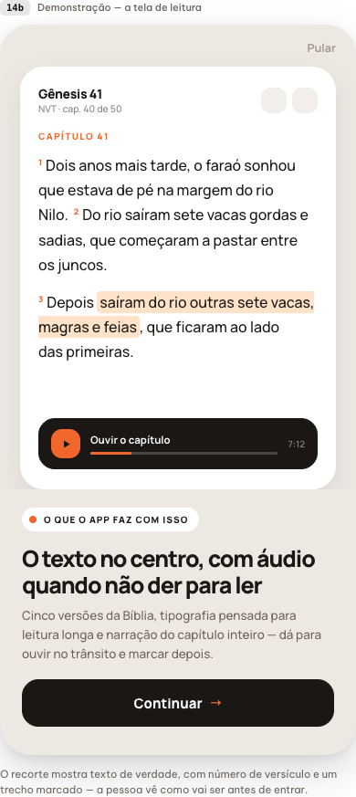

**Status:** CANÔNICA — implementar exatamente assim  
**Imagem:** `screens/14b.png` · **No arquivo de design:** `Jesus Corner Redesign.dc.html#14b`

**Textos da tela, na ordem (18):**

- Pular
- Gênesis 41
- NVT · cap. 40 de 50
- Capítulo 41
- 1
- Dois anos mais tarde, o faraó sonhou que estava de pé na margem do rio Nilo.
- 2
- Do rio saíram sete vacas gordas e sadias, que começaram a pastar entre os juncos.
- 3
- Depois
- saíram do rio outras sete vacas, magras e feias
- , que ficaram ao lado das primeiras.
- Ouvir o capítulo
- 7:12
- O que o app faz com isso
- O texto no centro, com áudio quando não der para ler
- Cinco versões da Bíblia, tipografia pensada para leitura longa e narração do capítulo inteiro — dá para ouvir no trânsito e marcar depois.
- Continuar

**Cores usadas:** #EDE8E2, #A29A91, #FFF, #1A1714, #8B8279, #F2EEE9, #F0662B, #FFE3C9, #6E655C

**Nota de design:** O recorte mostra texto de verdade, com número de versículo e um trecho marcado — a pessoa vê como vai ser antes de entrar.

**Checklist:**
- [ ] Todos os textos acima aparecem, letra por letra (exceto dados de exemplo)
- [ ] Ordem dos blocos igual à imagem
- [ ] Só as cores listadas; Manrope em tudo
- [ ] Nenhum texto cortado; rolagem termina acima da barra de abas
- [ ] Toque mínimo 44px; um só elemento laranja de ação
- [ ] Estado vazio e esqueleto de carregamento existem

---

### 14c · Demonstração — perguntar sobre o texto

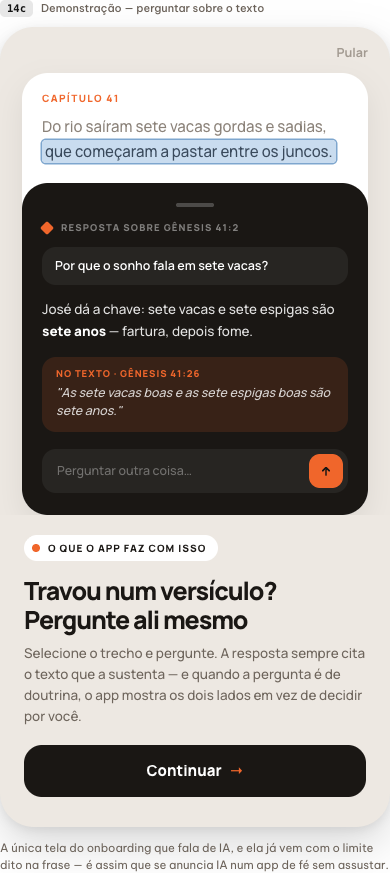

**Status:** CANÔNICA — implementar exatamente assim  
**Imagem:** `screens/14c.png` · **No arquivo de design:** `Jesus Corner Redesign.dc.html#14c`

**Textos da tela, na ordem (16):**

- Pular
- Capítulo 41
- Do rio saíram sete vacas gordas e sadias,
- que começaram a pastar entre os juncos.
- Resposta sobre Gênesis 41:2
- Por que o sonho fala em sete vacas?
- José dá a chave: sete vacas e sete espigas são
- sete anos
- — fartura, depois fome.
- No texto · Gênesis 41:26
- "As sete vacas boas e as sete espigas boas são sete anos."
- Perguntar outra coisa…
- O que o app faz com isso
- Travou num versículo? Pergunte ali mesmo
- Selecione o trecho e pergunte. A resposta sempre cita o texto que a sustenta — e quando a pergunta é de doutrina, o app mostra os dois lados em vez de decidir por você.
- Continuar

**Cores usadas:** #EDE8E2, #A29A91, #FFF, #F0662B, #8B8279, #C9DCEF, #3A4A5C, #7EA6CE, #1A1714, #6E655C  
ℹ Azul claro (#C9DCEF, #3A4A5C, #7EA6CE) é a cor de **seleção de trecho** no texto bíblico — única cor fora da paleta permitida no app.

**Nota de design:** A única tela do onboarding que fala de IA, e ela já vem com o limite dito na frase — é assim que se anuncia IA num app de fé sem assustar.

**Checklist:**
- [ ] Todos os textos acima aparecem, letra por letra (exceto dados de exemplo)
- [ ] Ordem dos blocos igual à imagem
- [ ] Só as cores listadas; Manrope em tudo
- [ ] Nenhum texto cortado; rolagem termina acima da barra de abas
- [ ] Toque mínimo 44px; um só elemento laranja de ação
- [ ] Estado vazio e esqueleto de carregamento existem

---

### 14e · Demonstração — constância sem culpa

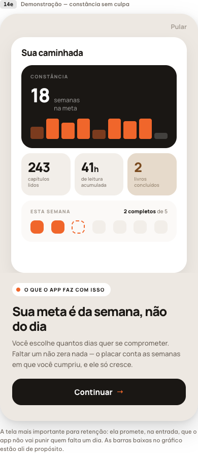

**Status:** CANÔNICA — implementar exatamente assim  
**Imagem:** `screens/14e.png` · **No arquivo de design:** `Jesus Corner Redesign.dc.html#14e`

**Textos da tela, na ordem (23):**

- Pular
- Sua caminhada
- Constância
- 18
- semanas
- na meta
- 243
- capítulos
- lidos
- 41
- h
- de leitura
- acumulada
- 2
- livros
- concluídos
- Esta semana
- 2 completos
- de 5
- O que o app faz com isso
- Sua meta é da semana, não do dia
- Você escolhe quantos dias quer se comprometer. Faltar um não zera nada — o placar conta as semanas em que você cumpriu, e ele só cresce.
- Continuar

**Cores usadas:** #EDE8E2, #A29A91, #FFF, #1A1714, #F0662B, #F2EEE9, #8B8279, #E6DACB, #7A4A1E, #9C8B76, #FBF9F7, #6E655C  

**Nota de design:** A tela mais importante para retenção: ela promete, na entrada, que o app não vai punir quem falta um dia. As barras baixas no gráfico estão ali de propósito.

**Checklist:**
- [ ] Todos os textos acima aparecem, letra por letra (exceto dados de exemplo)
- [ ] Ordem dos blocos igual à imagem
- [ ] Só as cores listadas; Manrope em tudo
- [ ] Nenhum texto cortado; rolagem termina acima da barra de abas
- [ ] Toque mínimo 44px; um só elemento laranja de ação
- [ ] Estado vazio e esqueleto de carregamento existem

---

### 14f · Demonstração — comunidade

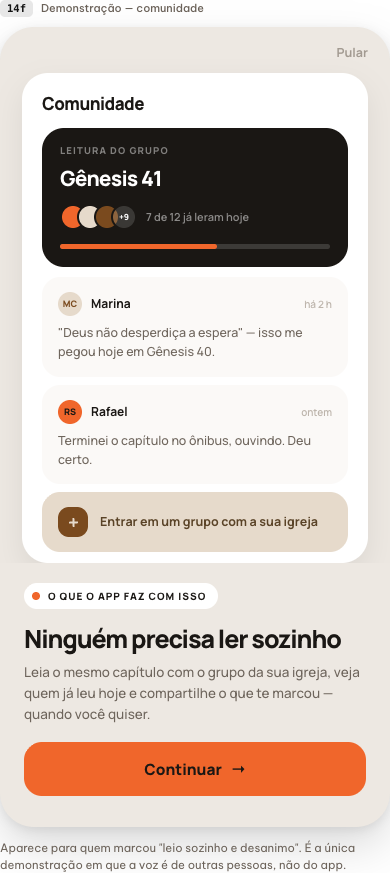

**Status:** CANÔNICA — implementar exatamente assim  
**Imagem:** `screens/14f.png` · **No arquivo de design:** `Jesus Corner Redesign.dc.html#14f`

**Textos da tela, na ordem (19):**

- Pular
- Comunidade
- Leitura do grupo
- Gênesis 41
- +9
- 7 de 12 já leram hoje
- MC
- Marina
- há 2 h
- "Deus não desperdiça a espera" — isso me pegou hoje em Gênesis 40.
- RS
- Rafael
- ontem
- Terminei o capítulo no ônibus, ouvindo. Deu certo.
- Entrar em um grupo com a sua igreja
- O que o app faz com isso
- Ninguém precisa ler sozinho
- Leia o mesmo capítulo com o grupo da sua igreja, veja quem já leu hoje e compartilhe o que te marcou — quando você quiser.
- Continuar

**Cores usadas:** #EDE8E2, #A29A91, #FFF, #1A1714, #F0662B, #E6DACB, #7A4A1E, #FBF9F7, #BDB5AC, #6E655C, #5A4327  

**Nota de design:** Aparece para quem marcou "leio sozinho e desanimo". É a única demonstração em que a voz é de outras pessoas, não do app.

   

   Com isso o caminho até o primeiro versículo tem 7 telas:  15a  →  15b  → uma demonstração →  15f  →  15c  →  15d  →  15e .

**Checklist:**
- [ ] Todos os textos acima aparecem, letra por letra (exceto dados de exemplo)
- [ ] Ordem dos blocos igual à imagem
- [ ] Só as cores listadas; Manrope em tudo
- [ ] Nenhum texto cortado; rolagem termina acima da barra de abas
- [ ] Toque mínimo 44px; um só elemento laranja de ação
- [ ] Estado vazio e esqueleto de carregamento existem

---

### 15f · Pergunta 3 — tempo de cada passo, separado

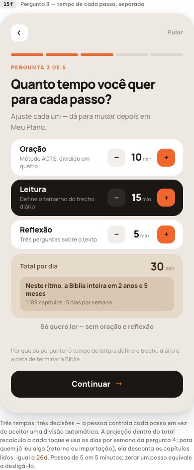

**Status:** CANÔNICA — implementar exatamente assim  
**Imagem:** `screens/15f.png` · **No arquivo de design:** `Jesus Corner Redesign.dc.html#15f`

**Textos da tela, na ordem (24):**

- Pular
- Pergunta 3 de 5
- Quanto tempo você quer para cada passo?
- Ajuste cada um — dá para mudar depois em Meu Plano.
- Oração
- Método ACTS, dividido em quatro
- 10
- min
- Leitura
- Define o tamanho do trecho diário
- 15
- min
- Reflexão
- Três perguntas sobre o texto
- 5
- min
- Total por dia
- 30
- min
- Neste ritmo, a Bíblia inteira em 2 anos e 5 meses
- 1.189 capítulos · 5 dias por semana
- Só quero ler — sem oração e reflexão
- Por que eu pergunto: o tempo de leitura define o trecho diário e a data de terminar a Bíblia.
- Continuar

**Cores usadas:** #EDE8E2, #FFF, #1A1714, #A29A91, #F0662B, #DDD6CE, #8B8279, #F2EEE9, #E6DACB, #5A4327, #3A2A18, #9C8B76, #D8C7B2, #7A6A55  

**Nota de design:** Três tempos, três decisões — a pessoa controla cada passo em vez de aceitar uma divisão automática. A projeção dentro do total recalcula a cada toque e usa os dias por semana da pergunta 4; para quem já leu algo (retorno ou importação), ela desconta os capítulos lidos, igual a 26d . Passos de 5 em 5 minutos; zerar um passo equivale a desligá-lo.

**Checklist:**
- [ ] Todos os textos acima aparecem, letra por letra (exceto dados de exemplo)
- [ ] Ordem dos blocos igual à imagem
- [ ] Só as cores listadas; Manrope em tudo
- [ ] Nenhum texto cortado; rolagem termina acima da barra de abas
- [ ] Toque mínimo 44px; um só elemento laranja de ação
- [ ] Estado vazio e esqueleto de carregamento existem

---

### 27a · Pergunta 4 — o compromisso da semana

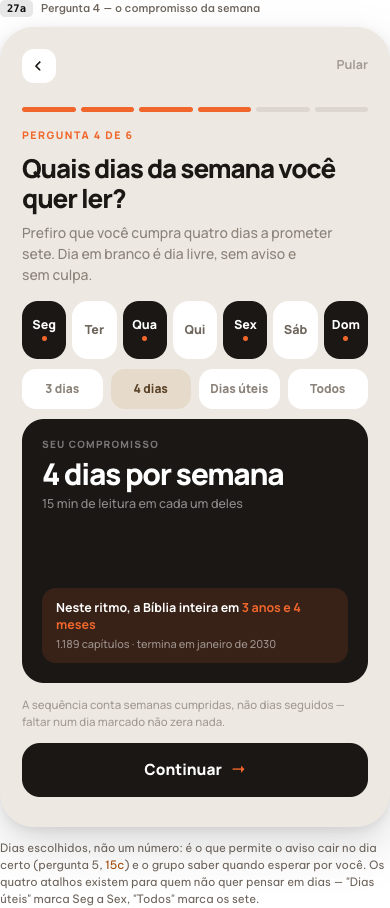

**Status:** CANÔNICA — implementar exatamente assim  
**Imagem:** `screens/27a.png` · **No arquivo de design:** `Jesus Corner Redesign.dc.html#27a`

**Textos da tela, na ordem (23):**

- Pular
- Pergunta 4 de 6
- Quais dias da semana você quer ler?
- Prefiro que você cumpra quatro dias a prometer sete. Dia em branco é dia livre, sem aviso e sem culpa.
- Seg
- Ter
- Qua
- Qui
- Sex
- Sáb
- Dom
- 3 dias
- 4 dias
- Dias úteis
- Todos
- Seu compromisso
- 4 dias por semana
- 15 min de leitura em cada um deles
- Neste ritmo, a Bíblia inteira em
- 3 anos e 4 meses
- 1.189 capítulos · termina em janeiro de 2030
- A sequência conta semanas cumpridas, não dias seguidos — faltar num dia marcado não zera nada.
- Continuar

**Cores usadas:** #EDE8E2, #FFF, #1A1714, #A29A91, #F0662B, #DDD6CE, #8B8279, #6E655C, #E6DACB, #5A4327  

**Nota de design:** Dias escolhidos, não um número: é o que permite o aviso cair no dia certo (pergunta 5, 15c ) e o grupo saber quando esperar por você. Os quatro atalhos existem para quem não quer pensar em dias — "Dias úteis" marca Seg a Sex, "Todos" marca os sete.

   

   Ajustes que vêm com isso: as barras de progresso de  15f  e das outras telas do onboarding passam a ter seis segmentos; a projeção em  15f  e em  26d  usa os dias marcados aqui (e não mais uma estimativa de 5); e em Meu Plano os dias aparecem como a linha "Seg · Qua · Sex · Dom", editável no mesmo componente desta tela.

**Checklist:**
- [ ] Todos os textos acima aparecem, letra por letra (exceto dados de exemplo)
- [ ] Ordem dos blocos igual à imagem
- [ ] Só as cores listadas; Manrope em tudo
- [ ] Nenhum texto cortado; rolagem termina acima da barra de abas
- [ ] Toque mínimo 44px; um só elemento laranja de ação
- [ ] Estado vazio e esqueleto de carregamento existem

---

### 15c · Pergunta 4 — a hora do dia

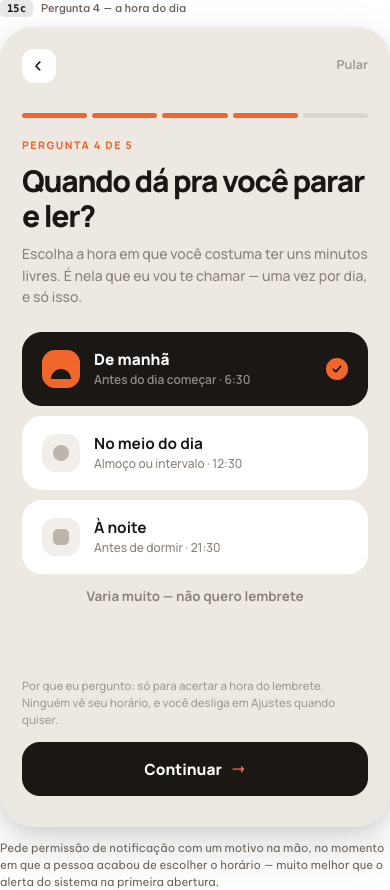

**Status:** CANÔNICA — implementar exatamente assim  
**Imagem:** `screens/15c.png` · **No arquivo de design:** `Jesus Corner Redesign.dc.html#15c`

**Textos da tela, na ordem (13):**

- Pular
- Pergunta 4 de 5
- Quando dá pra você parar e ler?
- Escolha a hora em que você costuma ter uns minutos livres. É nela que eu vou te chamar — uma vez por dia, e só isso.
- De manhã
- Antes do dia começar · 6:30
- No meio do dia
- Almoço ou intervalo · 12:30
- À noite
- Antes de dormir · 21:30
- Varia muito — não quero lembrete
- Por que eu pergunto: só para acertar a hora do lembrete. Ninguém vê seu horário, e você desliga em Ajustes quando quiser.
- Continuar

**Cores usadas:** #EDE8E2, #FFF, #1A1714, #A29A91, #F0662B, #DDD6CE, #8B8279, #F2EEE9, #BDB5AC  

**Nota de design:** Pede permissão de notificação com um motivo na mão, no momento em que a pessoa acabou de escolher o horário — muito melhor que o alerta do sistema na primeira abertura.

**Checklist:**
- [ ] Todos os textos acima aparecem, letra por letra (exceto dados de exemplo)
- [ ] Ordem dos blocos igual à imagem
- [ ] Só as cores listadas; Manrope em tudo
- [ ] Nenhum texto cortado; rolagem termina acima da barra de abas
- [ ] Toque mínimo 44px; um só elemento laranja de ação
- [ ] Estado vazio e esqueleto de carregamento existem

---

### 15d · Pergunta 5 — o compromisso da semana

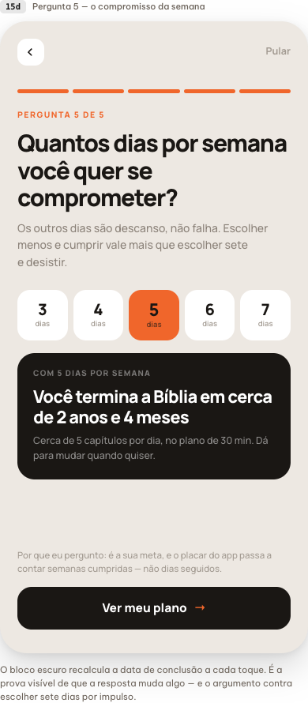

**Status:** CANÔNICA — implementar exatamente assim  
**Imagem:** `screens/15d.png` · **No arquivo de design:** `Jesus Corner Redesign.dc.html#15d`

**Textos da tela, na ordem (19):**

- Pular
- Pergunta 5 de 5
- Quantos dias por semana você quer se comprometer?
- Os outros dias são descanso, não falha. Escolher menos e cumprir vale mais que escolher sete e desistir.
- 3
- dias
- 4
- dias
- 5
- dias
- 6
- dias
- 7
- dias
- Com 5 dias por semana
- Você termina a Bíblia em cerca de 2 anos e 4 meses
- Cerca de 5 capítulos por dia, no plano de 30 min. Dá para mudar quando quiser.
- Por que eu pergunto: é a sua meta, e o placar do app passa a contar semanas cumpridas — não dias seguidos.
- Ver meu plano

**Cores usadas:** #EDE8E2, #FFF, #1A1714, #A29A91, #F0662B, #8B8279

**Nota de design:** O bloco escuro recalcula a data de conclusão a cada toque. É a prova visível de que a resposta muda algo — e o argumento contra escolher sete dias por impulso.

**Checklist:**
- [ ] Todos os textos acima aparecem, letra por letra (exceto dados de exemplo)
- [ ] Ordem dos blocos igual à imagem
- [ ] Só as cores listadas; Manrope em tudo
- [ ] Nenhum texto cortado; rolagem termina acima da barra de abas
- [ ] Toque mínimo 44px; um só elemento laranja de ação
- [ ] Estado vazio e esqueleto de carregamento existem

---

### 15e · Resultado — o plano montado com as respostas

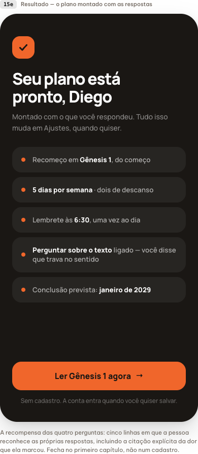

**Status:** CANÔNICA — implementar exatamente assim  
**Imagem:** `screens/15e.png` · **No arquivo de design:** `Jesus Corner Redesign.dc.html#15e`

**Textos da tela, na ordem (16):**

- Seu plano está pronto, Diego
- Montado com o que você respondeu. Tudo isso muda em Ajustes, quando quiser.
- Recomeço em
- Gênesis 1
- , do começo
- 5 dias por semana
- · dois de descanso
- Lembrete às
- 6:30
- , uma vez ao dia
- Perguntar sobre o texto
- ligado — você disse que trava no sentido
- Conclusão prevista:
- janeiro de 2029
- Ler Gênesis 1 agora
- Sem cadastro. A conta entra quando você quiser salvar.

**Cores usadas:** #1A1714, #F0662B, #FFF

**Nota de design:** A recompensa das quatro perguntas: cinco linhas em que a pessoa reconhece as próprias respostas, incluindo a citação explícita da dor que ela marcou. Fecha no primeiro capítulo, não num cadastro.

   

   Se quiser cortar, tire  15a : é a que menos muda o produto. As quatro que eu manteria são  15b  (define o que mostrar em seguida),  15f  (o tempo do método, que dimensiona o plano),  15c  (lembrete com motivo) e  15d  (meta semanal). Uma coisa que precisa do seu aval: "conclusão prevista: janeiro de 2029" é honesto, mas pode assustar — a alternativa é mostrar só "cerca de 5 capítulos por dia" e guardar a data para depois da primeira semana.

**Checklist:**
- [ ] Todos os textos acima aparecem, letra por letra (exceto dados de exemplo)
- [ ] Ordem dos blocos igual à imagem
- [ ] Só as cores listadas; Manrope em tudo
- [ ] Nenhum texto cortado; rolagem termina acima da barra de abas
- [ ] Toque mínimo 44px; um só elemento laranja de ação
- [ ] Estado vazio e esqueleto de carregamento existem

---

## Meu Plano e os três passos (rodadas 4, 21, 26)

### 4b · Meu Plano — só hoje, um passo ativo

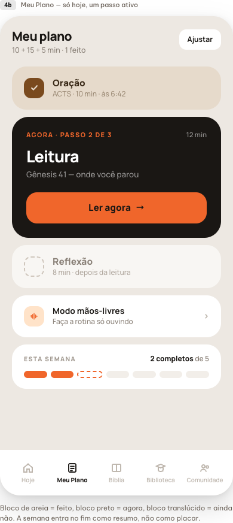

**Status:** CANÔNICA — implementar exatamente assim  
**Imagem:** `screens/4b.png` · **No arquivo de design:** `Jesus Corner Redesign.dc.html#4b`

**Textos da tela, na ordem (22):**

- Meu plano
- 10 + 15 + 5 min · 1 feito
- Ajustar
- Oração
- ACTS · 10 min · às 6:42
- Agora · passo 2 de 3
- 12 min
- Leitura
- Gênesis 41 — onde você parou
- Ler agora
- Reflexão
- 8 min · depois da leitura
- Modo mãos-livres
- Faça a rotina só ouvindo
- Esta semana
- 2 completos
- de 5
- Hoje
- Meu Plano
- Bíblia
- Biblioteca
- Comunidade

**Cores usadas:** #EDE8E2, #1A1714, #8B8279, #FFF, #E6DACB, #7A4A1E, #3A2A18, #9C8B76, #F0662B, #CFC6BC, #B0A79E, #FFE3C9, #BDB5AC, #A29A91, #F2EEE9  

**Nota de design:** Bloco de areia = feito, bloco preto = agora, bloco translúcido = ainda não. A semana entra no fim como resumo, não como placar.

**Checklist:**
- [ ] Todos os textos acima aparecem, letra por letra (exceto dados de exemplo)
- [ ] Ordem dos blocos igual à imagem
- [ ] Só as cores listadas; Manrope em tudo
- [ ] Nenhum texto cortado; rolagem termina acima da barra de abas
- [ ] Toque mínimo 44px; um só elemento laranja de ação
- [ ] Estado vazio e esqueleto de carregamento existem

---

### 26a · Passo 1 · Oração (ACTS)

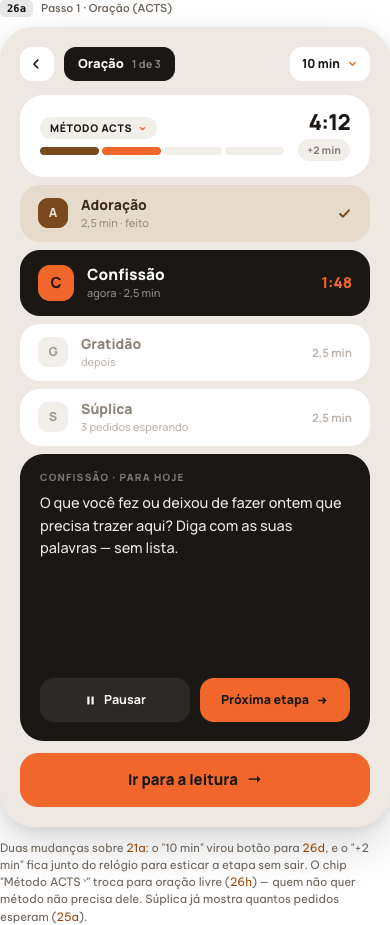

**Status:** CANÔNICA — implementar exatamente assim  
**Imagem:** `screens/26a.png` · **No arquivo de design:** `Jesus Corner Redesign.dc.html#26a`

**Textos da tela, na ordem (26):**

- Oração
- 1 de 3
- 10 min
- Método ACTS
- 4:12
- +2 min
- A
- Adoração
- 2,5 min · feito
- C
- Confissão
- agora · 2,5 min
- 1:48
- G
- Gratidão
- depois
- 2,5 min
- S
- Súplica
- 3 pedidos esperando
- 2,5 min
- Confissão · para hoje
- O que você fez ou deixou de fazer ontem que precisa trazer aqui? Diga com as suas palavras — sem lista.
- Pausar
- Próxima etapa
- Ir para a leitura

**Cores usadas:** #EDE8E2, #FFF, #1A1714, #F0662B, #F2EEE9, #7A4A1E, #8B8279, #E6DACB, #3A2A18, #9C8B76, #A29A91, #BDB5AC

**Nota de design:** Duas mudanças sobre 21a : o "10 min" virou botão para 26d , e o "+2 min" fica junto do relógio para esticar a etapa sem sair. O chip "Método ACTS ˅" troca para oração livre ( 26h ) — quem não quer método não precisa dele. Súplica já mostra quantos pedidos esperam ( 25a ).

**Checklist:**
- [ ] Todos os textos acima aparecem, letra por letra (exceto dados de exemplo)
- [ ] Ordem dos blocos igual à imagem
- [ ] Só as cores listadas; Manrope em tudo
- [ ] Nenhum texto cortado; rolagem termina acima da barra de abas
- [ ] Toque mínimo 44px; um só elemento laranja de ação
- [ ] Estado vazio e esqueleto de carregamento existem

---

### 26h · Passo 1 · sem método, oração livre

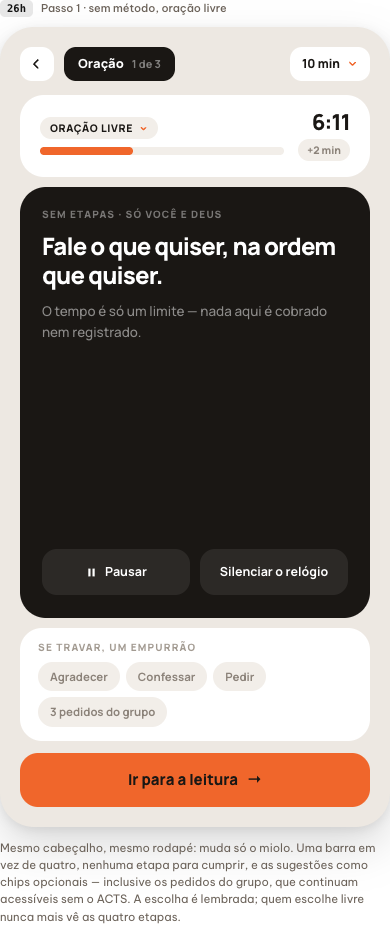

**Status:** CANÔNICA — implementar exatamente assim  
**Imagem:** `screens/26h.png` · **No arquivo de design:** `Jesus Corner Redesign.dc.html#26h`

**Textos da tela, na ordem (17):**

- Oração
- 1 de 3
- 10 min
- Oração livre
- 6:11
- +2 min
- Sem etapas · só você e Deus
- Fale o que quiser, na ordem que quiser.
- O tempo é só um limite — nada aqui é cobrado nem registrado.
- Pausar
- Silenciar o relógio
- Se travar, um empurrão
- Agradecer
- Confessar
- Pedir
- 3 pedidos do grupo
- Ir para a leitura

**Cores usadas:** #EDE8E2, #FFF, #1A1714, #F0662B, #F2EEE9, #8B8279, #A29A91

**Nota de design:** Mesmo cabeçalho, mesmo rodapé: muda só o miolo. Uma barra em vez de quatro, nenhuma etapa para cumprir, e as sugestões como chips opcionais — inclusive os pedidos do grupo, que continuam acessíveis sem o ACTS. A escolha é lembrada; quem escolhe livre nunca mais vê as quatro etapas.

**Checklist:**
- [ ] Todos os textos acima aparecem, letra por letra (exceto dados de exemplo)
- [ ] Ordem dos blocos igual à imagem
- [ ] Só as cores listadas; Manrope em tudo
- [ ] Nenhum texto cortado; rolagem termina acima da barra de abas
- [ ] Toque mínimo 44px; um só elemento laranja de ação
- [ ] Estado vazio e esqueleto de carregamento existem

---

### 26b · Passo 2 · Leitura

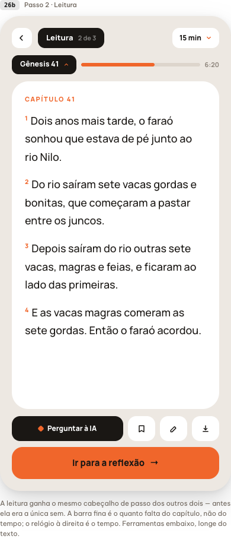

**Status:** CANÔNICA — implementar exatamente assim  
**Imagem:** `screens/26b.png` · **No arquivo de design:** `Jesus Corner Redesign.dc.html#26b`

**Textos da tela, na ordem (16):**

- Leitura
- 2 de 3
- 15 min
- Gênesis 41
- 6:20
- Capítulo 41
- 1
- Dois anos mais tarde, o faraó sonhou que estava de pé junto ao rio Nilo.
- 2
- Do rio saíram sete vacas gordas e bonitas, que começaram a pastar entre os juncos.
- 3
- Depois saíram do rio outras sete vacas, magras e feias, e ficaram ao lado das primeiras.
- 4
- E as vacas magras comeram as sete gordas. Então o faraó acordou.
- Perguntar à IA
- Ir para a reflexão

**Cores usadas:** #EDE8E2, #FFF, #1A1714, #F0662B, #DDD5CC, #8B8279  

**Nota de design:** A leitura ganha o mesmo cabeçalho de passo dos outros dois — antes ela era a única sem. A barra fina é o quanto falta do capítulo, não do tempo; o relógio à direita é o tempo. Ferramentas embaixo, longe do texto.

**Checklist:**
- [ ] Todos os textos acima aparecem, letra por letra (exceto dados de exemplo)
- [ ] Ordem dos blocos igual à imagem
- [ ] Só as cores listadas; Manrope em tudo
- [ ] Nenhum texto cortado; rolagem termina acima da barra de abas
- [ ] Toque mínimo 44px; um só elemento laranja de ação
- [ ] Estado vazio e esqueleto de carregamento existem

---

### 26c · Passo 3 · Reflexão, refeita

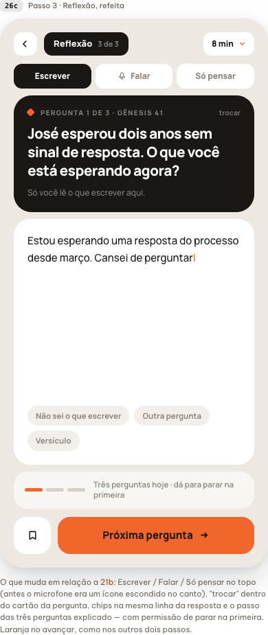

**Status:** CANÔNICA — implementar exatamente assim  
**Imagem:** `screens/26c.png` · **No arquivo de design:** `Jesus Corner Redesign.dc.html#26c`

**Textos da tela, na ordem (17):**

- Reflexão
- 3 de 3
- 8 min
- Escrever
- Falar
- Só pensar
- Pergunta 1 de 3 · Gênesis 41
- trocar
- José esperou dois anos sem sinal de resposta. O que você está esperando agora?
- Só você lê o que escrever aqui.
- Estou esperando uma resposta do processo desde março. Cansei de perguntar
- |
- Não sei o que escrever
- Outra pergunta
- Versículo
- Três perguntas hoje · dá para parar na primeira
- Próxima pergunta

**Cores usadas:** #EDE8E2, #FFF, #1A1714, #F0662B, #8B8279, #F2EEE9, #D6CFC7  

**Nota de design:** O que muda em relação a 21b : Escrever / Falar / Só pensar no topo (antes o microfone era um ícone escondido no canto), "trocar" dentro do cartão da pergunta, chips na mesma linha da resposta e o passo das três perguntas explicado — com permissão de parar na primeira. Laranja no avançar, como nos outros dois passos.

**Checklist:**
- [ ] Todos os textos acima aparecem, letra por letra (exceto dados de exemplo)
- [ ] Ordem dos blocos igual à imagem
- [ ] Só as cores listadas; Manrope em tudo
- [ ] Nenhum texto cortado; rolagem termina acima da barra de abas
- [ ] Toque mínimo 44px; um só elemento laranja de ação
- [ ] Estado vazio e esqueleto de carregamento existem

---

### 26d · Tempo de cada passo — a folha do relógio

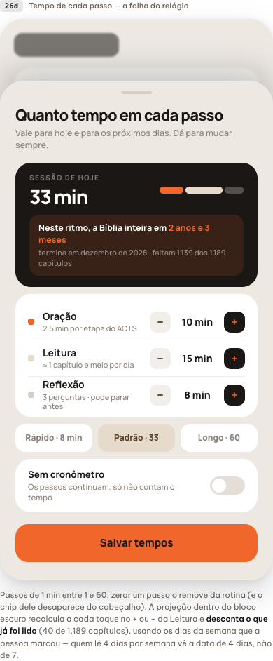

**Status:** CANÔNICA — implementar exatamente assim  
**Imagem:** `screens/26d.png` · **No arquivo de design:** `Jesus Corner Redesign.dc.html#26d`

**Textos da tela, na ordem (22):**

- Quanto tempo em cada passo
- Vale para hoje e para os próximos dias. Dá para mudar sempre.
- Sessão de hoje
- 33 min
- Neste ritmo, a Bíblia inteira em
- 2 anos e 3 meses
- termina em dezembro de 2028 · faltam 1.139 dos 1.189 capítulos
- Oração
- 2,5 min por etapa do ACTS
- 10 min
- Leitura
- ≈ 1 capítulo e meio por dia
- 15 min
- Reflexão
- 3 perguntas · pode parar antes
- 8 min
- Rápido · 8 min
- Padrão · 33
- Longo · 60
- Sem cronômetro
- Os passos continuam, só não contam o tempo
- Salvar tempos

**Cores usadas:** #EDE8E2, #1A1714, #FFF, #E6DACB, #D6CFC7, #8B8279, #F0662B, #F2EEE9, #5A4327, #E4DED7  

**Nota de design:** Passos de 1 min entre 1 e 60; zerar um passo o remove da rotina (e o chip dele desaparece do cabeçalho). A projeção dentro do bloco escuro recalcula a cada toque no + ou − da Leitura e desconta o que já foi lido (40 de 1.189 capítulos), usando os dias da semana que a pessoa marcou — quem lê 4 dias por semana vê a data de 4 dias, não de 7.

**Checklist:**
- [ ] Todos os textos acima aparecem, letra por letra (exceto dados de exemplo)
- [ ] Ordem dos blocos igual à imagem
- [ ] Só as cores listadas; Manrope em tudo
- [ ] Nenhum texto cortado; rolagem termina acima da barra de abas
- [ ] Toque mínimo 44px; um só elemento laranja de ação
- [ ] Estado vazio e esqueleto de carregamento existem

---

### 21c · Rotina concluída — fechamento do dia

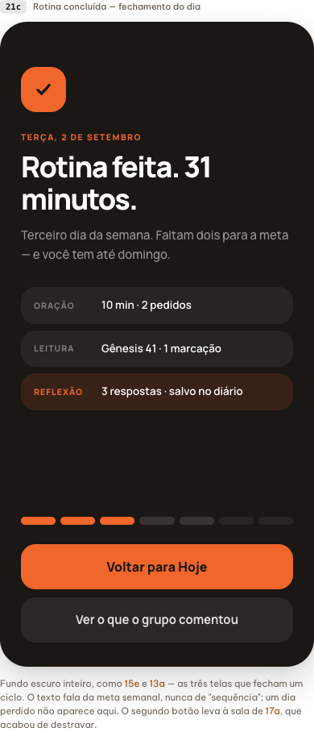

**Status:** CANÔNICA — implementar exatamente assim  
**Imagem:** `screens/21c.png` · **No arquivo de design:** `Jesus Corner Redesign.dc.html#21c`

**Textos da tela, na ordem (11):**

- Terça, 2 de setembro
- Rotina feita. 31 minutos.
- Terceiro dia da semana. Faltam dois para a meta — e você tem até domingo.
- Oração
- 10 min · 2 pedidos
- Leitura
- Gênesis 41 · 1 marcação
- Reflexão
- 3 respostas · salvo no diário
- Voltar para Hoje
- Ver o que o grupo comentou

**Cores usadas:** #1A1714, #F0662B, #FFF

**Nota de design:** Fundo escuro inteiro, como 15e e 13a — as três telas que fecham um ciclo. O texto fala da meta semanal, nunca de "sequência"; um dia perdido não aparece aqui. O segundo botão leva à sala de 17a , que acabou de destravar.

   

   Com isso os três passos de  4b  têm destino: Oração →  21a , Leitura →  4a , Reflexão →  21b , e o fim →  21c . Para bater, o cabeçalho de  4a  deveria mostrar "passo 2 de 3" ao lado do chip de capítulo quando aberta pelo plano — aplico se aprovar.

**Checklist:**
- [ ] Todos os textos acima aparecem, letra por letra (exceto dados de exemplo)
- [ ] Ordem dos blocos igual à imagem
- [ ] Só as cores listadas; Manrope em tudo
- [ ] Nenhum texto cortado; rolagem termina acima da barra de abas
- [ ] Toque mínimo 44px; um só elemento laranja de ação
- [ ] Estado vazio e esqueleto de carregamento existem

---

### 5a · Ajustar meu plano

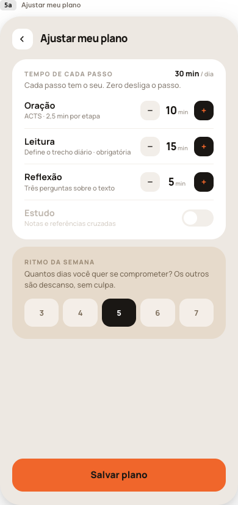

**Status:** CANÔNICA — implementar exatamente assim  
**Imagem:** `screens/5a.png` · **No arquivo de design:** `Jesus Corner Redesign.dc.html#5a`

**Textos da tela, na ordem (27):**

- Ajustar meu plano
- Tempo de cada passo
- 30 min
- / dia
- Cada passo tem o seu. Zero desliga o passo.
- Oração
- ACTS · 2,5 min por etapa
- 10
- min
- Leitura
- Define o trecho diário · obrigatória
- 15
- min
- Reflexão
- Três perguntas sobre o texto
- 5
- min
- Estudo
- Notas e referências cruzadas
- Ritmo da semana
- Quantos dias você quer se comprometer? Os outros são descanso, sem culpa.
- 3
- 4
- 5
- 6
- 7
- Salvar plano

**Cores usadas:** #EDE8E2, #FFF, #1A1714, #A29A91, #8B8279, #F2EEE9, #F0662B, #BDB5AC, #D6CFC7, #E6DACB, #9C8B76, #7A6B58  

**Checklist:**
- [ ] Todos os textos acima aparecem, letra por letra (exceto dados de exemplo)
- [ ] Ordem dos blocos igual à imagem
- [ ] Só as cores listadas; Manrope em tudo
- [ ] Nenhum texto cortado; rolagem termina acima da barra de abas
- [ ] Toque mínimo 44px; um só elemento laranja de ação
- [ ] Estado vazio e esqueleto de carregamento existem

---

### 21a · Oração — passo 1, método ACTS em quatro etapas

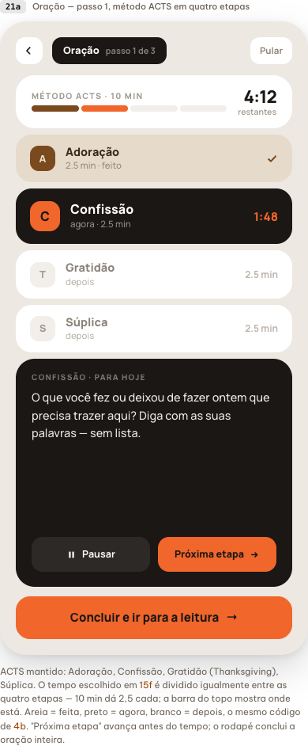

**Status:** SUPERSEDIDA — implemente 26a  
**Imagem:** `screens/21a.png` · **No arquivo de design:** `Jesus Corner Redesign.dc.html#21a`

**Nota de design:** ACTS mantido: Adoração, Confissão, Gratidão (Thanksgiving), Súplica. O tempo escolhido em 15f é dividido igualmente entre as quatro etapas — 10 min dá 2,5 cada; a barra do topo mostra onde está. Areia = feita, preto = agora, branco = depois, o mesmo código de 4b . "Próxima etapa" avança antes do tempo; o rodapé conclui a oração inteira.

_Não implementar como está — ver status acima._

---

### 21b · Reflexão — passo 3, pergunta gerada + resposta

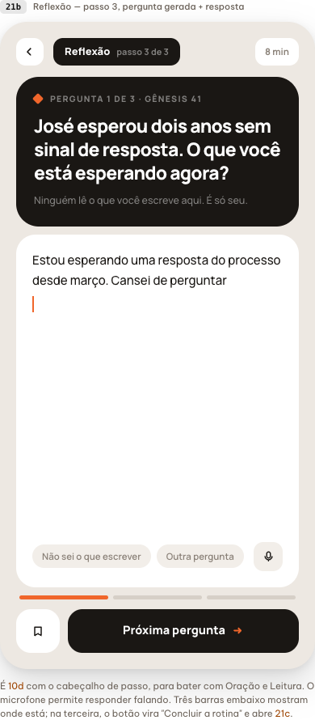

**Status:** SUPERSEDIDA — implemente 26c + 29b  
**Imagem:** `screens/21b.png` · **No arquivo de design:** `Jesus Corner Redesign.dc.html#21b`

**Nota de design:** É 10d com o cabeçalho de passo, para bater com Oração e Leitura. O microfone permite responder falando. Três barras embaixo mostram onde está; na terceira, o botão vira "Concluir a rotina" e abre 21c .

_Não implementar como está — ver status acima._

---

### 5e · Ferramentas — folha sobre a leitura

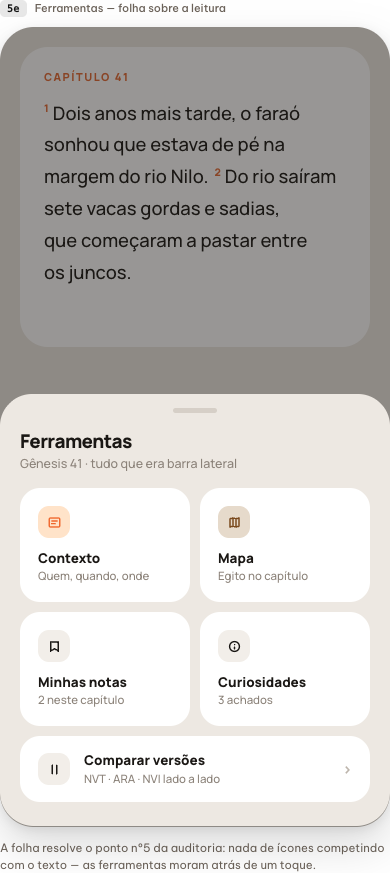

**Status:** CANÔNICA — implementar exatamente assim  
**Imagem:** `screens/5e.png` · **No arquivo de design:** `Jesus Corner Redesign.dc.html#5e`

**Textos da tela, na ordem (17):**

- Capítulo 41
- 1
- Dois anos mais tarde, o faraó sonhou que estava de pé na margem do rio Nilo.
- 2
- Do rio saíram sete vacas gordas e sadias, que começaram a pastar entre os juncos.
- Ferramentas
- Gênesis 41 · tudo que era barra lateral
- Contexto
- Quem, quando, onde
- Mapa
- Egito no capítulo
- Minhas notas
- 2 neste capítulo
- Curiosidades
- 3 achados
- Comparar versões
- NVT · ARA · NVI lado a lado

**Cores usadas:** #EDE8E2, #FFF, #F0662B, #1A1714, #D6CFC7, #8B8279, #FFE3C9, #E6DACB, #7A4A1E, #F2EEE9, #BDB5AC  

**Nota de design:** A folha resolve o ponto nº5 da auditoria: nada de ícones competindo com o texto — as ferramentas moram atrás de um toque.

**Checklist:**
- [ ] Todos os textos acima aparecem, letra por letra (exceto dados de exemplo)
- [ ] Ordem dos blocos igual à imagem
- [ ] Só as cores listadas; Manrope em tudo
- [ ] Nenhum texto cortado; rolagem termina acima da barra de abas
- [ ] Toque mínimo 44px; um só elemento laranja de ação
- [ ] Estado vazio e esqueleto de carregamento existem

---

### 18b · Trocar de capítulo sem sair da leitura

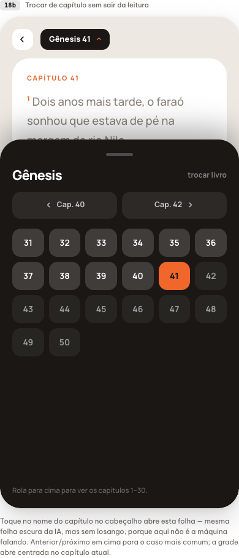

**Status:** CANÔNICA — implementar exatamente assim  
**Imagem:** `screens/18b.png` · **No arquivo de design:** `Jesus Corner Redesign.dc.html#18b`

**Textos da tela, na ordem (29):**

- Gênesis 41
- Capítulo 41
- 1
- Dois anos mais tarde, o faraó sonhou que estava de pé na margem do rio Nilo.
- Gênesis
- trocar livro
- Cap. 40
- Cap. 42
- 31
- 32
- 33
- 34
- 35
- 36
- 37
- 38
- 39
- 40
- 41
- 42
- 43
- 44
- 45
- 46
- 47
- 48
- 49
- 50
- Rola para cima para ver os capítulos 1–30.

**Cores usadas:** #EDE8E2, #FFF, #1A1714, #F0662B, #8B8279

**Nota de design:** Toque no nome do capítulo no cabeçalho abre esta folha — mesma folha escura da IA, mas sem losango, porque aqui não é a máquina falando. Anterior/próximo em cima para o caso mais comum; a grade abre centrada no capítulo atual.

   

   No app, o cabeçalho de  4a  ganha o mesmo chip escuro "Gênesis 41 ˄" de  18b  para abrir a folha. Se aprovar, atualizo o handoff com 5f, 18a e 18b.

**Checklist:**
- [ ] Todos os textos acima aparecem, letra por letra (exceto dados de exemplo)
- [ ] Ordem dos blocos igual à imagem
- [ ] Só as cores listadas; Manrope em tudo
- [ ] Nenhum texto cortado; rolagem termina acima da barra de abas
- [ ] Toque mínimo 44px; um só elemento laranja de ação
- [ ] Estado vazio e esqueleto de carregamento existem

---

### 4a · Leitura — texto primeiro, controles em bloco

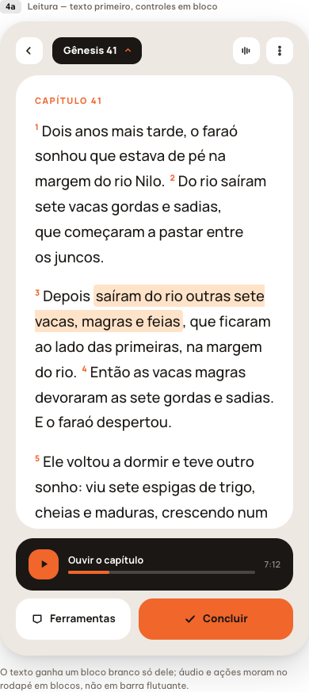

**Status:** SUPERSEDIDA — implemente 32a (leitura livre) e 26b (leitura no plano)  
**Imagem:** `screens/4a.png` · **No arquivo de design:** `Jesus Corner Redesign.dc.html#4a`

**Nota de design:** O texto ganha um bloco branco só dele; áudio e ações moram no rodapé em blocos, não em barra flutuante.

_Não implementar como está — ver status acima._

---

## Pedidos de oração (rodada 25)

### 25a · Súplica — pedidos de quem ora com você

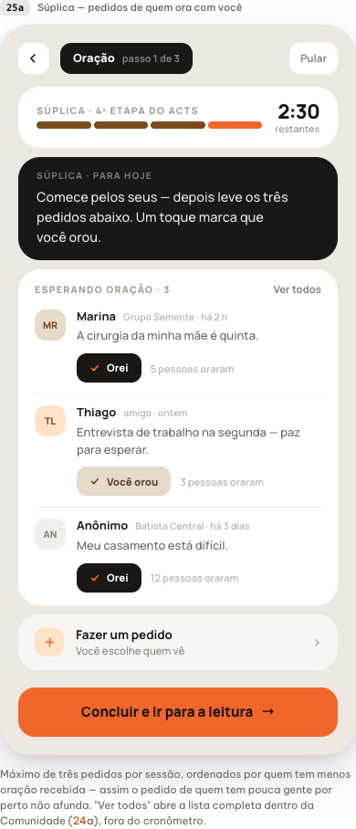

**Status:** CANÔNICA — implementar exatamente assim  
**Imagem:** `screens/25a.png` · **No arquivo de design:** `Jesus Corner Redesign.dc.html#25a`

**Textos da tela, na ordem (31):**

- Oração
- passo 1 de 3
- Pular
- Súplica · 4ª etapa do ACTS
- 2:30
- restantes
- Súplica · para hoje
- Comece pelos seus — depois leve os três pedidos abaixo. Um toque marca que você orou.
- Esperando oração · 3
- Ver todos
- MR
- Marina
- Grupo Semente · há 2 h
- A cirurgia da minha mãe é quinta.
- Orei
- 5 pessoas oraram
- TL
- Thiago
- amigo · ontem
- Entrevista de trabalho na segunda — paz para esperar.
- Você orou
- 3 pessoas oraram
- AN
- Anônimo
- Batista Central · há 3 dias
- Meu casamento está difícil.
- Orei
- 12 pessoas oraram
- Fazer um pedido
- Você escolhe quem vê
- Concluir e ir para a leitura

**Cores usadas:** #EDE8E2, #FFF, #1A1714, #8B8279, #A29A91, #7A4A1E, #F0662B, #F2EEE9, #E6DACB, #BDB5AC, #6E655C, #FFE3C9, #5A4327

**Nota de design:** Máximo de três pedidos por sessão, ordenados por quem tem menos oração recebida — assim o pedido de quem tem pouca gente por perto não afunda. "Ver todos" abre a lista completa dentro da Comunidade ( 24a ), fora do cronômetro.

**Checklist:**
- [ ] Todos os textos acima aparecem, letra por letra (exceto dados de exemplo)
- [ ] Ordem dos blocos igual à imagem
- [ ] Só as cores listadas; Manrope em tudo
- [ ] Nenhum texto cortado; rolagem termina acima da barra de abas
- [ ] Toque mínimo 44px; um só elemento laranja de ação
- [ ] Estado vazio e esqueleto de carregamento existem

---

### 25b · Fazer um pedido — quem vê vem antes

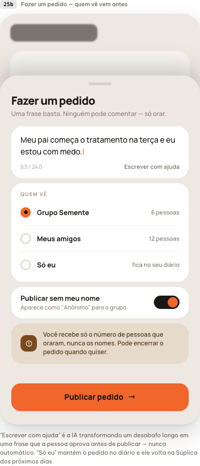

**Status:** CANÔNICA — implementar exatamente assim  
**Imagem:** `screens/25b.png` · **No arquivo de design:** `Jesus Corner Redesign.dc.html#25b`

**Textos da tela, na ordem (17):**

- Fazer um pedido
- Uma frase basta. Ninguém pode comentar — só orar.
- Meu pai começa o tratamento na terça e eu estou com medo.
- |
- 63 / 240
- Escrever com ajuda
- Quem vê
- Grupo Semente
- 6 pessoas
- Meus amigos
- 12 pessoas
- Só eu
- fica no seu diário
- Publicar sem meu nome
- Aparece como "Anônimo" para o grupo
- Você recebe só o número de pessoas que oraram, nunca os nomes. Pode encerrar o pedido quando quiser.
- Publicar pedido

**Cores usadas:** #EDE8E2, #1A1714, #FFF, #D6CFC7, #8B8279, #F0662B, #BDB5AC, #A29A91, #F2EEE9, #E6DACB, #7A4A1E, #5A4327  

**Nota de design:** "Escrever com ajuda" é a IA transformando um desabafo longo em uma frase que a pessoa aprova antes de publicar — nunca automático. "Só eu" mantém o pedido no diário e ele volta na Súplica dos próximos dias.

   

   O cartão antigo de pedido em  5d  sai: na página do grupo ele passa a ser a mesma linha de  25a , com "Orei" e o contador. Em  4b , a linha "Oração · 10 min · 2 pedidos" já antecipa quantos pedidos vão aparecer na Súplica.

**Checklist:**
- [ ] Todos os textos acima aparecem, letra por letra (exceto dados de exemplo)
- [ ] Ordem dos blocos igual à imagem
- [ ] Só as cores listadas; Manrope em tudo
- [ ] Nenhum texto cortado; rolagem termina acima da barra de abas
- [ ] Toque mínimo 44px; um só elemento laranja de ação
- [ ] Estado vazio e esqueleto de carregamento existem

---

## Estudos (rodadas 22, 26)

### 26e · Adicionar estudo — pronto ou criado

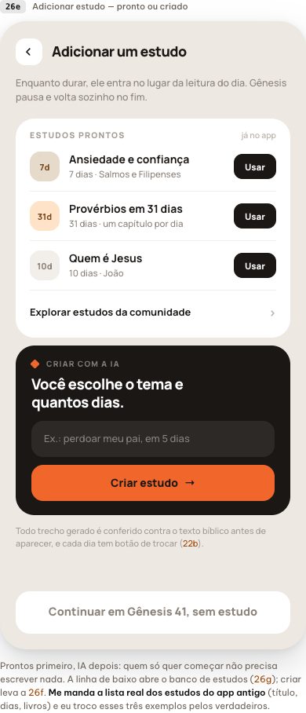

**Status:** CANÔNICA — implementar exatamente assim  
**Imagem:** `screens/26e.png` · **No arquivo de design:** `Jesus Corner Redesign.dc.html#26e`

**Textos da tela, na ordem (25):**

- Adicionar um estudo
- Enquanto durar, ele entra no lugar da leitura do dia. Gênesis pausa e volta sozinho no fim.
- Estudos prontos
- já no app
- 7d
- Ansiedade e confiança
- 7 dias · Salmos e Filipenses
- Usar
- 31d
- Provérbios em 31 dias
- 31 dias · um capítulo por dia
- Usar
- 10d
- Quem é Jesus
- 10 dias · João
- Usar
- Explorar estudos da comunidade
- Criar com a IA
- Você escolhe o tema e quantos dias.
- Ex.: perdoar meu pai, em 5 dias
- Criar estudo
- Todo trecho gerado é conferido contra o texto bíblico antes de aparecer, e cada dia tem botão de trocar (
- 22b
- ).
- Continuar em Gênesis 41, sem estudo

**Cores usadas:** #EDE8E2, #FFF, #1A1714, #8B8279, #A29A91, #BDB5AC, #F2EEE9, #E6DACB, #7A4A1E, #FFE3C9, #F0662B  
⚠ Verificar: #22B

**Nota de design:** Prontos primeiro, IA depois: quem só quer começar não precisa escrever nada. A linha de baixo abre o banco de estudos ( 26g ); criar leva a 26f . Me manda a lista real dos estudos do app antigo (título, dias, livros) e eu troco esses três exemplos pelos verdadeiros.

**Checklist:**
- [ ] Todos os textos acima aparecem, letra por letra (exceto dados de exemplo)
- [ ] Ordem dos blocos igual à imagem
- [ ] Só as cores listadas; Manrope em tudo
- [ ] Nenhum texto cortado; rolagem termina acima da barra de abas
- [ ] Toque mínimo 44px; um só elemento laranja de ação
- [ ] Estado vazio e esqueleto de carregamento existem

---

### 26f · Ajustar o estudo antes de começar

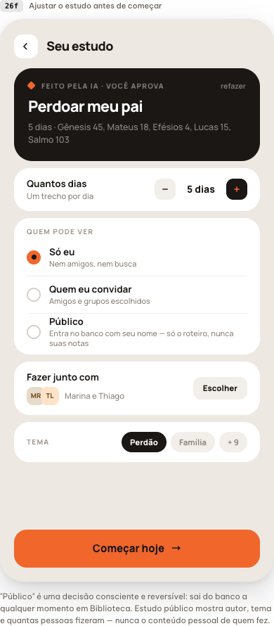

**Status:** CANÔNICA — implementar exatamente assim  
**Imagem:** `screens/26f.png` · **No arquivo de design:** `Jesus Corner Redesign.dc.html#26f`

**Textos da tela, na ordem (25):**

- Seu estudo
- Feito pela IA · você aprova
- refazer
- Perdoar meu pai
- 5 dias · Gênesis 45, Mateus 18, Efésios 4, Lucas 15, Salmo 103
- Quantos dias
- Um trecho por dia
- 5 dias
- Quem pode ver
- Só eu
- Nem amigos, nem busca
- Quem eu convidar
- Amigos e grupos escolhidos
- Público
- Entra no banco com seu nome — só o roteiro, nunca suas notas
- Fazer junto com
- MR
- TL
- Marina e Thiago
- Escolher
- Tema
- Perdão
- Família
- + 9
- Começar hoje

**Cores usadas:** #EDE8E2, #FFF, #1A1714, #F0662B, #8B8279, #F2EEE9, #A29A91, #D6CFC7, #E6DACB, #7A4A1E, #FFE3C9  

**Nota de design:** "Público" é uma decisão consciente e reversível: sai do banco a qualquer momento em Biblioteca. Estudo público mostra autor, tema e quantas pessoas fizeram — nunca o conteúdo pessoal de quem fez.

**Checklist:**
- [ ] Todos os textos acima aparecem, letra por letra (exceto dados de exemplo)
- [ ] Ordem dos blocos igual à imagem
- [ ] Só as cores listadas; Manrope em tudo
- [ ] Nenhum texto cortado; rolagem termina acima da barra de abas
- [ ] Toque mínimo 44px; um só elemento laranja de ação
- [ ] Estado vazio e esqueleto de carregamento existem

---

### 26g · Banco de estudos — buscar por tema

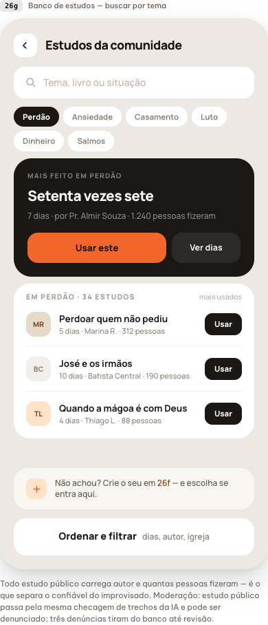

**Status:** CANÔNICA — implementar exatamente assim  
**Imagem:** `screens/26g.png` · **No arquivo de design:** `Jesus Corner Redesign.dc.html#26g`

**Textos da tela, na ordem (32):**

- Estudos da comunidade
- Tema, livro ou situação
- Perdão
- Ansiedade
- Casamento
- Luto
- Dinheiro
- Salmos
- Mais feito em perdão
- Setenta vezes sete
- 7 dias · por Pr. Almir Souza · 1.240 pessoas fizeram
- Usar este
- Ver dias
- Em perdão · 34 estudos
- mais usados
- MR
- Perdoar quem não pediu
- 5 dias · Marina R. · 312 pessoas
- Usar
- BC
- José e os irmãos
- 10 dias · Batista Central · 190 pessoas
- Usar
- TL
- Quando a mágoa é com Deus
- 4 dias · Thiago L. · 88 pessoas
- Usar
- Não achou? Crie o seu em
- 26f
- — e escolha se entra aqui.
- Ordenar e filtrar
- dias, autor, igreja

**Cores usadas:** #EDE8E2, #FFF, #1A1714, #BDB5AC, #8B8279, #F0662B, #A29A91, #F2EEE9, #E6DACB, #7A4A1E, #FFE3C9, #6E655C  
⚠ Verificar: #26F

**Nota de design:** Todo estudo público carrega autor e quantas pessoas fizeram — é o que separa o confiável do improvisado. Moderação: estudo público passa pela mesma checagem de trechos da IA e pode ser denunciado; três denúncias tiram do banco até revisão.

   

   Substitui o turno 21 na implementação:  26a  no lugar de  21a ,  26c  no lugar de  21b , e  26b  passa a ser a leitura dentro da rotina ( 4a  continua sendo a leitura livre, sem chip de passo). O fechamento do dia segue  21c , só trocando os tempos fixos pelos escolhidos em  26d .

**Checklist:**
- [ ] Todos os textos acima aparecem, letra por letra (exceto dados de exemplo)
- [ ] Ordem dos blocos igual à imagem
- [ ] Só as cores listadas; Manrope em tudo
- [ ] Nenhum texto cortado; rolagem termina acima da barra de abas
- [ ] Toque mínimo 44px; um só elemento laranja de ação
- [ ] Estado vazio e esqueleto de carregamento existem

---

### 22a · Criar — o pedido

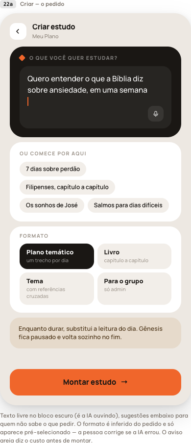

**Status:** CANÔNICA — implementar exatamente assim  
**Imagem:** `screens/22a.png` · **No arquivo de design:** `Jesus Corner Redesign.dc.html#22a`

**Textos da tela, na ordem (20):**

- Criar estudo
- Meu Plano
- O que você quer estudar?
- Quero entender o que a Bíblia diz sobre ansiedade, em uma semana
- Ou comece por aqui
- 7 dias sobre perdão
- Filipenses, capítulo a capítulo
- Os sonhos de José
- Salmos para dias difíceis
- Formato
- Plano temático
- um trecho por dia
- Livro
- capítulo a capítulo
- Tema
- com referências cruzadas
- Para o grupo
- só admin
- Enquanto durar, substitui a leitura do dia. Gênesis fica pausado e volta sozinho no fim.
- Montar estudo

**Cores usadas:** #EDE8E2, #FFF, #1A1714, #8B8279, #F0662B, #A29A91, #F2EEE9, #E6DACB, #5A4327

**Nota de design:** Texto livre no bloco escuro (é a IA ouvindo), sugestões embaixo para quem não sabe o que pedir. O formato é inferido do pedido e só aparece pré-selecionado — a pessoa corrige se a IA errou. O aviso areia diz o custo antes de montar.

**Checklist:**
- [ ] Todos os textos acima aparecem, letra por letra (exceto dados de exemplo)
- [ ] Ordem dos blocos igual à imagem
- [ ] Só as cores listadas; Manrope em tudo
- [ ] Nenhum texto cortado; rolagem termina acima da barra de abas
- [ ] Toque mínimo 44px; um só elemento laranja de ação
- [ ] Estado vazio e esqueleto de carregamento existem

---

### 22b · Proposta — revisar dia a dia antes de começar

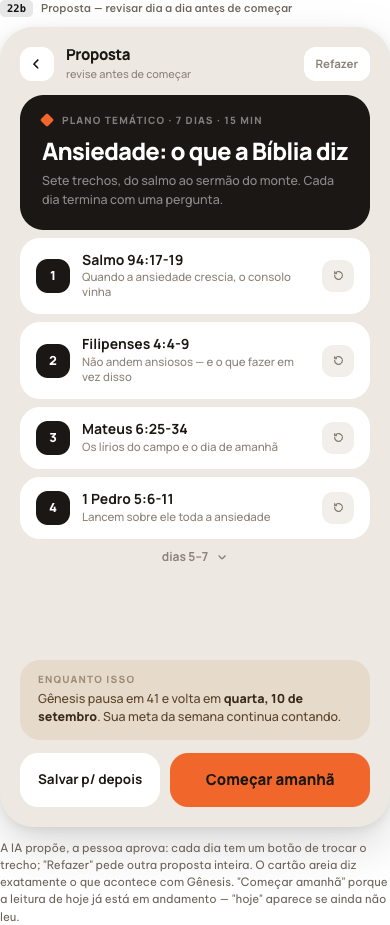

**Status:** CANÔNICA — implementar exatamente assim  
**Imagem:** `screens/22b.png` · **No arquivo de design:** `Jesus Corner Redesign.dc.html#22b`

**Textos da tela, na ordem (25):**

- Proposta
- revise antes de começar
- Refazer
- Plano temático · 7 dias · 15 min
- Ansiedade: o que a Bíblia diz
- Sete trechos, do salmo ao sermão do monte. Cada dia termina com uma pergunta.
- 1
- Salmo 94:17-19
- Quando a ansiedade crescia, o consolo vinha
- 2
- Filipenses 4:4-9
- Não andem ansiosos — e o que fazer em vez disso
- 3
- Mateus 6:25-34
- Os lírios do campo e o dia de amanhã
- 4
- 1 Pedro 5:6-11
- Lancem sobre ele toda a ansiedade
- dias 5–7
- Enquanto isso
- Gênesis pausa em 41 e volta em
- quarta, 10 de setembro
- . Sua meta da semana continua contando.
- Salvar p/ depois
- Começar amanhã

**Cores usadas:** #EDE8E2, #FFF, #1A1714, #8B8279, #F0662B, #F2EEE9, #E6DACB, #9C8B76, #5A4327, #3A2A18

**Nota de design:** A IA propõe, a pessoa aprova: cada dia tem um botão de trocar o trecho; "Refazer" pede outra proposta inteira. O cartão areia diz exatamente o que acontece com Gênesis. "Começar amanhã" porque a leitura de hoje já está em andamento — "hoje" aparece se ainda não leu.

**Checklist:**
- [ ] Todos os textos acima aparecem, letra por letra (exceto dados de exemplo)
- [ ] Ordem dos blocos igual à imagem
- [ ] Só as cores listadas; Manrope em tudo
- [ ] Nenhum texto cortado; rolagem termina acima da barra de abas
- [ ] Toque mínimo 44px; um só elemento laranja de ação
- [ ] Estado vazio e esqueleto de carregamento existem

---

### 22c · Meu Plano com o estudo ativo

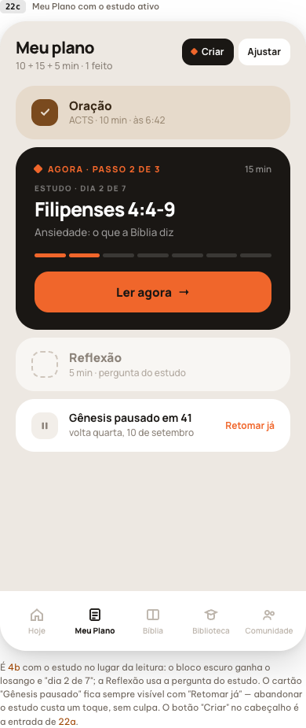

**Status:** CANÔNICA — implementar exatamente assim  
**Imagem:** `screens/22c.png` · **No arquivo de design:** `Jesus Corner Redesign.dc.html#22c`

**Textos da tela, na ordem (22):**

- Meu plano
- 10 + 15 + 5 min · 1 feito
- Criar
- Ajustar
- Oração
- ACTS · 10 min · às 6:42
- Agora · passo 2 de 3
- 15 min
- Estudo · dia 2 de 7
- Filipenses 4:4-9
- Ansiedade: o que a Bíblia diz
- Ler agora
- Reflexão
- 5 min · pergunta do estudo
- Gênesis pausado em 41
- volta quarta, 10 de setembro
- Retomar já
- Hoje
- Meu Plano
- Bíblia
- Biblioteca
- Comunidade

**Cores usadas:** #EDE8E2, #1A1714, #8B8279, #F0662B, #FFF, #E6DACB, #7A4A1E, #3A2A18, #9C8B76, #CFC6BC, #B0A79E, #F2EEE9, #BDB5AC  

**Nota de design:** É 4b com o estudo no lugar da leitura: o bloco escuro ganha o losango e "dia 2 de 7"; a Reflexão usa a pergunta do estudo. O cartão "Gênesis pausado" fica sempre visível com "Retomar já" — abandonar o estudo custa um toque, sem culpa. O botão "Criar" no cabeçalho é a entrada de 22a .

**Checklist:**
- [ ] Todos os textos acima aparecem, letra por letra (exceto dados de exemplo)
- [ ] Ordem dos blocos igual à imagem
- [ ] Só as cores listadas; Manrope em tudo
- [ ] Nenhum texto cortado; rolagem termina acima da barra de abas
- [ ] Toque mínimo 44px; um só elemento laranja de ação
- [ ] Estado vazio e esqueleto de carregamento existem

---

### 22d · Para o grupo — o admin cria, o líder recebe a pergunta

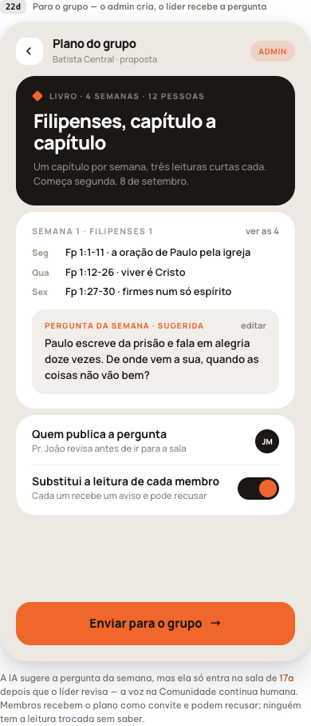

**Status:** CANÔNICA — implementar exatamente assim  
**Imagem:** `screens/22d.png` · **No arquivo de design:** `Jesus Corner Redesign.dc.html#22d`

**Textos da tela, na ordem (23):**

- Plano do grupo
- Batista Central · proposta
- Admin
- Livro · 4 semanas · 12 pessoas
- Filipenses, capítulo a capítulo
- Um capítulo por semana, três leituras curtas cada. Começa segunda, 8 de setembro.
- Semana 1 · Filipenses 1
- ver as 4
- Seg
- Fp 1:1-11 · a oração de Paulo pela igreja
- Qua
- Fp 1:12-26 · viver é Cristo
- Sex
- Fp 1:27-30 · firmes num só espírito
- Pergunta da semana · sugerida
- editar
- Paulo escreve da prisão e fala em alegria doze vezes. De onde vem a sua, quando as coisas não vão bem?
- Quem publica a pergunta
- Pr. João revisa antes de ir para a sala
- JM
- Substitui a leitura de cada membro
- Cada um recebe um aviso e pode recusar
- Enviar para o grupo

**Cores usadas:** #EDE8E2, #FFF, #1A1714, #8B8279, #F0662B, #A29A91, #F2EEE9

**Nota de design:** A IA sugere a pergunta da semana, mas ela só entra na sala de 17a depois que o líder revisa — a voz na Comunidade continua humana. Membros recebem o plano como convite e podem recusar; ninguém tem a leitura trocada sem saber.

   

   Para bater com o resto:  4b  ganha o botão "Criar" no cabeçalho (como em  22c ); a Biblioteca ( 4c ) ganha uma seção "Meus estudos" com os salvos e concluídos; e a administração ( 19c ) ganha a linha "Plano do grupo". Aplico os três se aprovar. Uma regra de produto que vale escrever no handoff: trecho gerado pela IA que não bater com o texto da versão escolhida é descartado antes de mostrar.

**Checklist:**
- [ ] Todos os textos acima aparecem, letra por letra (exceto dados de exemplo)
- [ ] Ordem dos blocos igual à imagem
- [ ] Só as cores listadas; Manrope em tudo
- [ ] Nenhum texto cortado; rolagem termina acima da barra de abas
- [ ] Toque mínimo 44px; um só elemento laranja de ação
- [ ] Estado vazio e esqueleto de carregamento existem

---

## Biblioteca

### 4c · Biblioteca — notas, marcações e estudos

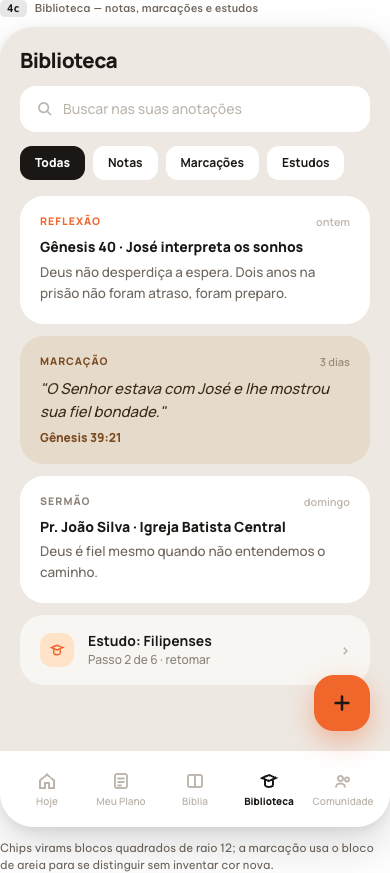

**Status:** CANÔNICA — implementar exatamente assim  
**Imagem:** `screens/4c.png` · **No arquivo de design:** `Jesus Corner Redesign.dc.html#4c`

**Textos da tela, na ordem (25):**

- Biblioteca
- Buscar nas suas anotações
- Todas
- Notas
- Marcações
- Estudos
- Reflexão
- ontem
- Gênesis 40 · José interpreta os sonhos
- Deus não desperdiça a espera. Dois anos na prisão não foram atraso, foram preparo.
- Marcação
- 3 dias
- "O Senhor estava com José e lhe mostrou sua fiel bondade."
- Gênesis 39:21
- Sermão
- domingo
- Pr. João Silva · Igreja Batista Central
- Deus é fiel mesmo quando não entendemos o caminho.
- Estudo: Filipenses
- Passo 2 de 6 · retomar
- Hoje
- Meu Plano
- Bíblia
- Biblioteca
- Comunidade

**Cores usadas:** #EDE8E2, #1A1714, #FFF, #BDB5AC, #F0662B, #6E655C, #E6DACB, #7A4A1E, #9C8B76, #3A2A18, #8B8279, #FFE3C9

**Nota de design:** Chips virams blocos quadrados de raio 12; a marcação usa o bloco de areia para se distinguir sem inventar cor nova.

   

   Falta o quê? Posso fazer no mesmo padrão: Caminhada (métricas completas), Onboarding, Comunidade e a folha de Ferramentas da leitura.

**Checklist:**
- [ ] Todos os textos acima aparecem, letra por letra (exceto dados de exemplo)
- [ ] Ordem dos blocos igual à imagem
- [ ] Só as cores listadas; Manrope em tudo
- [ ] Nenhum texto cortado; rolagem termina acima da barra de abas
- [ ] Toque mínimo 44px; um só elemento laranja de ação
- [ ] Estado vazio e esqueleto de carregamento existem

---

## Comunidade (rodadas 5, 17, 24)

### 24a · Início da Comunidade — grupos e amigos

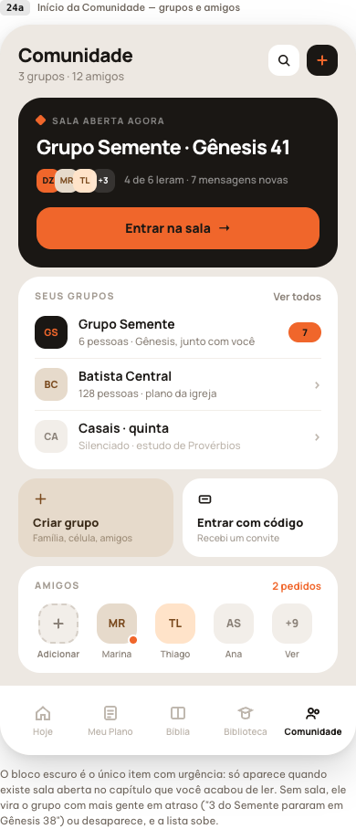

**Status:** CANÔNICA — implementar exatamente assim  
**Imagem:** `screens/24a.png` · **No arquivo de design:** `Jesus Corner Redesign.dc.html#24a`

**Textos da tela, na ordem (42):**

- Comunidade
- 3 grupos · 12 amigos
- Sala aberta agora
- Grupo Semente · Gênesis 41
- DZ
- MR
- TL
- +3
- 4 de 6 leram · 7 mensagens novas
- Entrar na sala
- Seus grupos
- Ver todos
- GS
- Grupo Semente
- 6 pessoas · Gênesis, junto com você
- 7
- BC
- Batista Central
- 128 pessoas · plano da igreja
- CA
- Casais · quinta
- Silenciado · estudo de Provérbios
- Criar grupo
- Família, célula, amigos
- Entrar com código
- Recebi um convite
- Amigos
- 2 pedidos
- Adicionar
- MR
- Marina
- TL
- Thiago
- AS
- Ana
- +9
- Ver
- Hoje
- Meu Plano
- Bíblia
- Biblioteca
- Comunidade

**Cores usadas:** #EDE8E2, #1A1714, #8B8279, #FFF, #F0662B, #E6DACB, #7A4A1E, #FFE3C9, #A29A91, #F2EEE9, #BDB5AC, #3A2A18, #9C8B76, #D6CFC7  

**Nota de design:** O bloco escuro é o único item com urgência: só aparece quando existe sala aberta no capítulo que você acabou de ler. Sem sala, ele vira o grupo com mais gente em atraso ("3 do Semente pararam em Gênesis 38") ou desaparece, e a lista sobe.

**Checklist:**
- [ ] Todos os textos acima aparecem, letra por letra (exceto dados de exemplo)
- [ ] Ordem dos blocos igual à imagem
- [ ] Só as cores listadas; Manrope em tudo
- [ ] Nenhum texto cortado; rolagem termina acima da barra de abas
- [ ] Toque mínimo 44px; um só elemento laranja de ação
- [ ] Estado vazio e esqueleto de carregamento existem

---

### 24b · Criar grupo — folha em três decisões

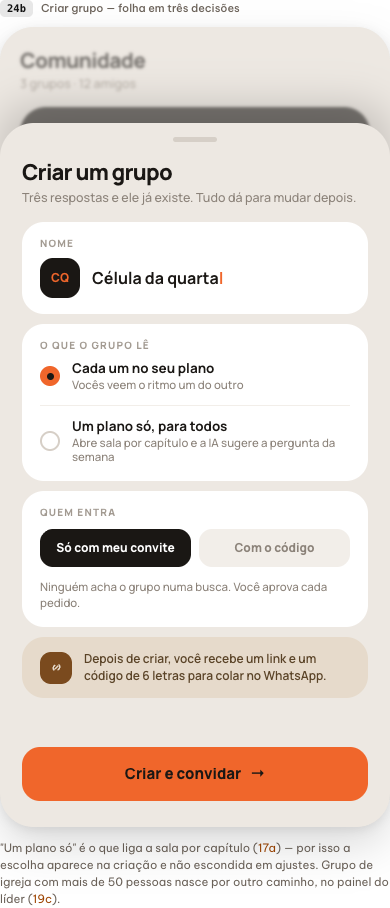

**Status:** CANÔNICA — implementar exatamente assim  
**Imagem:** `screens/24b.png` · **No arquivo de design:** `Jesus Corner Redesign.dc.html#24b`

**Textos da tela, na ordem (19):**

- Comunidade
- 3 grupos · 12 amigos
- Criar um grupo
- Três respostas e ele já existe. Tudo dá para mudar depois.
- Nome
- CQ
- Célula da quarta
- |
- O que o grupo lê
- Cada um no seu plano
- Vocês veem o ritmo um do outro
- Um plano só, para todos
- Abre sala por capítulo e a IA sugere a pergunta da semana
- Quem entra
- Só com meu convite
- Com o código
- Ninguém acha o grupo numa busca. Você aprova cada pedido.
- Depois de criar, você recebe um link e um código de 6 letras para colar no WhatsApp.
- Criar e convidar

**Cores usadas:** #EDE8E2, #1A1714, #8B8279, #FFF, #D6CFC7, #A29A91, #F0662B, #F2EEE9, #E6DACB, #7A4A1E, #5A4327  

**Nota de design:** "Um plano só" é o que liga a sala por capítulo ( 17a ) — por isso a escolha aparece na criação e não escondida em ajustes. Grupo de igreja com mais de 50 pessoas nasce por outro caminho, no painel do líder ( 19c ).

**Checklist:**
- [ ] Todos os textos acima aparecem, letra por letra (exceto dados de exemplo)
- [ ] Ordem dos blocos igual à imagem
- [ ] Só as cores listadas; Manrope em tudo
- [ ] Nenhum texto cortado; rolagem termina acima da barra de abas
- [ ] Toque mínimo 44px; um só elemento laranja de ação
- [ ] Estado vazio e esqueleto de carregamento existem

---

### 24c · Adicionar amigos — pedidos primeiro

**Status:** CANÔNICA — implementar exatamente assim  
**Imagem:** `screens/24c.png` · **No arquivo de design:** `Jesus Corner Redesign.dc.html#24c`

**Textos da tela, na ordem (31):**

- Amigos
- Nome, @usuário ou telefone
- Querem te acompanhar · 2
- RS
- Rafael Souza
- Batista Central · 3 amigos em comum
- Aceitar
- JP
- Julia Prado
- Está nos seus contatos
- Aceitar
- Compartilhar meu convite
- jesuscorner.app/d/diego
- Enviar
- Talvez você conheça
- dos seus grupos
- CM
- Camila Moraes
- Grupo Semente
- Adicionar
- PH
- Pedro Henrique
- Casais · quinta
- Adicionar
- LB
- Letícia Braga
- Batista Central
- Enviado
- Ver meus 12 amigos
- Amigo vê seu ritmo e suas notas compartilhadas — nunca notas privadas, marcações nem conversas com a IA.
- Convidar pelo WhatsApp

**Cores usadas:** #EDE8E2, #FFF, #1A1714, #BDB5AC, #E6DACB, #7A4A1E, #F0662B, #FFE3C9, #3A2A18, #9C8B76, #A29A91, #F2EEE9, #8B8279

**Nota de design:** Sem aba de busca vazia: a tela abre no que já está esperando resposta. A leitura de contatos é opcional e só entra se a pessoa autorizar — sem isso, o caminho é o link de convite.

   

   O que muda no que já existe: a aba Comunidade passa a abrir  24a ;  5d  ganha um botão de voltar no cabeçalho, porque agora é uma página interna; e o perfil ( 19a ) ganha a linha "Amigos e convites" apontando para  24c . Se quiser, desenho também a página do amigo (ritmo, notas compartilhadas, "orar por") e a tela de aprovação de pedidos de entrada no grupo.

**Checklist:**
- [ ] Todos os textos acima aparecem, letra por letra (exceto dados de exemplo)
- [ ] Ordem dos blocos igual à imagem
- [ ] Só as cores listadas; Manrope em tudo
- [ ] Nenhum texto cortado; rolagem termina acima da barra de abas
- [ ] Toque mínimo 44px; um só elemento laranja de ação
- [ ] Estado vazio e esqueleto de carregamento existem

---

### 5d · Comunidade — grupo e pedidos de oração

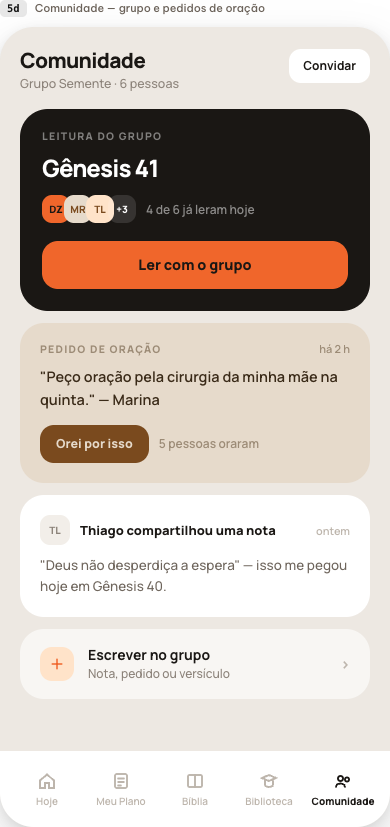

**Status:** CANÔNICA — implementar exatamente assim  
**Imagem:** `screens/5d.png` · **No arquivo de design:** `Jesus Corner Redesign.dc.html#5d`

**Textos da tela, na ordem (27):**

- Comunidade
- Grupo Semente · 6 pessoas
- Convidar
- Leitura do grupo
- Gênesis 41
- DZ
- MR
- TL
- +3
- 4 de 6 já leram hoje
- Ler com o grupo
- Pedido de oração
- há 2 h
- "Peço oração pela cirurgia da minha mãe na quinta." — Marina
- Orei por isso
- 5 pessoas oraram
- TL
- Thiago compartilhou uma nota
- ontem
- "Deus não desperdiça a espera" — isso me pegou hoje em Gênesis 40.
- Escrever no grupo
- Nota, pedido ou versículo
- Hoje
- Meu Plano
- Bíblia
- Biblioteca
- Comunidade

**Cores usadas:** #EDE8E2, #1A1714, #8B8279, #FFF, #F0662B, #E6DACB, #7A4A1E, #FFE3C9, #9C8B76, #3A2A18, #F2EEE9, #BDB5AC, #6E655C

**Checklist:**
- [ ] Todos os textos acima aparecem, letra por letra (exceto dados de exemplo)
- [ ] Ordem dos blocos igual à imagem
- [ ] Só as cores listadas; Manrope em tudo
- [ ] Nenhum texto cortado; rolagem termina acima da barra de abas
- [ ] Toque mínimo 44px; um só elemento laranja de ação
- [ ] Estado vazio e esqueleto de carregamento existem

---

### 17a · Sala do capítulo — só abre para quem leu

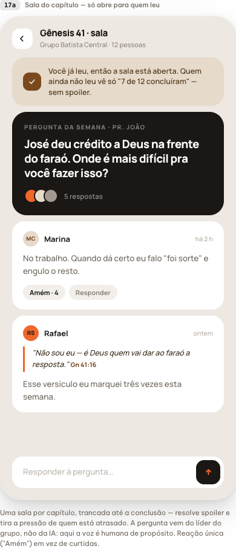

**Status:** CANÔNICA — implementar exatamente assim  
**Imagem:** `screens/17a.png` · **No arquivo de design:** `Jesus Corner Redesign.dc.html#17a`

**Textos da tela, na ordem (19):**

- Gênesis 41 · sala
- Grupo Batista Central · 12 pessoas
- Você já leu, então a sala está aberta. Quem ainda não leu vê só "7 de 12 concluíram" — sem spoiler.
- Pergunta da semana · Pr. João
- José deu crédito a Deus na frente do faraó. Onde é mais difícil pra você fazer isso?
- 5 respostas
- MC
- Marina
- há 2 h
- No trabalho. Quando dá certo eu falo "foi sorte" e engulo o resto.
- Amém · 4
- Responder
- RS
- Rafael
- ontem
- "Não sou eu — é Deus quem vai dar ao faraó a resposta."
- Gn 41:16
- Esse versículo eu marquei três vezes esta semana.
- Responder à pergunta…

**Cores usadas:** #EDE8E2, #FFF, #1A1714, #8B8279, #E6DACB, #7A4A1E, #5A4327, #F0662B, #A29A91, #BDB5AC, #6E655C, #F2EEE9, #3A2A18

**Nota de design:** Uma sala por capítulo, trancada até a conclusão — resolve spoiler e tira a pressão de quem está atrasado. A pergunta vem do líder do grupo, não da IA: aqui a voz é humana de propósito. Reação única ("Amém") em vez de curtidas.

**Checklist:**
- [ ] Todos os textos acima aparecem, letra por letra (exceto dados de exemplo)
- [ ] Ordem dos blocos igual à imagem
- [ ] Só as cores listadas; Manrope em tudo
- [ ] Nenhum texto cortado; rolagem termina acima da barra de abas
- [ ] Toque mínimo 44px; um só elemento laranja de ação
- [ ] Estado vazio e esqueleto de carregamento existem

---

### 17b · Retrospectiva do mês — o app se vendendo sozinho

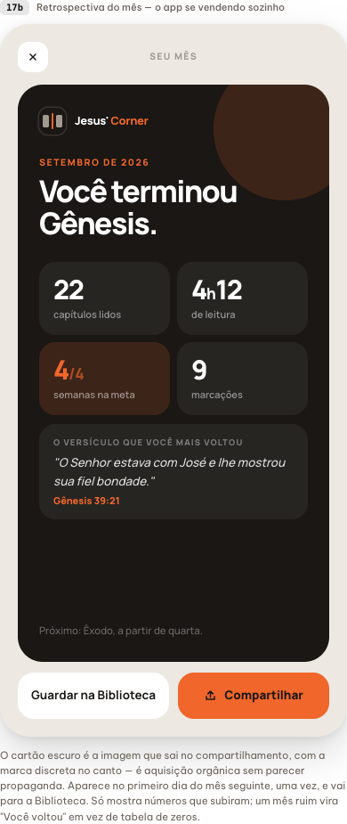

**Status:** CANÔNICA — implementar exatamente assim  
**Imagem:** `screens/17b.png` · **No arquivo de design:** `Jesus Corner Redesign.dc.html#17b`

**Textos da tela, na ordem (22):**

- Seu mês
- Jesus'
- Corner
- Setembro de 2026
- Você terminou Gênesis.
- 22
- capítulos lidos
- 4
- h
- 12
- de leitura
- 4
- /4
- semanas na meta
- 9
- marcações
- O versículo que você mais voltou
- "O Senhor estava com José e lhe mostrou sua fiel bondade."
- Gênesis 39:21
- Próximo: Êxodo, a partir de quarta.
- Guardar na Biblioteca
- Compartilhar

**Cores usadas:** #EDE8E2, #FFF, #1A1714, #A29A91, #F0662B

**Nota de design:** O cartão escuro é a imagem que sai no compartilhamento, com a marca discreta no canto — é aquisição orgânica sem parecer propaganda. Aparece no primeiro dia do mês seguinte, uma vez, e vai para a Biblioteca. Só mostra números que subiram; um mês ruim vira "Você voltou" em vez de tabela de zeros.

**Checklist:**
- [ ] Todos os textos acima aparecem, letra por letra (exceto dados de exemplo)
- [ ] Ordem dos blocos igual à imagem
- [ ] Só as cores listadas; Manrope em tudo
- [ ] Nenhum texto cortado; rolagem termina acima da barra de abas
- [ ] Toque mínimo 44px; um só elemento laranja de ação
- [ ] Estado vazio e esqueleto de carregamento existem

---

### 17c · Leitura com a camada do grupo

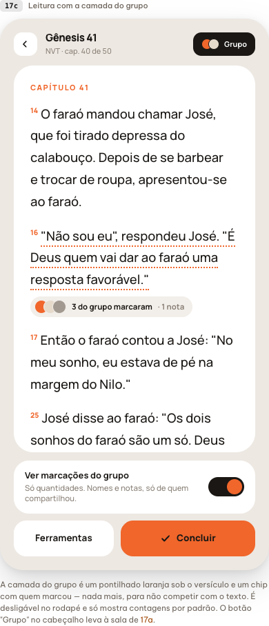

**Status:** CANÔNICA — implementar exatamente assim  
**Imagem:** `screens/17c.png` · **No arquivo de design:** `Jesus Corner Redesign.dc.html#17c`

**Textos da tela, na ordem (18):**

- Gênesis 41
- NVT · cap. 40 de 50
- Grupo
- Capítulo 41
- 14
- O faraó mandou chamar José, que foi tirado depressa do calabouço. Depois de se barbear e trocar de roupa, apresentou-se ao faraó.
- 16
- "Não sou eu", respondeu José. "É Deus quem vai dar ao faraó uma resposta favorável."
- 3 do grupo marcaram
- · 1 nota
- 17
- Então o faraó contou a José: "No meu sonho, eu estava de pé na margem do Nilo."
- 25
- José disse ao faraó: "Os dois sonhos do faraó são um só. Deus revelou ao faraó o que está prestes a fazer."
- Ver marcações do grupo
- Só quantidades. Nomes e notas, só de quem compartilhou.
- Ferramentas
- Concluir

**Cores usadas:** #EDE8E2, #FFF, #1A1714, #8B8279, #F0662B, #E6DACB, #F2EEE9, #A29A91

**Nota de design:** A camada do grupo é um pontilhado laranja sob o versículo e um chip com quem marcou — nada mais, para não competir com o texto. É desligável no rodapé e só mostra contagens por padrão. O botão "Grupo" no cabeçalho leva à sala de 17a .

   

   O que eu aplicaria primeiro: o achado 4 (Início sem zeros na primeira semana) custa uma regra e evita o pior primeiro dia possível; o 6 (reportar resposta) é obrigatório antes de a IA ir ao ar.  17c  é a maior mudança de produto — leitura social dentro do texto — e a que mais aproxima o app do que faz o Fable reter. Os cinco ajustes já estão aplicados: regra da primeira semana e saudação no título em  12a , onboarding em 7 telas ( 15  e  14 ), "Reportar resposta" em  10b  e aviso do grupo em  10f .

**Checklist:**
- [ ] Todos os textos acima aparecem, letra por letra (exceto dados de exemplo)
- [ ] Ordem dos blocos igual à imagem
- [ ] Só as cores listadas; Manrope em tudo
- [ ] Nenhum texto cortado; rolagem termina acima da barra de abas
- [ ] Toque mínimo 44px; um só elemento laranja de ação
- [ ] Estado vazio e esqueleto de carregamento existem

---

## Perfil (rodada 19)

### 19a · Perfil — abre ao tocar nas iniciais

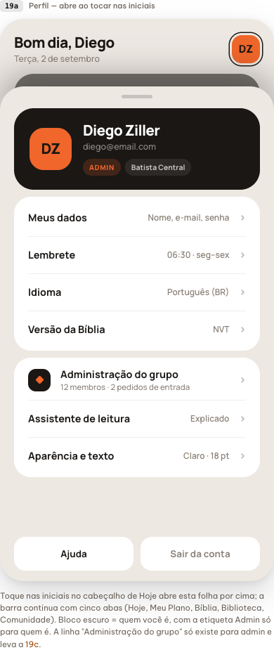

**Status:** CANÔNICA — implementar exatamente assim  
**Imagem:** `screens/19a.png` · **No arquivo de design:** `Jesus Corner Redesign.dc.html#19a`

**Textos da tela, na ordem (23):**

- Bom dia, Diego
- Terça, 2 de setembro
- DZ
- Diego Ziller
- diego@email.com
- Admin
- Batista Central
- Meus dados
- Nome, e-mail, senha
- Lembrete
- 06:30 · seg–sex
- Idioma
- Português (BR)
- Versão da Bíblia
- NVT
- Administração do grupo
- 12 membros · 2 pedidos de entrada
- Assistente de leitura
- Explicado
- Aparência e texto
- Claro · 18 pt
- Ajuda
- Sair da conta

**Cores usadas:** #EDE8E2, #1A1714, #8B8279, #F0662B, #FFF, #F2EEE9, #BDB5AC

**Nota de design:** Toque nas iniciais no cabeçalho de Hoje abre esta folha por cima; a barra continua com cinco abas (Hoje, Meu Plano, Bíblia, Biblioteca, Comunidade). Bloco escuro = quem você é, com a etiqueta Admin só para quem é. A linha "Administração do grupo" só existe para admin e leva a 19c .

**Checklist:**
- [ ] Todos os textos acima aparecem, letra por letra (exceto dados de exemplo)
- [ ] Ordem dos blocos igual à imagem
- [ ] Só as cores listadas; Manrope em tudo
- [ ] Nenhum texto cortado; rolagem termina acima da barra de abas
- [ ] Toque mínimo 44px; um só elemento laranja de ação
- [ ] Estado vazio e esqueleto de carregamento existem

---

### 19b · Idioma — do app e da Bíblia, separados

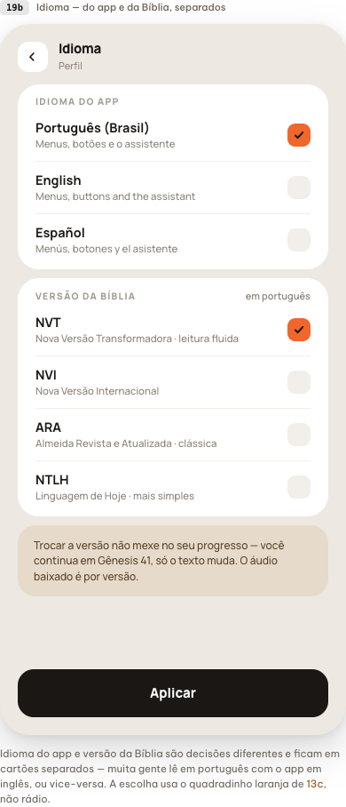

**Status:** CANÔNICA — implementar exatamente assim  
**Imagem:** `screens/19b.png` · **No arquivo de design:** `Jesus Corner Redesign.dc.html#19b`

**Textos da tela, na ordem (21):**

- Idioma
- Perfil
- Idioma do app
- Português (Brasil)
- Menus, botões e o assistente
- English
- Menus, buttons and the assistant
- Español
- Menús, botones y el asistente
- Versão da Bíblia
- em português
- NVT
- Nova Versão Transformadora · leitura fluida
- NVI
- Nova Versão Internacional
- ARA
- Almeida Revista e Atualizada · clássica
- NTLH
- Linguagem de Hoje · mais simples
- Trocar a versão não mexe no seu progresso — você continua em Gênesis 41, só o texto muda. O áudio baixado é por versão.
- Aplicar

**Cores usadas:** #EDE8E2, #FFF, #1A1714, #8B8279, #A29A91, #F2EEE9, #F0662B, #E6DACB, #5A4327

**Nota de design:** Idioma do app e versão da Bíblia são decisões diferentes e ficam em cartões separados — muita gente lê em português com o app em inglês, ou vice-versa. A escolha usa o quadradinho laranja de 13c , não rádio.

**Checklist:**
- [ ] Todos os textos acima aparecem, letra por letra (exceto dados de exemplo)
- [ ] Ordem dos blocos igual à imagem
- [ ] Só as cores listadas; Manrope em tudo
- [ ] Nenhum texto cortado; rolagem termina acima da barra de abas
- [ ] Toque mínimo 44px; um só elemento laranja de ação
- [ ] Estado vazio e esqueleto de carregamento existem

---

### 19c · Administração do grupo — só para admin

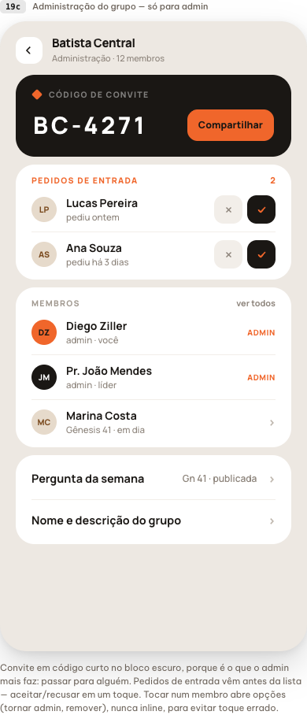

**Status:** CANÔNICA — implementar exatamente assim  
**Imagem:** `screens/19c.png` · **No arquivo de design:** `Jesus Corner Redesign.dc.html#19c`

**Textos da tela, na ordem (29):**

- Batista Central
- Administração · 12 membros
- Código de convite
- BC-4271
- Compartilhar
- Pedidos de entrada
- 2
- LP
- Lucas Pereira
- pediu ontem
- AS
- Ana Souza
- pediu há 3 dias
- Membros
- ver todos
- DZ
- Diego Ziller
- admin · você
- Admin
- JM
- Pr. João Mendes
- admin · líder
- Admin
- MC
- Marina Costa
- Gênesis 41 · em dia
- Pergunta da semana
- Gn 41 · publicada
- Nome e descrição do grupo

**Cores usadas:** #EDE8E2, #FFF, #1A1714, #8B8279, #F0662B, #F2EEE9, #E6DACB, #7A4A1E, #A29A91, #BDB5AC

**Nota de design:** Convite em código curto no bloco escuro, porque é o que o admin mais faz: passar para alguém. Pedidos de entrada vêm antes da lista — aceitar/recusar em um toque. Tocar num membro abre opções (tornar admin, remover), nunca inline, para evitar toque errado.

   

   Para quem não tem conta, a folha abre com o bloco escuro de  13c  em versão curta ("guarde sua leitura") e sem as linhas Meus dados e Administração — o resto (lembrete, idioma, versão) funciona igual. Se aprovar, incluo 5f, 18a, 18b e 19a–c no handoff.

**Checklist:**
- [ ] Todos os textos acima aparecem, letra por letra (exceto dados de exemplo)
- [ ] Ordem dos blocos igual à imagem
- [ ] Só as cores listadas; Manrope em tudo
- [ ] Nenhum texto cortado; rolagem termina acima da barra de abas
- [ ] Toque mínimo 44px; um só elemento laranja de ação
- [ ] Estado vazio e esqueleto de carregamento existem

---

## IA na leitura (rodada 10)

### 10a · Selecionou um trecho — "Perguntar" entra no menu

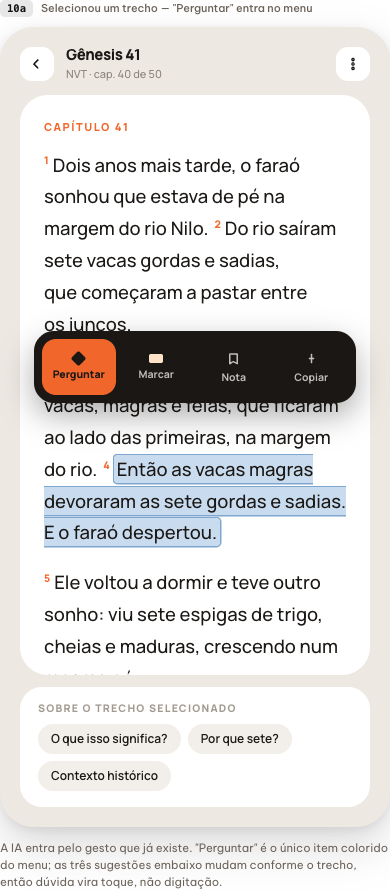

**Status:** CANÔNICA — implementar exatamente assim  
**Imagem:** `screens/10a.png` · **No arquivo de design:** `Jesus Corner Redesign.dc.html#10a`

**Textos da tela, na ordem (21):**

- Gênesis 41
- NVT · cap. 40 de 50
- Capítulo 41
- 1
- Dois anos mais tarde, o faraó sonhou que estava de pé na margem do rio Nilo.
- 2
- Do rio saíram sete vacas gordas e sadias, que começaram a pastar entre os juncos.
- 3
- Depois saíram do rio outras sete vacas, magras e feias, que ficaram ao lado das primeiras, na margem do rio.
- 4
- Então as vacas magras devoraram as sete gordas e sadias. E o faraó despertou.
- 5
- Ele voltou a dormir e teve outro sonho: viu sete espigas de trigo, cheias e maduras, crescendo num mesmo pé.
- Perguntar
- Marcar
- Nota
- Copiar
- Sobre o trecho selecionado
- O que isso significa?
- Por que sete?
- Contexto histórico

**Cores usadas:** #EDE8E2, #FFF, #1A1714, #8B8279, #F0662B, #C9DCEF, #7EA6CE, #FFE3C9, #A29A91, #F2EEE9  
ℹ Azul claro (#C9DCEF, #7EA6CE) é a cor de **seleção de trecho** no texto bíblico — única cor fora da paleta permitida no app.

**Nota de design:** A IA entra pelo gesto que já existe. "Perguntar" é o único item colorido do menu; as três sugestões embaixo mudam conforme o trecho, então dúvida vira toque, não digitação.

**Checklist:**
- [ ] Todos os textos acima aparecem, letra por letra (exceto dados de exemplo)
- [ ] Ordem dos blocos igual à imagem
- [ ] Só as cores listadas; Manrope em tudo
- [ ] Nenhum texto cortado; rolagem termina acima da barra de abas
- [ ] Toque mínimo 44px; um só elemento laranja de ação
- [ ] Estado vazio e esqueleto de carregamento existem

---

### 10b · Resposta — meia tela, texto continua visível

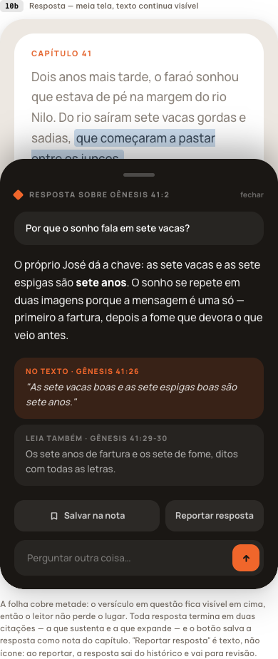

**Status:** CANÔNICA — implementar exatamente assim  
**Imagem:** `screens/10b.png` · **No arquivo de design:** `Jesus Corner Redesign.dc.html#10b`

**Textos da tela, na ordem (16):**

- Capítulo 41
- Dois anos mais tarde, o faraó sonhou que estava de pé na margem do rio Nilo. Do rio saíram sete vacas gordas e sadias,
- que começaram a pastar entre os juncos.
- Resposta sobre Gênesis 41:2
- fechar
- Por que o sonho fala em sete vacas?
- O próprio José dá a chave: as sete vacas e as sete espigas são
- sete anos
- . O sonho se repete em duas imagens porque a mensagem é uma só — primeiro a fartura, depois a fome que devora o que veio antes.
- No texto · Gênesis 41:26
- "As sete vacas boas e as sete espigas boas são sete anos."
- Leia também · Gênesis 41:29-30
- Os sete anos de fartura e os sete de fome, ditos com todas as letras.
- Salvar na nota
- Reportar resposta
- Perguntar outra coisa…

**Cores usadas:** #EDE8E2, #FFF, #F0662B, #8B8279, #C9DCEF, #3A4A5C, #1A1714  
ℹ Azul claro (#C9DCEF, #3A4A5C) é a cor de **seleção de trecho** no texto bíblico — única cor fora da paleta permitida no app.

**Nota de design:** A folha cobre metade: o versículo em questão fica visível em cima, então o leitor não perde o lugar. Toda resposta termina em duas citações — a que sustenta e a que expande — e o botão salva a resposta como nota do capítulo. "Reportar resposta" é texto, não ícone: ao reportar, a resposta sai do histórico e vai para revisão.

**Checklist:**
- [ ] Todos os textos acima aparecem, letra por letra (exceto dados de exemplo)
- [ ] Ordem dos blocos igual à imagem
- [ ] Só as cores listadas; Manrope em tudo
- [ ] Nenhum texto cortado; rolagem termina acima da barra de abas
- [ ] Toque mínimo 44px; um só elemento laranja de ação
- [ ] Estado vazio e esqueleto de carregamento existem

---

### 10c · Antes de ler — contexto em 30 segundos

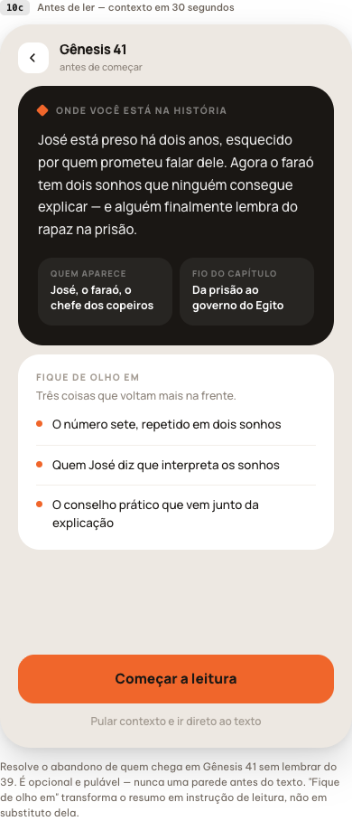

**Status:** CANÔNICA — implementar exatamente assim  
**Imagem:** `screens/10c.png` · **No arquivo de design:** `Jesus Corner Redesign.dc.html#10c`

**Textos da tela, na ordem (15):**

- Gênesis 41
- antes de começar
- Onde você está na história
- José está preso há dois anos, esquecido por quem prometeu falar dele. Agora o faraó tem dois sonhos que ninguém consegue explicar — e alguém finalmente lembra do rapaz na prisão.
- Quem aparece
- José, o faraó, o chefe dos copeiros
- Fio do capítulo
- Da prisão ao governo do Egito
- Fique de olho em
- Três coisas que voltam mais na frente.
- O número sete, repetido em dois sonhos
- Quem José diz que interpreta os sonhos
- O conselho prático que vem junto da explicação
- Começar a leitura
- Pular contexto e ir direto ao texto

**Cores usadas:** #EDE8E2, #FFF, #1A1714, #8B8279, #F0662B, #A29A91, #F2EEE9

**Nota de design:** Resolve o abandono de quem chega em Gênesis 41 sem lembrar do 39. É opcional e pulável — nunca uma parede antes do texto. "Fique de olho em" transforma o resumo em instrução de leitura, não em substituto dela.

**Checklist:**
- [ ] Todos os textos acima aparecem, letra por letra (exceto dados de exemplo)
- [ ] Ordem dos blocos igual à imagem
- [ ] Só as cores listadas; Manrope em tudo
- [ ] Nenhum texto cortado; rolagem termina acima da barra de abas
- [ ] Toque mínimo 44px; um só elemento laranja de ação
- [ ] Estado vazio e esqueleto de carregamento existem

---

### 10d · Depois de concluir — reflexão que pergunta de volta

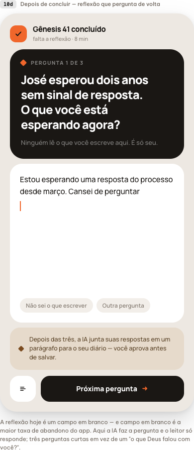

**Status:** CANÔNICA — implementar exatamente assim  
**Imagem:** `screens/10d.png` · **No arquivo de design:** `Jesus Corner Redesign.dc.html#10d`

**Textos da tela, na ordem (10):**

- Gênesis 41 concluído
- falta a reflexão · 8 min
- Pergunta 1 de 3
- José esperou dois anos sem sinal de resposta. O que você está esperando agora?
- Ninguém lê o que você escreve aqui. É só seu.
- Estou esperando uma resposta do processo desde março. Cansei de perguntar
- Não sei o que escrever
- Outra pergunta
- Depois das três, a IA junta suas respostas em um parágrafo para o seu diário — você aprova antes de salvar.
- Próxima pergunta

**Cores usadas:** #EDE8E2, #F0662B, #1A1714, #8B8279, #FFF, #F2EEE9, #E6DACB, #7A4A1E, #5A4327

**Nota de design:** A reflexão hoje é um campo em branco — e campo em branco é a maior taxa de abandono do app. Aqui a IA faz a pergunta e o leitor só responde; três perguntas curtas em vez de um "o que Deus falou com você?".

**Checklist:**
- [ ] Todos os textos acima aparecem, letra por letra (exceto dados de exemplo)
- [ ] Ordem dos blocos igual à imagem
- [ ] Só as cores listadas; Manrope em tudo
- [ ] Nenhum texto cortado; rolagem termina acima da barra de abas
- [ ] Toque mínimo 44px; um só elemento laranja de ação
- [ ] Estado vazio e esqueleto de carregamento existem

---

### 10e · Quando a IA não deve responder

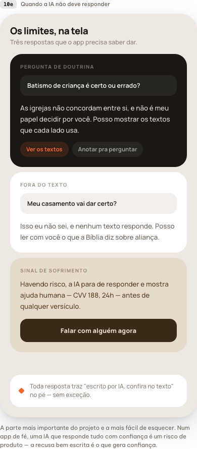

**Status:** CANÔNICA — implementar exatamente assim  
**Imagem:** `screens/10e.png` · **No arquivo de design:** `Jesus Corner Redesign.dc.html#10e`

**Textos da tela, na ordem (14):**

- Os limites, na tela
- Três respostas que o app precisa saber dar.
- Pergunta de doutrina
- Batismo de criança é certo ou errado?
- As igrejas não concordam entre si, e não é meu papel decidir por você. Posso mostrar os textos que cada lado usa.
- Ver os textos
- Anotar pra perguntar
- Fora do texto
- Meu casamento vai dar certo?
- Isso eu não sei, e nenhum texto responde. Posso ler com você o que a Bíblia diz sobre aliança.
- Sinal de sofrimento
- Havendo risco, a IA para de responder e mostra ajuda humana — CVV 188, 24h — antes de qualquer versículo.
- Falar com alguém agora
- Toda resposta traz "escrito por IA, confira no texto" no pé — sem exceção.

**Cores usadas:** #EDE8E2, #1A1714, #8B8279, #FFF, #F0662B, #A29A91, #F2EEE9, #6E655C, #E6DACB, #9C8B76, #5A4327, #3A2A18

**Nota de design:** A parte mais importante do projeto e a mais fácil de esquecer. Num app de fé, uma IA que responde tudo com confiança é um risco de produto — a recusa bem escrita é o que gera confiança.

**Checklist:**
- [ ] Todos os textos acima aparecem, letra por letra (exceto dados de exemplo)
- [ ] Ordem dos blocos igual à imagem
- [ ] Só as cores listadas; Manrope em tudo
- [ ] Nenhum texto cortado; rolagem termina acima da barra de abas
- [ ] Toque mínimo 44px; um só elemento laranja de ação
- [ ] Estado vazio e esqueleto de carregamento existem

---

### 10f · Ajustes de IA — o leitor no controle

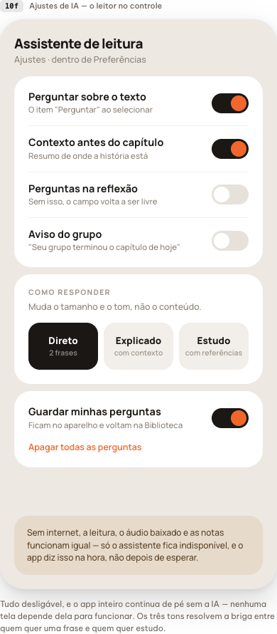

**Status:** CANÔNICA — implementar exatamente assim  
**Imagem:** `screens/10f.png` · **No arquivo de design:** `Jesus Corner Redesign.dc.html#10f`

**Textos da tela, na ordem (22):**

- Assistente de leitura
- Ajustes · dentro de Preferências
- Perguntar sobre o texto
- O item "Perguntar" ao selecionar
- Contexto antes do capítulo
- Resumo de onde a história está
- Perguntas na reflexão
- Sem isso, o campo volta a ser livre
- Aviso do grupo
- "Seu grupo terminou o capítulo de hoje"
- Como responder
- Muda o tamanho e o tom, não o conteúdo.
- Direto
- 2 frases
- Explicado
- com contexto
- Estudo
- com referências
- Guardar minhas perguntas
- Ficam no aparelho e voltam na Biblioteca
- Apagar todas as perguntas
- Sem internet, a leitura, o áudio baixado e as notas funcionam igual — só o assistente fica indisponível, e o app diz isso na hora, não depois de esperar.

**Cores usadas:** #EDE8E2, #1A1714, #8B8279, #FFF, #F2EEE9, #F0662B, #E6E1DA, #A29A91, #E6DACB, #5A4327  

**Nota de design:** Tudo desligável, e o app inteiro continua de pé sem a IA — nenhuma tela depende dela para funcionar. Os três tons resolvem a briga entre quem quer uma frase e quem quer estudo.

   

   Se for escolher uma para construir primeiro, é  10a  +  10b : é o fluxo completo, cabe num sprint e não mexe em nenhuma outra tela.  10d  é a de maior impacto em retenção, porque ataca o campo em branco da reflexão. Posso detalhar qualquer uma em estados reais — carregando, erro, resposta longa, sem internet — ou escrever os textos de recusa palavra por palavra.

**Checklist:**
- [ ] Todos os textos acima aparecem, letra por letra (exceto dados de exemplo)
- [ ] Ordem dos blocos igual à imagem
- [ ] Só as cores listadas; Manrope em tudo
- [ ] Nenhum texto cortado; rolagem termina acima da barra de abas
- [ ] Toque mínimo 44px; um só elemento laranja de ação
- [ ] Estado vazio e esqueleto de carregamento existem

---

## Marca (rodada 16)

### 16a · A marca e o logotipo

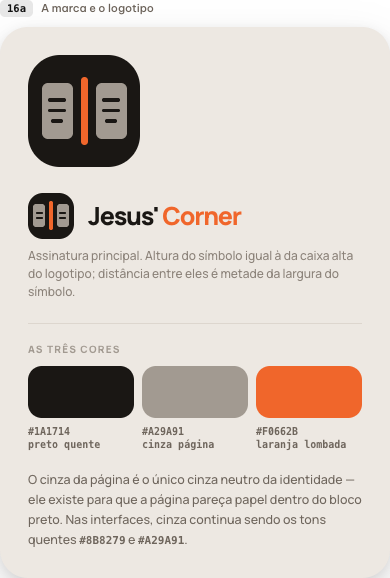

**Status:** MARCA — exportar SVG, não é tela  
**Imagem:** `screens/16a.png` · **No arquivo de design:** `Jesus Corner Redesign.dc.html#16a`

_Não implementar como está — ver status acima._

---

### 16b · Em uso — ícone, tamanhos e cabeçalho

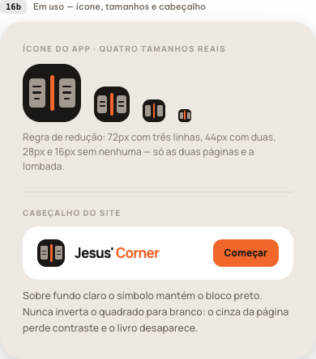

**Status:** MARCA — aplicar em 13a e no site  
**Imagem:** `screens/16b.png` · **No arquivo de design:** `Jesus Corner Redesign.dc.html#16b`

_Não implementar como está — ver status acima._

---

### 16c · Variações e limites

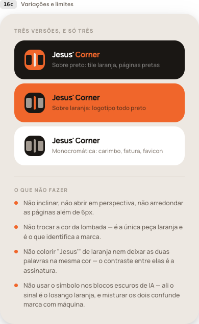

**Status:** MARCA — regra, não é tela  
**Imagem:** `screens/16c.png` · **No arquivo de design:** `Jesus Corner Redesign.dc.html#16c`

_Não implementar como está — ver status acima._

---

## Painel do administrador — web 1280px (rodada 23)

### 23a · Visão geral — o que está acontecendo, o que precisa de ação

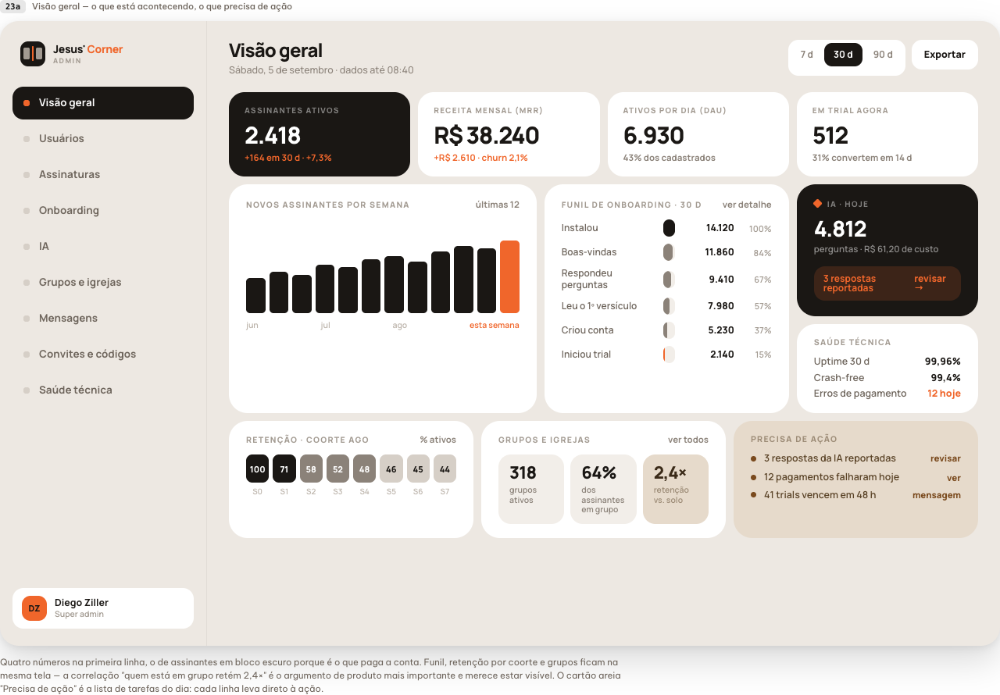

**Status:** CANÔNICA — implementar exatamente assim  
**Imagem:** `screens/23a.png` · **No arquivo de design:** `Jesus Corner Redesign.dc.html#23a`

**Textos da tela, na ordem (104):**

- Jesus'
- Corner
- Admin
- Visão geral
- Usuários
- Assinaturas
- Onboarding
- IA
- Grupos e igrejas
- Mensagens
- Convites e códigos
- Saúde técnica
- DZ
- Diego Ziller
- Super admin
- Visão geral
- Sábado, 5 de setembro · dados até 08:40
- 7 d
- 30 d
- 90 d
- Exportar
- Assinantes ativos
- 2.418
- +164 em 30 d · +7,3%
- Receita mensal (MRR)
- R$ 38.240
- +R$ 2.610 · churn 2,1%
- Ativos por dia (DAU)
- 6.930
- 43% dos cadastrados
- Em trial agora
- 512
- 31% convertem em 14 d
- Novos assinantes por semana
- últimas 12
- jun
- jul
- ago
- esta semana
- Funil de onboarding · 30 d
- ver detalhe
- Instalou
- 14.120
- 100%
- Boas-vindas
- 11.860
- 84%
- Respondeu perguntas
- 9.410
- 67%
- Leu o 1º versículo
- 7.980
- 57%
- Criou conta
- 5.230
- 37%
- Iniciou trial
- 2.140
- 15%
- IA · hoje
- 4.812
- perguntas · R$ 61,20 de custo
- 3 respostas reportadas
- revisar →
- Saúde técnica
- Uptime 30 d
- 99,96%
- Crash-free
- 99,4%
- Erros de pagamento
- 12 hoje
- Retenção · coorte ago
- % ativos
- 100
- S0
- 71
- S1
- 58
- S2
- 52
- S3
- 48
- S4
- 46
- S5
- 45
- S6
- 44
- S7
- Grupos e igrejas
- ver todos
- 318
- grupos ativos
- 64%
- dos assinantes em grupo
- 2,4×
- retenção vs. solo
- Precisa de ação
- 3 respostas da IA reportadas
- revisar
- 12 pagamentos falharam hoje
- ver
- 41 trials vencem em 48 h
- mensagem

**Cores usadas:** #EDE8E2, #1A1714, #A29A91, #F0662B, #FFF, #D6CFC7, #6E655C, #8B8279, #BDB5AC, #F2EEE9, #E6DACB, #3A2A18, #9C8B76, #7A4A1E, #5A4327

**Nota de design:** Quatro números na primeira linha, o de assinantes em bloco escuro porque é o que paga a conta. Funil, retenção por coorte e grupos ficam na mesma tela — a correlação "quem está em grupo retém 2,4×" é o argumento de produto mais importante e merece estar visível. O cartão areia "Precisa de ação" é a lista de tarefas do dia: cada linha leva direto à ação.

**Checklist:**
- [ ] Todos os textos acima aparecem, letra por letra (exceto dados de exemplo)
- [ ] Ordem dos blocos igual à imagem
- [ ] Só as cores listadas; Manrope em tudo
- [ ] Nenhum texto cortado; rolagem termina acima da barra de abas
- [ ] Toque mínimo 44px; um só elemento laranja de ação
- [ ] Estado vazio e esqueleto de carregamento existem

---

### 23b · Usuários — buscar, entender, agir

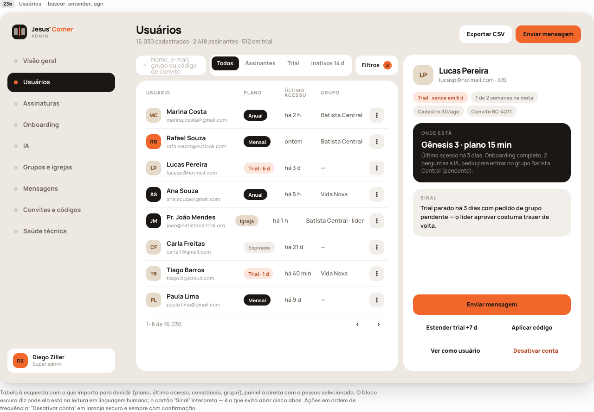

**Status:** CANÔNICA — implementar exatamente assim  
**Imagem:** `screens/23b.png` · **No arquivo de design:** `Jesus Corner Redesign.dc.html#23b`

**Textos da tela, na ordem (97):**

- Jesus'
- Corner
- Admin
- Visão geral
- Usuários
- Assinaturas
- Onboarding
- IA
- Grupos e igrejas
- Mensagens
- Convites e códigos
- Saúde técnica
- DZ
- Diego Ziller
- Super admin
- Usuários
- 16.030 cadastrados · 2.418 assinantes · 512 em trial
- Exportar CSV
- Enviar mensagem
- Nome, e-mail, grupo ou código de convite
- Todos
- Assinantes
- Trial
- Inativos 14 d
- Filtros
- 2
- Usuário
- Plano
- Último acesso
- Grupo
- MC
- Marina Costa
- marina.costa@gmail.com
- Anual
- há 2 h
- Batista Central
- RS
- Rafael Souza
- rafa.souza@outlook.com
- Mensal
- ontem
- Batista Central
- LP
- Lucas Pereira
- lucasp@hotmail.com
- Trial · 6 d
- há 3 d
- —
- AS
- Ana Souza
- ana.souza@gmail.com
- Anual
- há 5 h
- Vida Nova
- JM
- Pr. João Mendes
- joao@batistacentral.org
- Igreja
- há 1 h
- Batista Central · líder
- CF
- Carla Freitas
- carla.f@gmail.com
- Expirado
- há 21 d
- —
- TB
- Tiago Barros
- tiago.b@icloud.com
- Trial · 1 d
- há 40 min
- Vida Nova
- PL
- Paula Lima
- paula.lima@gmail.com
- Mensal
- há 9 d
- —
- 1–8 de 16.030
- ‹
- LP
- Lucas Pereira
- lucasp@hotmail.com · iOS
- Trial · vence em 6 d
- 1 de 2 semanas na meta
- Cadastro 30/ago
- Convite BC-4271
- Onde está
- Gênesis 3 · plano 15 min
- Último acesso há 3 dias. Onboarding completo, 2 perguntas à IA, pediu para entrar no grupo Batista Central (pendente).
- Sinal
- Trial parado há 3 dias com pedido de grupo pendente — o líder aprovar costuma trazer de volta.
- Enviar mensagem
- Estender trial +7 d
- Aplicar código
- Ver como usuário
- Desativar conta

**Cores usadas:** #EDE8E2, #1A1714, #A29A91, #F0662B, #D6CFC7, #6E655C, #FFF, #8B8279, #BDB5AC, #F2EEE9, #E6DACB, #7A4A1E, #B3441A, #5A4327

**Nota de design:** Tabela à esquerda com o que importa para decidir (plano, último acesso, constância, grupo), painel à direita com a pessoa selecionada. O bloco escuro diz onde ela está na leitura em linguagem humana; o cartão "Sinal" interpreta — é o que evita abrir cinco abas. Ações em ordem de frequência; "Desativar conta" em laranja escuro e sempre com confirmação.

**Checklist:**
- [ ] Todos os textos acima aparecem, letra por letra (exceto dados de exemplo)
- [ ] Ordem dos blocos igual à imagem
- [ ] Só as cores listadas; Manrope em tudo
- [ ] Nenhum texto cortado; rolagem termina acima da barra de abas
- [ ] Toque mínimo 44px; um só elemento laranja de ação
- [ ] Estado vazio e esqueleto de carregamento existem

---

### 23c · Mensagens — segmento, canal, texto, prévia

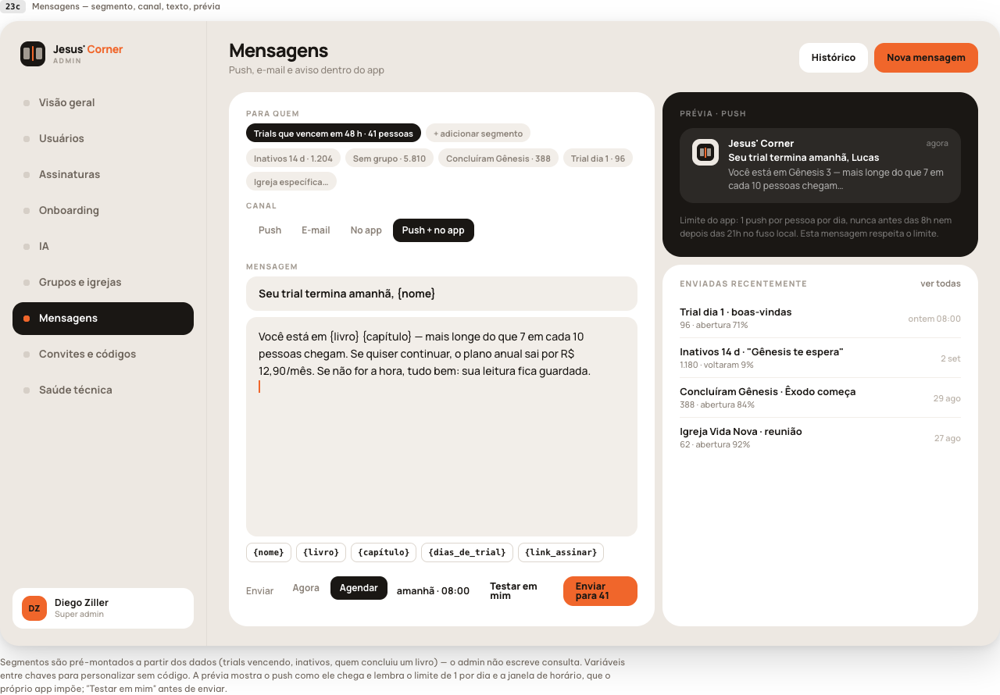

**Status:** CANÔNICA — implementar exatamente assim  
**Imagem:** `screens/23c.png` · **No arquivo de design:** `Jesus Corner Redesign.dc.html#23c`

**Textos da tela, na ordem (66):**

- Jesus'
- Corner
- Admin
- Visão geral
- Usuários
- Assinaturas
- Onboarding
- IA
- Grupos e igrejas
- Mensagens
- Convites e códigos
- Saúde técnica
- DZ
- Diego Ziller
- Super admin
- Mensagens
- Push, e-mail e aviso dentro do app
- Histórico
- Nova mensagem
- Para quem
- Trials que vencem em 48 h · 41 pessoas
- + adicionar segmento
- Inativos 14 d · 1.204
- Sem grupo · 5.810
- Concluíram Gênesis · 388
- Trial dia 1 · 96
- Igreja específica…
- Canal
- Push
- E-mail
- No app
- Push + no app
- Mensagem
- Seu trial termina amanhã, {nome}
- Você está em {livro} {capítulo} — mais longe do que 7 em cada 10 pessoas chegam. Se quiser continuar, o plano anual sai por R$ 12,90/mês. Se não for a hora, tudo bem: sua leitura fica guardada.
- {nome}
- {livro}
- {capítulo}
- {dias_de_trial}
- {link_assinar}
- Enviar
- Agora
- Agendar
- amanhã · 08:00
- Testar em mim
- Enviar para 41
- Prévia · push
- Jesus' Corner
- agora
- Seu trial termina amanhã, Lucas
- Você está em Gênesis 3 — mais longe do que 7 em cada 10 pessoas chegam…
- Limite do app: 1 push por pessoa por dia, nunca antes das 8h nem depois das 21h no fuso local. Esta mensagem respeita o limite.
- Enviadas recentemente
- ver todas
- Trial dia 1 · boas-vindas
- 96 · abertura 71%
- ontem 08:00
- Inativos 14 d · "Gênesis te espera"
- 1.180 · voltaram 9%
- 2 set
- Concluíram Gênesis · Êxodo começa
- 388 · abertura 84%
- 29 ago
- Igreja Vida Nova · reunião
- 62 · abertura 92%
- 27 ago

**Cores usadas:** #EDE8E2, #1A1714, #A29A91, #F0662B, #D6CFC7, #6E655C, #FFF, #8B8279, #F2EEE9, #DDD6CE, #BDB5AC

**Nota de design:** Segmentos são pré-montados a partir dos dados (trials vencendo, inativos, quem concluiu um livro) — o admin não escreve consulta. Variáveis entre chaves para personalizar sem código. A prévia mostra o push como ele chega e lembra o limite de 1 por dia e a janela de horário, que o próprio app impõe; "Testar em mim" antes de enviar.

**Checklist:**
- [ ] Todos os textos acima aparecem, letra por letra (exceto dados de exemplo)
- [ ] Ordem dos blocos igual à imagem
- [ ] Só as cores listadas; Manrope em tudo
- [ ] Nenhum texto cortado; rolagem termina acima da barra de abas
- [ ] Toque mínimo 44px; um só elemento laranja de ação
- [ ] Estado vazio e esqueleto de carregamento existem

---

### 23d · Convites e códigos — promo, igreja, indicação

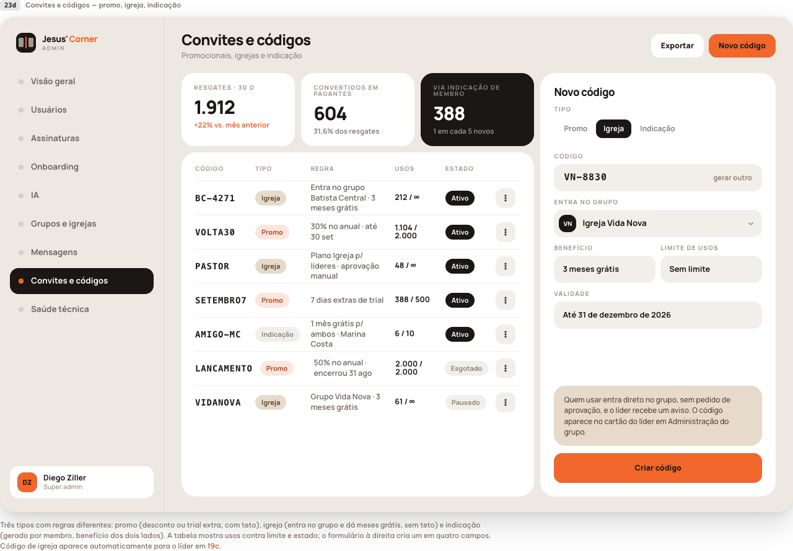

**Status:** CANÔNICA — implementar exatamente assim  
**Imagem:** `screens/23d.png` · **No arquivo de design:** `Jesus Corner Redesign.dc.html#23d`

**Textos da tela, na ordem (87):**

- Jesus'
- Corner
- Admin
- Visão geral
- Usuários
- Assinaturas
- Onboarding
- IA
- Grupos e igrejas
- Mensagens
- Convites e códigos
- Saúde técnica
- DZ
- Diego Ziller
- Super admin
- Convites e códigos
- Promocionais, igrejas e indicação
- Exportar
- Novo código
- Resgates · 30 d
- 1.912
- +22% vs. mês anterior
- Convertidos em pagantes
- 604
- 31,6% dos resgates
- Via indicação de membro
- 388
- 1 em cada 5 novos
- Código
- Tipo
- Regra
- Usos
- Estado
- BC-4271
- Igreja
- Entra no grupo Batista Central · 3 meses grátis
- 212 / ∞
- Ativo
- VOLTA30
- Promo
- 30% no anual · até 30 set
- 1.104 / 2.000
- Ativo
- PASTOR
- Igreja
- Plano Igreja p/ líderes · aprovação manual
- 48 / ∞
- Ativo
- SETEMBRO7
- Promo
- 7 dias extras de trial
- 388 / 500
- Ativo
- AMIGO-MC
- Indicação
- 1 mês grátis p/ ambos · Marina Costa
- 6 / 10
- Ativo
- LANCAMENTO
- Promo
- 50% no anual · encerrou 31 ago
- 2.000 / 2.000
- Esgotado
- VIDANOVA
- Igreja
- Grupo Vida Nova · 3 meses grátis
- 61 / ∞
- Pausado
- Novo código
- Tipo
- Promo
- Igreja
- Indicação
- Código
- VN-8830
- gerar outro
- Entra no grupo
- VN
- Igreja Vida Nova
- Benefício
- 3 meses grátis
- Limite de usos
- Sem limite
- Validade
- Até 31 de dezembro de 2026
- Quem usar entra direto no grupo, sem pedido de aprovação, e o líder recebe um aviso. O código aparece no cartão do líder em Administração do grupo.
- Criar código

**Cores usadas:** #EDE8E2, #1A1714, #A29A91, #F0662B, #D6CFC7, #6E655C, #FFF, #8B8279, #F2EEE9, #E6DACB, #5A4327, #B3441A

**Nota de design:** Três tipos com regras diferentes: promo (desconto ou trial extra, com teto), igreja (entra no grupo e dá meses grátis, sem teto) e indicação (gerado por membro, benefício dos dois lados). A tabela mostra usos contra limite e estado; o formulário à direita cria um em quatro campos. Código de igreja aparece automaticamente para o líder em 19c .

   

   Ficaram fora, por enquanto: Assinaturas (MRR por plano, churn, cobranças falhas e reembolso), Onboarding em detalhe (queda por pergunta, tempos escolhidos), IA (custo por dia, perguntas mais feitas, fila de reportes com aprovar/remover), Grupos (lista de igrejas, líderes, planos de grupo) e Saúde técnica. Desenho as cinco no mesmo esqueleto se aprovar — e a versão de celular, que reduz cada uma a KPIs + lista de ações.

**Checklist:**
- [ ] Todos os textos acima aparecem, letra por letra (exceto dados de exemplo)
- [ ] Ordem dos blocos igual à imagem
- [ ] Só as cores listadas; Manrope em tudo
- [ ] Nenhum texto cortado; rolagem termina acima da barra de abas
- [ ] Toque mínimo 44px; um só elemento laranja de ação
- [ ] Estado vazio e esqueleto de carregamento existem

---

**Total de telas neste documento: 82.**
