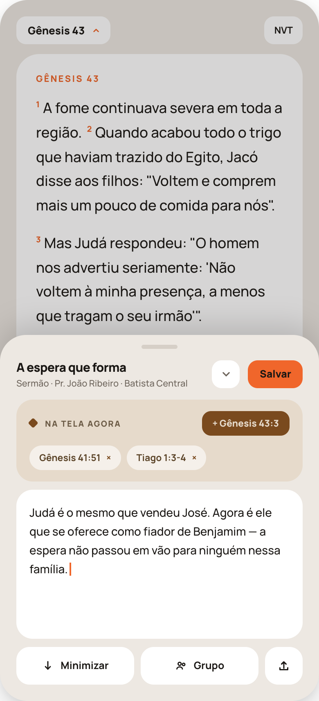
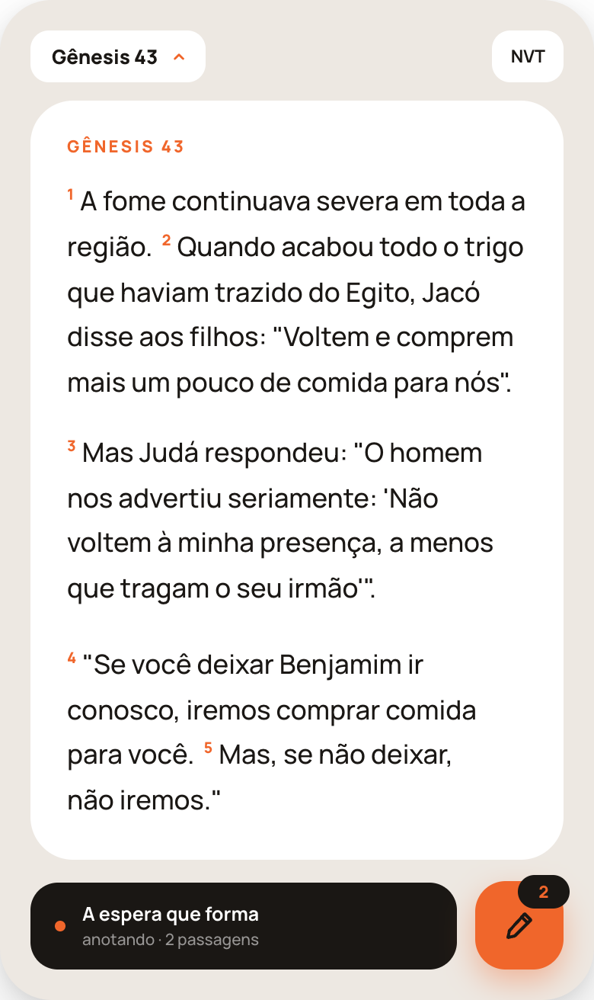
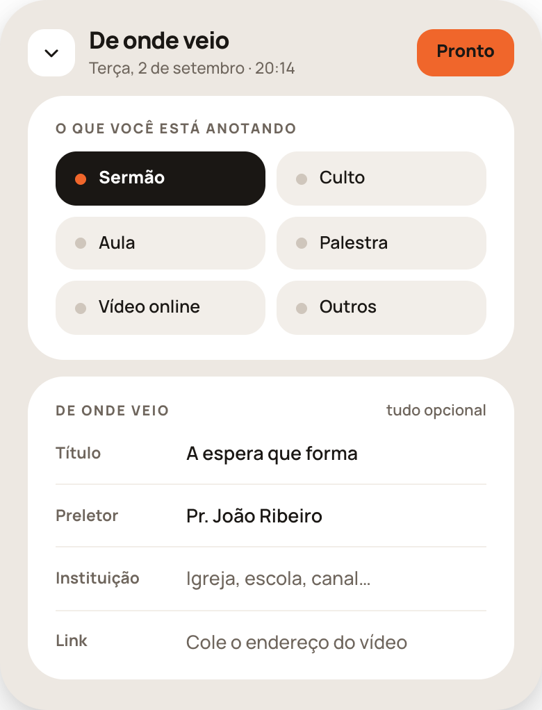
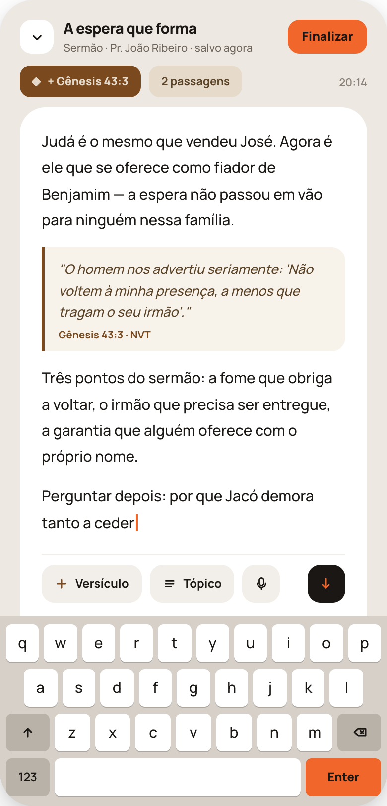
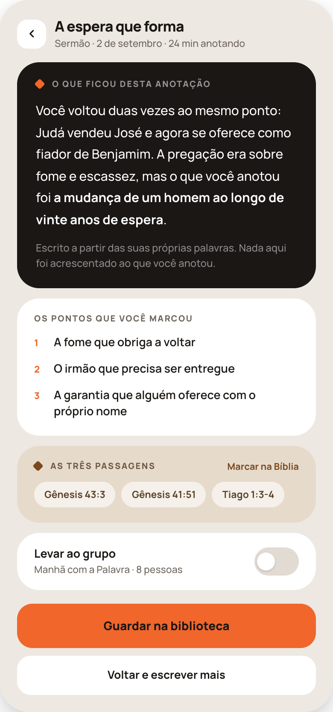

# HANDOFF 34 — Anotação de pregação

Especificação tela por tela. Abra o PNG de cada tela antes de codá-la e depois de codá-la.

## Regras da área inteira

1. **A anotação não é uma tela, é uma folha sobre o texto.** Em 34d e 34e o capítulo continua visível, rolável e legível por trás. Só em 34g — quando o teclado sobe — o texto sai de cena, porque aí a pessoa está escrevendo, não procurando.
2. **Nada é obrigatório.** Título, tipo, preletor, instituição e link são todos opcionais e vivem atrás de um chevron. Quem só quer escrever nunca passa por 34f. Uma anotação com o corpo vazio e uma passagem presa é uma anotação válida.
3. **O rascunho se salva sozinho**, a cada pausa. Não existe estado em que fechar perde o que foi escrito — por isso 34g não tem "Salvar", tem "Finalizar".
4. **A troca de fundo é a troca de voz.** Branco = o texto bíblico e o que a pessoa escreveu. Areia `#E6DACB` = as passagens (o que ela leva embora). Preto `#1A1714` = o app falando — e o app só fala em dois lugares: a tarja do lápis em 34e e o resumo de 34h.
5. **A referência entra por toque, nunca digitada.** "Na tela agora" oferece o versículo que está sendo lido; o botão "Versículo" de 34g abre busca. Ninguém digita "Gênesis 43:3" à mão.
6. **A anotação é privada por padrão.** O grupo é sempre uma escolha explícita, com o toggle nascendo desligado.
7. **O resumo de 34h só usa as palavras da anotação.** Não acrescenta teologia, não interpreta o sermão, não elogia quem escreveu. Sem material suficiente, não há resumo.

## Tokens

**Cores** — fundo da tela `#EDE8E2` · cartão branco `#fff` · preto `#1A1714` · laranja `#F0662B` · areia escura `#E6DACB` · marrom (ação sobre areia) `#7A4A1E` · campo claro `#F2EEE9` · citação sobre branco `#F7F2EA` · teclado `#D6D0C8` com teclas `#fff` e modificadores `#B9B2A9` · trilho de toggle desligado `#E2DBD3`.
**Texto** — título `#1A1714` · secundário `#6E655C` · terciário `#8B8279`. Sobre areia: `#5A4327` / `#6B5A45`. Sobre preto: `#fff`, `rgba(255,255,255,.55)` secundário, `.5` nota de rodapé.
**Fontes** — **Manrope** em tudo (500 / 600 / 700 / 800; títulos com letter-spacing −.4 a −.5px). Texto bíblico 17,5px/1.7 peso 500; corpo da anotação 15px/1.75 peso 500; número do versículo 10px/800 laranja em `vertical-align:super`.
**Rótulos de seção** — Manrope 800, 10px, letter-spacing .12em, maiúsculas, `#6E655C` (ou `#6B5A45` sobre areia).
**Raios** — moldura da tela 34 · cartão grande 26 · cartão médio 20 · campo/botão de rodapé 16–18 · controle de cabeçalho 12 · chip de passagem 99 · tecla 6.
**Alturas** — controle de cabeçalho 34 · botão de rodapé 46 (primário de 34h: 52) · botão da barra de ferramentas 38 · tira areia 32 · chip de passagem 30 · tecla 38 · lápis flutuante 58×58, raio 20.
**Espaçamento** — padding lateral 20px em tudo; gap entre cartões 12px; padding interno de cartão 18–22px.
**Losango** — 9×9px `rotate(45deg)` raio 2, marca de rótulo: laranja sobre preto, marrom `#7A4A1E` sobre areia.

---

## 34d · Folha sobre o texto

**É o destino do cartão "Anotar uma pregação" do Hoje.** O app abre a Bíblia no último capítulo lido com esta folha já expandida.

De cima para baixo:

1. **Cabeçalho da Bíblia** — seletor de capítulo (branco, raio 12, chevron laranja) e a versão à direita. É o cabeçalho normal da leitura, não muda.
2. **O capítulo**, cartão branco raio 28 no topo, com o rótulo laranja da referência e os versículos. **Rolável por baixo da folha** e coberto por um véu `rgba(26,23,20,.18)` — é o que diz que a folha está por cima.
3. **A folha** — sobe do rodapé com raio 32 no topo, `margin-top:-32px` sobre o texto e sombra alta `0 -12px 34px rgba(26,23,20,.16)`. Alça de arrasto 44×5 no topo. **Arrasta para cima e para baixo**; solta em três alturas (recolhida no lápis, meia folha, folha cheia).
4. **Linha do cabeçalho da folha** — título da anotação (800/15) e, abaixo, "Sermão · Pr. João Ribeiro · Batista Central" numa linha só; chevron 34×34 que abre **34f**; botão laranja "Salvar".
5. **"Na tela agora"** (areia, raio 20) — **fixo**. Losango marrom, o rótulo, e à direita o botão marrom **"+ <referência na tela>"**, que prende o versículo visível. Abaixo, as passagens já presas em fichas brancas translúcidas com "×".
6. **Área de escrita** — cartão branco raio 20, `min-height:150px`, texto 14px/1.65 com cursor laranja (2×16px).
7. **Rodapé de três ações** — "Minimizar" (leva a 34e) · "Grupo" (a mesma escolha de grupos de 39f, **desligada por padrão**) · ícone de compartilhar (texto ou imagem). Brancos, 46px, raio 16.

**Estado sem passagem presa:** o bloco areia continua existindo, só sem as fichas — "Na tela agora" é o que faz a primeira entrar.

---

## 34e · Lápis flutuante

1. **A leitura inteira** — o mesmo cabeçalho e o mesmo capítulo de 34d, agora **sem véu** e ocupando a tela até embaixo. É para isso que o lápis existe: procurar a citação no meio do sermão sem nada por cima.
2. **Tarja escura** (preto, raio 18) — ponto laranja, título da anotação e "anotando · N passagens". **Some depois de alguns segundos**, deixando só o lápis.
3. **O lápis** — 58×58, raio 20, laranja, sombra `0 8px 20px rgba(240,102,43,.4)`, ícone de lápis em `#1A1714`. Selo preto no canto superior direito com o número de passagens em laranja.

**Comportamento:** o lápis é **arrastável** e vive nas duas leituras (35f e 39d) e na Bíblia inteira. Sem anotação em andamento ele aparece **sem selo**, e um toque começa uma nova. Um toque com anotação aberta reabre 34d no ponto em que estava.

---

## 34f · Campos da anotação

Aberta pelo chevron de 34d, fechada por "Pronto". O que era uma tela inteira virou um detalhe da folha.

1. **Cabeçalho** — quadrado branco com chevron para baixo, "De onde veio" (800/17) e a data/hora da anotação; botão laranja **"Pronto"** à direita.
2. **"O que você está anotando"** (**fixo**) — grade 2×3 de seis tipos, raio 15, 13×14 de padding, com ponto de 8px à esquerda: **Sermão · Culto · Aula · Palestra · Vídeo online · Outros** (**fixos**). O selecionado fica preto com ponto laranja e texto branco 800; os demais `#F2EEE9` com ponto `#CFC6BC` e texto 600. **"Outros" abre um campo curto** para a pessoa escrever o tipo com as palavras dela (retiro, célula, devocional em família) — o que ela escreve vira uma opção reaproveitável nas próximas anotações.
3. **"De onde veio"** — rótulo com **"tudo opcional"** à direita (**fixo**). Quatro linhas separadas por filete `#F2EEE9`, rótulo de 82px à esquerda: **Título · Preletor · Instituição · Link** (**fixos**). Preenchido em `#1A1714` peso 600; vazio, o placeholder em `#6E655C` peso 500 ("Igreja, escola, canal…", "Cole o endereço do vídeo").

---

## 34g · Escrevendo

O teclado subiu. A folha toma a tela inteira e o texto bíblico sai de cena.

1. **Cabeçalho encolhido** — chevron 34×34 (baixa o teclado, volta a 34d), título da anotação e a linha "Sermão · Pr. João Ribeiro · **salvo agora**"; botão laranja **"Finalizar"** (leva a 34h). **Não existe "Salvar"** — ver a regra 3.
2. **Tira das passagens** — o essencial do bloco areia de 34d numa linha: botão marrom **"+ <referência>"**, ficha areia **"N passagens"** (toca e abre a lista completa) e a hora à direita.
3. **Superfície de escrita** — cartão branco raio 26 no topo, que segue **até o teclado sem degrau** (a divisória e a barra de ferramentas têm a mesma margem lateral de 20px). Parágrafos 15px/1.75, gap de 14px, cursor laranja no fim do texto.
4. **Versículo inserido** — bloco citado **dentro do texto**: fundo `#F7F2EA`, filete `3px solid #7A4A1E` à esquerda, raio `0 14px 14px 0`, texto em itálico 13,5px/1.6 `#5A4327` e a referência embaixo em 10,5px/700 `#7A4A1E` ("Gênesis 43:3 · NVT"). É o que faz a anotação continuar legível meses depois.
5. **Barra acima do teclado** (branca, filete `#F2EEE9` em cima) — só o que se usa em pé, no meio de uma pregação: **"Versículo"** (abre a busca de referência) · **"Tópico"** (quebra em pontos numerados) · **ditar** (ícone de microfone) e, encostado à direita, o **botão preto** que baixa o teclado.
6. **Teclado** — o do sistema. No quadro ele está desenhado só para mostrar a proporção; a tecla de ação é laranja.

---

## 34h · Resumo da anotação

"Finalizar" não fecha a anotação em silêncio: ela volta lida.

1. **Cabeçalho** — voltar, título da anotação e "Sermão · 2 de setembro · **24 min anotando**" (o tempo real com a folha aberta).
2. **"O que ficou desta anotação"** (preto, **fixo**) — losango laranja + rótulo; duas ou três linhas de resumo em 15px/1.7 branco, com **uma parte em 700** — a frase que resume a atenção da pessoa. Fecha com a nota em `rgba(255,255,255,.5)`: "Escrito a partir das suas próprias palavras. Nada aqui foi acrescentado ao que você anotou." (**fixo**).
3. **"Os pontos que você marcou"** (branco, **fixo**) — os tópicos criados pelo botão Tópico, numerados em laranja 11px/800 com coluna de 12px. **Sem tópico nenhum, o cartão não aparece.**
4. **"As três passagens"** (areia) — o numeral acompanha a quantidade ("A passagem" / "As três passagens"). Losango marrom, rótulo e a ação **"Marcar na Bíblia"** em marrom à direita, que transforma todas em marcações de uma vez. As fichas repetem as de 34d, agora sem "×".
5. **"Levar ao grupo"** — nome do grupo e o tamanho dele na segunda linha; toggle 46×27 **desligado por padrão**.
6. **Rodapé** — **"Guardar na biblioteca"** (laranja, 52px, raio 18) e **"Voltar e escrever mais"** (branco, 46px), que reabre 34g com a anotação como estava.

**Estado de anotação curta** — menos de ~40 palavras escritas, ou só tópicos soltos: **o bloco preto não aparece**. A tela mostra o texto como foi escrito, os tópicos e as passagens. O app não inventa síntese do que não tem o que sintetizar.

---

## Checklist por tela

- [ ] Os blocos estão na mesma ordem do PNG, sem nada inserido, agrupado ou reordenado.
- [ ] Os fundos respeitam a regra 4 (branco / areia / preto).
- [ ] Os textos marcados **fixo** estão palavra por palavra.
- [ ] Nenhum campo é obrigatório; a folha fecha com o corpo vazio.
- [ ] O rascunho sobrevive a fechar o app no meio de uma frase.
- [ ] Os toggles de grupo nascem desligados.
- [ ] Os valores da conta de exemplo não estão hardcoded.
