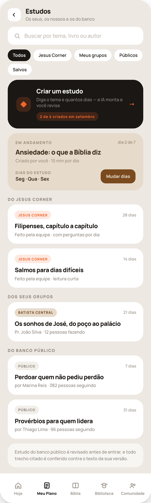
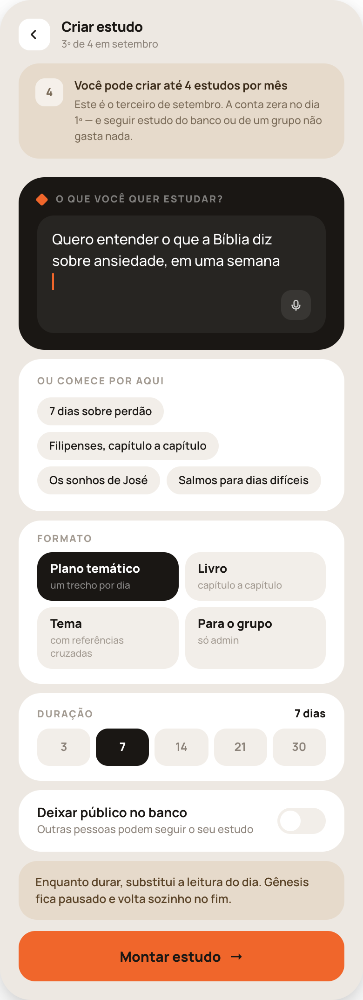
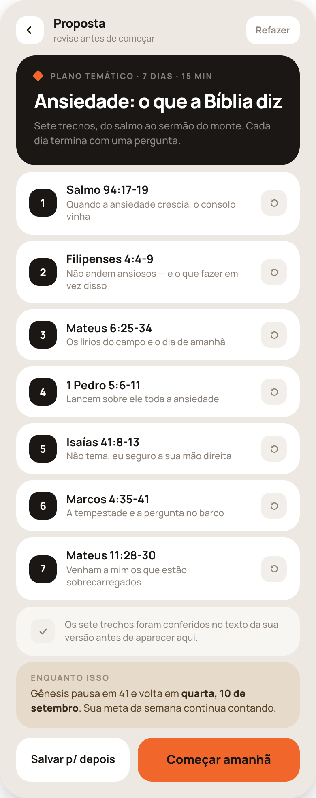
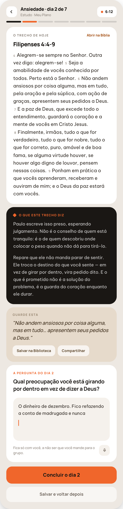
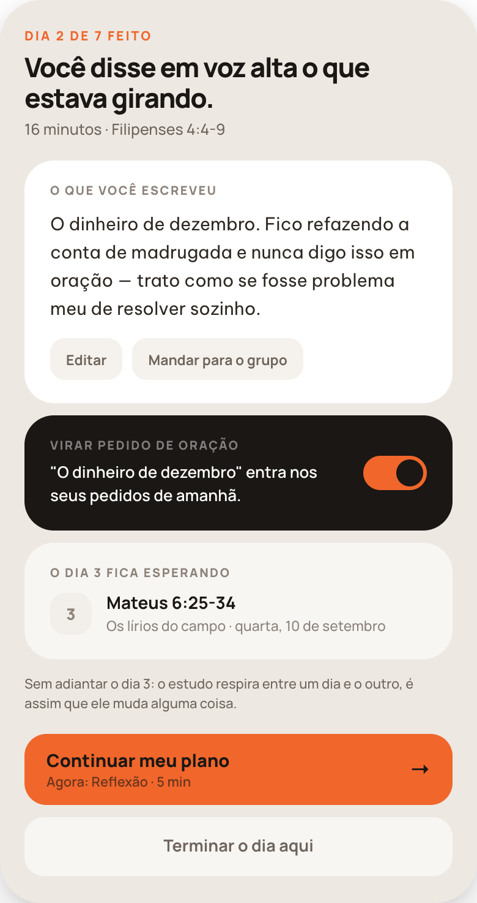
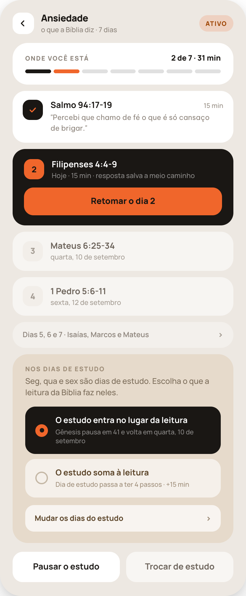
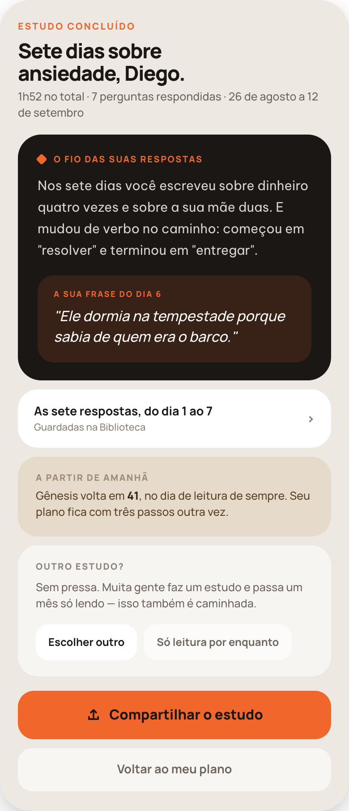
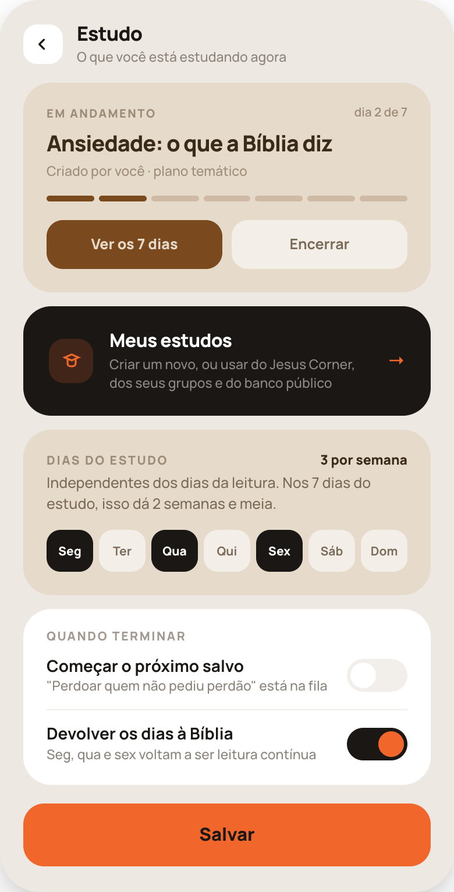
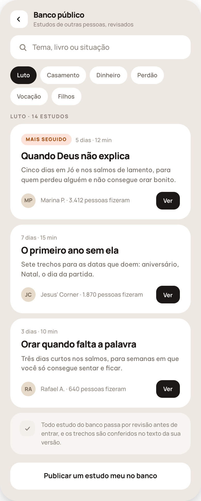

# HANDOFF 41 — Estudos

Especificação tela por tela. Abra o PNG de cada tela antes de codá-la e depois de codá-la.

## Regras da área inteira

1. **Toda tela é uma tela só, com rolagem.** Cabeçalho rola junto; o botão primário fica fixo no rodapé (41b, 41c, 41d, 41e, 41g, 41h). Nunca quebre uma tela alta em duas nem em abas. 41d tem ~1.600px de conteúdo: é assim.
2. **Barra de abas só em 41a.** As outras são telas empilhadas com voltar (chevron) no cabeçalho, 34×34, raio 12, fundo branco.
3. **A troca de fundo é a troca de voz.** Branco = a Bíblia e a pessoa. Preto `#1A1714` = o app explicando. Areia escura `#E6DACB` = o que ela leva embora / consequência no plano. Nunca inverta isso.
4. **O ensino é prosa curta, nunca lista de tópicos.** Dois parágrafos, fonte de leitura (Be Vietnam Pro 400/1.65), nunca bullets.
5. **Toda resposta escrita é gravada** por dia, com data e duração. Sem isso 41f e 41g não existem.
6. **4 estudos criados por mês, por conta.** Só *criar* consome cota; seguir estudo do banco/grupo/Jesus Corner é ilimitado e refazer a proposta em 41c **não** consome de novo. A conta zera no dia 1º.
7. **Nada entra no plano sem aprovação explícita** — o gerador propõe (41c), a pessoa aprova.
8. **Todo trecho citado é conferido contra o texto da versão do usuário** antes de aparecer. O que não bate não entra.

## Tokens

**Cores** — fundo da tela `#EDE8E2` · cartão branco `#fff` · preto `#1A1714` · laranja `#F0662B` · areia escura `#E6DACB` · marrom (ação sobre areia) `#7A4A1E` · campo claro `#F2EEE9` / `#F5F1EC`.
**Texto** — título `#1A1714` · corpo `#2E2822` · secundário `#6E655C` · terciário `#8B8279` · fraco `#A29A91` · placeholder `#BDB5AC`. Sobre areia: `#3A2A18` / `#5A4327` / `#7A6B58` / `#9C8B76`. Sobre preto: `#fff`, `rgba(255,255,255,.82)` corpo, `.5` secundário, `.45` rótulo.
**Fontes** — **Manrope** para interface (500 / 600 / 700 / 800; títulos com letter-spacing negativo −.4 a −1.2px). **Be Vietnam Pro** 400 para texto bíblico e para o ensino (line-height 1.6–1.65).
**Rótulos de seção** — Manrope 800, 9,5–10,5px, letter-spacing .12em, maiúsculas.
**Raios** — moldura da tela 34 · cartão grande 24–28 · cartão médio 20–22 · campo 16–18 · chip/toggle 99 · botão 18.
**Alturas** — botão primário 54 · secundário 48 · botão em cartão 40–44 · busca 46 · chip 34 · toggle 46×28 com knob 22 · barra de abas 76.
**Espaçamento** — padding lateral 20px em tudo; gap entre cartões 10–12px; padding interno de cartão 16–22px.

---

## 41a · Estudos (hub)

Blocos, de cima para baixo:

1. **Cabeçalho** — voltar · "Estudos" (800/17) · "Os seus, os nossos e os do banco" (**fixo**).
2. **Busca** — placeholder "Buscar por tema, livro ou autor" (**fixo**). Aceita tema, livro **e** nome de autor.
3. **Chips de origem** — "Todos" (ativo, preto) · "Jesus Corner" · "Meus grupos" · "Públicos" · "Salvos" (**fixos**). Filtram na própria tela.
4. **Criar um estudo** — cartão preto: título, "Diga o tema e quantos dias — a IA monta e você revisa" (**fixo**), chip laranja **"N de 4 criados em <mês>"** e seta. Cota esgotada: o chip vira "4 de 4 usados · zera em 1º de outubro", o cartão perde a seta e fica em `rgba(255,255,255,.06)`; tocar explica, não abre 41b.
5. **Em andamento** (areia) — "Em andamento" + "dia N de M", título, "Criado por você · 15 min por dia", "Dias do estudo" + os dias, botão marrom "Mudar dias". Sem estudo ativo, o bloco não existe (não vira estado vazio).
6. **Do Jesus Corner** — rótulo + cartões brancos: etiqueta laranja "Jesus Corner", duração à direita, título, autoria.
7. **Dos seus grupos** — etiqueta em areia com o nome do grupo, autor e "N pessoas fazendo".
8. **Do banco público** — etiqueta cinza "Público", "por <autor> · N pessoas seguindo".
9. **Linha de confiança** (**fixo**) — "Estudo do banco público é revisado antes de entrar, e todo trecho citado é conferido contra o texto da sua versão."
10. **Barra de abas** — Hoje · **Meu Plano** (ativo) · Bíblia · Biblioteca · Comunidade.

Exemplo (varia): "Ansiedade: o que a Bíblia diz", "Filipenses, capítulo a capítulo", "Batista Central", "Pr. João Silva · 12 pessoas fazendo", "382 pessoas seguindo".

## 41b · Criar estudo · o pedido

1. **Cabeçalho** — voltar · "Criar estudo" · subtítulo **"Nº de 4 em <mês>"** (o ordinal do que está sendo criado agora).
2. **Cartão do limite** (areia, o primeiro do corpo) — quadrado com "4", "Você pode criar até 4 estudos por mês" (**fixo**) e "Este é o terceiro de setembro. A conta zera no dia 1º — e seguir estudo do banco ou de um grupo não gasta nada." (o ordinal e o mês variam; o resto é **fixo**).
3. **O pedido** (preto) — rótulo "O que você quer estudar?" (**fixo**), campo de texto livre com cursor laranja e botão de ditado no canto inferior direito.
4. **Ou comece por aqui** — quatro sugestões em chips claros; tocar preenche o campo.
5. **Formato** — grade 2×2: "Plano temático / um trecho por dia" · "Livro / capítulo a capítulo" · "Tema / com referências cruzadas" · "Para o grupo / só admin" (**fixos**). Pré-marcado pelo que a pessoa escreveu. "Para o grupo" só aparece habilitado para admin.
6. **Duração** — rótulo + valor à direita; cinco opções 3 · 7 · 14 · 21 · 30. Pré-marcada pelo texto ("em uma semana" → 7).
7. **Deixar público no banco** — toggle, **desligado por padrão**.
8. **Aviso do plano** (areia) — "Enquanto durar, substitui a leitura do dia. Gênesis fica pausado e volta sozinho no fim." O livro e o padrão vêm do plano; a escolha substituir/somar mora em **41f** — este texto reflete o padrão (substituir).
9. **Rodapé fixo** — "Montar estudo →" (laranja, 54px).

## 41c · Proposta

1. **Cabeçalho** — voltar · "Proposta" · "revise antes de começar" (**fixo**) · botão "Refazer" à direita (pede outra proposta inteira; **não** consome cota).
2. **Cabeça do estudo** (preto) — "Plano temático · N dias · N min", título gerado, uma frase do que o estudo faz.
3. **Os N dias, todos visíveis** — cartão branco por dia: número em quadrado preto, referência, uma linha do que é, botão de recarregar à direita que **troca só aquele trecho**. Sem "ver mais", sem paginação.
4. **Linha de conferência** (**fixo**) — "Os sete trechos foram conferidos no texto da sua versão antes de aparecer aqui." (o numeral acompanha a duração).
5. **Enquanto isso** (areia) — o que acontece com a leitura: "Gênesis pausa em 41 e volta em **<data>**. Sua meta da semana continua contando."
6. **Rodapé fixo** — "Salvar p/ depois" (branco, largura do texto) + "Começar amanhã" (laranja, resto da linha). O rótulo do primário depende do próximo dia de estudo: hoje é dia de estudo → "Começar agora".

## 41d · O dia do estudo, aberto

A tela mais importante da área. Quatro partes, uma rolagem, nesta ordem:

1. **Cabeçalho** — voltar · "<Tema> · dia N de M" · "Estudo · Meu Plano" · **chip de tempo** à direita (ponto laranja + "6:12"). O chip conta o tempo na sessão; **não existe barra de progresso de tempo** e nada expira.
2. **Trilha de dias** — M barrinhas de 5px: dias feitos em preto, o dia de hoje em laranja, futuros em `rgba(0,0,0,.12)`.
3. **O trecho de hoje** (branco) — rótulo "O trecho de hoje" (**fixo**) + "Abrir na Bíblia" (leva à Bíblia no versículo, sem sair do estudo), referência em 800/18, e o **texto bíblico** em Be Vietnam Pro 400/15/1.62 com os números de versículo em 700/10px `#A29A91`.
4. **O que este trecho diz** (preto) — losango laranja + rótulo "O que este trecho diz" (**fixo**), dois parágrafos de prosa. Gerado com o trecho, guardado com o dia (não regenerar a cada abertura).
5. **Guarde esta** (areia) — o versículo-âncora em itálico + "Salvar na Biblioteca" e "Compartilhar" (**fixos**).
6. **A pergunta do dia N** (branco) — rótulo laranja, a pergunta em 700/17, campo de resposta `#F5F1EC` com o que ela já escreveu, cursor laranja, "Fica só com você, a não ser que você mande para o grupo." (**fixo**) e botão de ditado.
7. **Rodapé fixo** — "Concluir o dia N" (laranja) + "Salvar e voltar depois" (guarda a resposta a meio caminho; o dia continua aberto).

Interações: rascunho salvo automaticamente; segurar um versículo do trecho abre as ações de versículo da Bíblia (marcar, anotar, perguntar); "Concluir" só habilita com resposta escrita **ou** confirmação de pular a pergunta.

## 41e · Fim do dia do estudo

1. **Cabeçalho de texto** — "DIA N DE M FEITO" (laranja, 800/10,5, .14em), uma frase que reflete o que ela fez, "16 minutos · Filipenses 4:4-9".
2. **O que você escreveu** (branco) — a resposta em texto limpo + "Editar" e "Mandar para o grupo" (**fixos**).
3. **Virar pedido de oração** (preto) — rótulo, a frase "<trecho da resposta> entra nos seus pedidos de amanhã" e toggle **ligado por padrão**. Único lugar onde o estudo alimenta a oração.
4. **O dia N+1 fica esperando** (branco 60%) — número, referência, uma linha e a data. **Sem botão**: não se adianta o próximo dia.
5. **Linha de respiro** (**fixo**) — "Sem adiantar o dia 3: o estudo respira entre um dia e o outro, é assim que ele muda alguma coisa."
6. **Rodapé fixo** — "Continuar meu plano / Agora: <próximo passo> · N min" (laranja, 58px, com seta) + "Terminar o dia aqui". Se o estudo era o último passo do dia, o primário vira o resumo do dia (37c/40a-c).

No dia M (último), esta tela é substituída por **41g**.

## 41f · O estudo por dentro

1. **Cabeçalho** — voltar · título do estudo · "o que a Bíblia diz · N dias" · etiqueta "Ativo".
2. **Onde você está** (branco) — "N de M · <tempo total>" + trilha de M barras.
3. **Lista dos dias, em três estados visuais:**
   - **feito** — cartão branco, quadrado preto com tique laranja, referência, tempo, e **a frase que ela escreveu** entre aspas no lugar do resumo do trecho;
   - **hoje** — cartão preto, número em quadrado laranja, "Hoje · N min · resposta salva a meio caminho" quando houver rascunho, botão laranja "Retomar o dia N" (ou "Fazer o dia N");
   - **futuro** — branco 55%, número cinza, referência em cinza e a data. Sem botão.
   - Dias distantes colapsam numa linha: "Dias 5, 6 e 7 · Isaías, Marcos e Mateus" com chevron.
4. **Nos dias de estudo** (areia) — a regra que decide o dia: "Seg, qua e sex são dias de estudo. Escolha o que a leitura da Bíblia faz neles." + duas opções em rádio, com a consequência escrita embaixo de cada uma:
   - **O estudo entra no lugar da leitura** — "Gênesis pausa em 41 e volta em <data>" (selecionada por padrão);
   - **O estudo soma à leitura** — "Dia de estudo passa a ter 4 passos · +15 min".
   Trocar recalcula as datas na hora. Abaixo, "Mudar os dias do estudo →" (leva a 41h).
5. **Rodapé** — "Pausar o estudo" (mantém as respostas) + "Trocar de estudo" (vai para 41a).

## 41g · Estudo concluído

1. **Cabeçalho de texto** — "ESTUDO CONCLUÍDO" + "Sete dias sobre ansiedade, <nome>." + "1h52 no total · 7 perguntas respondidas · <data> a <data>".
2. **O fio das suas respostas** (preto) — síntese gerada **a partir das respostas dela**: assuntos que voltaram e como a linguagem mudou. Dentro dele, bloco laranja com **a frase dela** de um dos dias, identificada ("A sua frase do dia 6"). Nunca elogio genérico do app; se houver menos de 3 respostas escritas, o bloco de síntese não aparece e fica só a frase.
3. **As sete respostas, do dia 1 ao 7** — linha branca com chevron, "Guardadas na Biblioteca".
4. **A partir de amanhã** (areia) — "Gênesis volta em **41**, no dia de leitura de sempre. Seu plano fica com três passos outra vez." (reflete a escolha feita em 41f).
5. **Outro estudo?** — "Sem pressa. Muita gente faz um estudo e passa um mês só lendo — isso também é caminhada." (**fixo**) + "Escolher outro" (→41a) e "Só leitura por enquanto".
6. **Rodapé fixo** — "Compartilhar o estudo" (laranja, com ícone) + "Voltar ao meu plano".

## 41h · Organizar o estudo

1. **Cabeçalho** — voltar · "Estudo" · "O que você está estudando agora" (**fixo**).
2. **Em andamento** (areia) — "dia N de M", título, "Criado por você · plano temático", trilha em marrom, "Ver os 7 dias" (→41f) e "Encerrar" (para antes do fim; o progresso fica na Biblioteca).
3. **Meus estudos** (preto) — "Criar um novo, ou usar do Jesus Corner, dos seus grupos e do banco público" → 41a.
4. **Dias do estudo** (areia) — "N por semana" + "Independentes dos dias da leitura. Nos N dias do estudo, isso dá 2 semanas e meia." (a projeção é calculada) + os sete dias selecionáveis.
5. **Quando terminar** (branco) — dois toggles: "Começar o próximo salvo" ("<título> está na fila", desligado por padrão) e "Devolver os dias à Bíblia" ("Seg, qua e sex voltam a ser leitura contínua", **ligado** por padrão).
6. **Rodapé fixo** — "Salvar".

## 41i · Banco público

1. **Cabeçalho** — voltar · "Banco público" · "Estudos de outras pessoas, revisados" (**fixo**).
2. **Busca** — "Tema, livro ou situação" (**fixo**).
3. **Chips de tema** — Luto (ativo) · Casamento · Dinheiro · Perdão · Vocação · Filhos. Busca por **situação**, não por livro.
4. **Rótulo do resultado** — "<Tema> · N estudos".
5. **Cartões de estudo** — o primeiro pode ter a etiqueta "Mais seguido"; todos trazem "N dias · N min", título, duas linhas do que é, avatar com iniciais, "<autor> · N pessoas fizeram" e botão preto "Ver" (abre a prévia, não entra no plano direto).
6. **Linha de confiança** (**fixo**) — "Todo estudo do banco passa por revisão antes de entrar, e os trechos são conferidos no texto da sua versão."
7. **Rodapé** — "Publicar um estudo meu no banco" (branco).

---

## Modelo de dados mínimo

- **Estudo**: id, título, origem (criado | jesus_corner | grupo:<id> | publico), formato, duração em dias, minutos por dia, autor, público (bool), contagem de seguidores, revisado (bool).
- **Dia do estudo**: índice, referência do trecho, resumo de uma linha, ensino (2 parágrafos, gerado uma vez e guardado), versículo-âncora, pergunta.
- **Progresso**: dia atual, por dia → resposta (texto), rascunho, duração, data de conclusão.
- **Agenda**: dias da semana do estudo (independentes dos da leitura), modo `substitui | soma`, data projetada de retomada da leitura.
- **Cota**: estudos criados no mês corrente por conta (máx. 4), data de reset.
- **Encerramento**: encadear próximo salvo (bool), devolver dias à leitura (bool).

## Checklist por tela

- [ ] Ordem dos blocos idêntica ao PNG, sem inserir, remover, agrupar ou reordenar.
- [ ] Cores, raios, alturas, pesos e tamanhos de fonte conforme os tokens.
- [ ] Textos marcados **fixo** palavra por palavra, em português.
- [ ] Estados presentes: rascunho salvo, dia feito/hoje/futuro, cota esgotada, sem estudo ativo, toggles nos padrões certos.
- [ ] Tela única com rolagem, primário fixo no rodapé, abas só em 41a.
- [ ] Plurais e concordância corretos quando o número muda ("1 dia" / "7 dias", "1 pessoa" / "12 pessoas").
- [ ] Nenhum valor de exemplo hardcoded.
