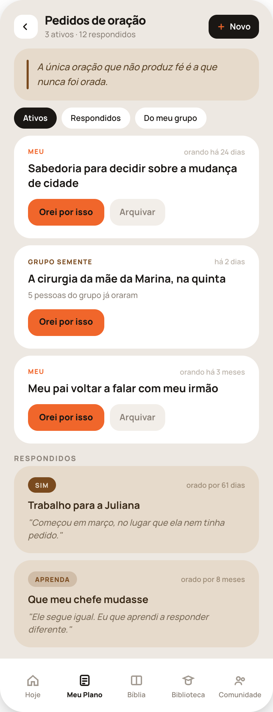
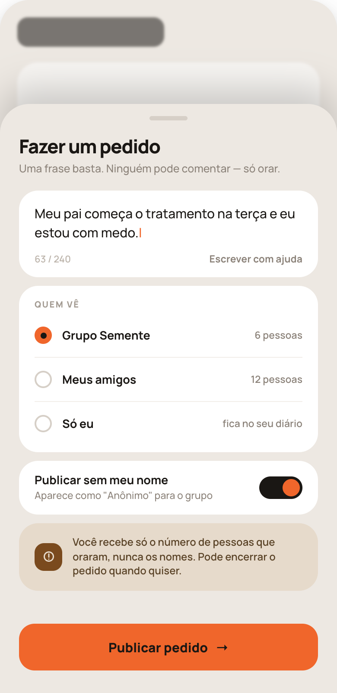
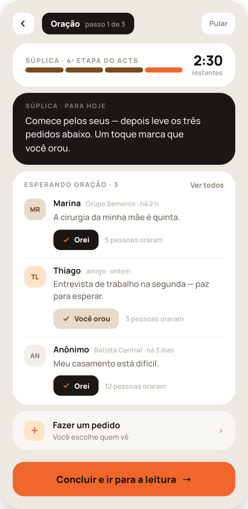
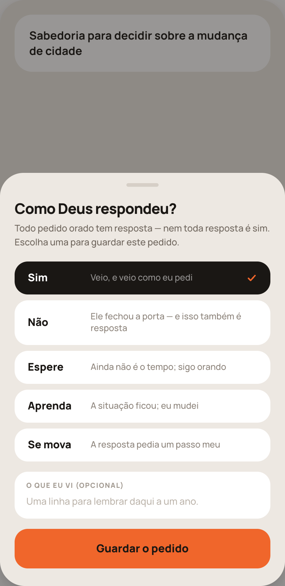

# HANDOFF — Pedidos de oração

## Tokens

**Fundos.** `#EDE8E2` fundo da tela · `#fff` cartão de pedido ativo e lista · `#E6DACB` areia: **pedido respondido**, aviso de privacidade, frase do topo · `#1A1714` preto: o app falando, ação primária de uma linha, "Orei" não marcado · `#F2EEE9` areia clara: botão secundário, avatar neutro · `#D6CFC7` alça da folha e radio desmarcado · `#FFE3C9` pêssego: avatar de amigo, ícone de "fazer pedido".

**Texto.** `#1A1714` título de pedido e valor · `#3A2A18` título sobre areia · `#6E655C` corpo do pedido em lista · `#5A4327` texto sobre areia · `#7A6B58` frase de memória (itálico, sobre areia) · `#8B8279` apoio e subtítulo · `#A29A91` rótulo maiúsculo · `#BDB5AC` meta, contador de caracteres, placeholder · `#9C8B76` meta sobre areia · `#7A4A1E` acento sobre areia (selo de grupo, barra da frase).

**Acento.** `#F0662B` laranja: botão "Orei por isso", selo **Meu**, cursor, radio marcado, ação primária de tela. Sobre laranja o texto é **`#1A1714`**, nunca branco.

**Tipografia.** Manrope em tudo. Título de tela 17/800 (-0.5px) em PD1; 20–22/800 (-0.6 a -0.8px) em folha. Título de pedido ativo 15,5/700, line-height 1.35. Título de pedido respondido 14,5/700. Corpo do pedido em lista 13/500. Frase de memória 12,5/500 **itálico**. Rótulo maiúsculo 9,5–10,5/800, letter-spacing .1–.12em. Meta 10,5–11/600.

**Formas.** Tela 390×800, raio 34. Cartão de pedido 24. Cartão de aviso/frase 22. Botão "Orei por isso" altura 38, raio 14. Botão "Orei" em lista altura 32, raio 11. Ação primária de tela altura 54, raio 18. Pílula de filtro 99. Avatar 34, raio 12. Folha inferior raio 32 no topo, alça 44×5.

**Sombra.** Moldura: `0 3px 10px rgba(0,0,0,.08), 0 20px 44px rgba(0,0,0,.14)`. Folha: `0 -18px 40px rgba(0,0,0,.18)` sobre véu `rgba(26,23,20,.45)`.

## Regras do sistema

1. **O dado de um pedido é o tempo**, não o engajamento: "orando há 24 dias", "há 2 dias", "orado por 61 dias", "orado por 8 meses". Nunca curtida, nunca comentário, nunca feed.
2. **Quem pediu vê o número, nunca os nomes.** Vale em toda a interface, e é dito explicitamente em PD2 antes de publicar.
3. **"Arquivar" nunca é "cancelar".** Todo pedido sai dos ativos escolhendo uma das cinco respostas de PD4.
4. **Pedido de outra pessoa não tem "Arquivar"** — quem arquiva é o autor. Só "Orei por isso".
5. **Um toque marca o dia.** "Orei por isso" registra a data; repetir no mesmo dia não conta duas vezes.

---

## PD1 — Pedidos de oração

Vive na aba **Meu Plano** (barra de abas visível embaixo, "Meu Plano" ativo).

**Cabeçalho.** Voltar (quadrado branco 34, raio 12) · título **Pedidos de oração** (fixo) · subtítulo "N ativos · N respondidos" · botão preto **Novo** (fixo) com + laranja. Leva a PD2.

**Corpo.**
1. Cartão areia com barra `#7A4A1E` de 3px à esquerda e a frase em itálico: **"A única oração que não produz fé é a que nunca foi orada."** (fixo). É a mesma frase todos os dias — texto do app, não gerada por IA.
2. Pílulas **Ativos · Respondidos · Do meu grupo** (fixas); ativa preta.
3. **Pedidos ativos**, cada um em cartão branco:
   - linha superior: selo de origem — **Meu** (laranja, 9,5/800) ou o nome do grupo (`#7A4A1E`) — e, à direita, o tempo ("orando há 24 dias", "há 2 dias");
   - o pedido em 15,5/700, `text-wrap: pretty`;
   - nos pedidos de grupo, uma linha "N pessoas do grupo já oraram";
   - ações: **Orei por isso** (laranja, texto `#1A1714`) e, **somente nos próprios**, **Arquivar** (`#F2EEE9`, texto `#8B8279`) → PD4.
4. Rótulo **Respondidos** (fixo).
5. **Pedidos respondidos**, em cartão areia: selo da resposta (o "Sim" em pílula `#7A4A1E` com texto `#E6DACB`; as outras em `rgba(122,74,30,.2)` com texto `#7A4A1E`), tempo total orado à direita, título em `#3A2A18` e a frase que a pessoa escreveu em itálico `#7A6B58`.

**Estados.** Sem pedidos ativos, os filtros permanecem e o lugar dos ativos recebe uma linha discreta convidando a fazer o primeiro — os respondidos continuam visíveis. Pedido já orado hoje mostra "Você orou" em areia, como em PD3.

---

## PD2 — Fazer um pedido

Folha inferior sobre a tela anterior desfocada (`opacity:.55; filter:blur(1.5px)`), começando a 120px do topo.

**Topo da folha.** Alça · título **Fazer um pedido** (fixo) · subtítulo fixo: **"Uma frase basta. Ninguém pode comentar — só orar."**

**Corpo.**
1. Campo de texto (cartão branco): o pedido em 15/500 com cursor laranja; embaixo, contador **"N / 240"** e **"Escrever com ajuda"** (fixo) — a IA transforma um desabafo longo numa frase, que **a pessoa aprova antes de publicar; nunca automático**.
2. **Quem vê** (fixo) — três linhas com radio (marcado: círculo `#F0662B` com ponto `#1A1714`): **Grupo [nome]** ("N pessoas") · **Meus amigos** ("N pessoas") · **Só eu** ("fica no seu diário", fixo).
3. **Publicar sem meu nome** (fixo) — "Aparece como \"Anônimo\" para o grupo"; toggle preto com bolinha laranja.
4. Cartão areia com ícone `#7A4A1E`: **"Você recebe só o número de pessoas que oraram, nunca os nomes. Pode encerrar o pedido quando quiser."** (fixo). Vem **antes** do botão porque é a dúvida que trava a publicação.

**Rodapé.** **Publicar pedido →** (laranja, 54px).

**Comportamento.** "Só eu" mantém o pedido no diário e ele **volta na Súplica dos próximos dias**. O limite é 240 caracteres. Publicar leva de volta para onde a folha foi aberta.

---

## PD3 — Súplica

A 4ª etapa do ACTS dentro da sessão de oração. Mesma casca das outras etapas.

**Cabeçalho.** Voltar · pílula preta "Oração · passo 1 de 3" · **Pular** (fixo).

**Corpo.**
1. Cartão de progresso: **Súplica · 4ª etapa do ACTS** (fixo), quatro barras (três `#7A4A1E`, a atual `#F0662B`) e o tempo restante à direita (22/800).
2. Cartão preto **Súplica · para hoje** (fixo): **"Comece pelos seus — depois leve os três pedidos abaixo. Um toque marca que você orou."** (fixo).
3. Cartão branco **Esperando oração · N** (fixo) com **"Ver todos"** à direita → PD1. Até **três** linhas, cada uma com: avatar (areia para grupo, pêssego para amigo, `#F2EEE9` para anônimo), nome + origem e tempo ("Grupo Semente · há 2 h", "amigo · ontem", "Batista Central · há 3 dias"), o pedido em 13/500, e a linha de ação:
   - não orado: botão preto **Orei** com ✓ laranja;
   - já orado: botão areia **Você orou** com ✓ `#7A4A1E`, texto `#5A4327`;
   - ao lado, "N pessoas oraram" em `#BDB5AC`.
4. Linha translúcida **Fazer um pedido** · "Você escolhe quem vê" (fixos) → PD2.

**Rodapé.** **Concluir e ir para a leitura →** (laranja).

**Regras.** **Máximo de três pedidos por sessão**, ordenados por **quem recebeu menos oração** — assim o pedido de quem tem pouca gente por perto não afunda. "Ver todos" sai do cronômetro. Pedido anônimo aparece como "Anônimo" com avatar neutro.

---

## PD4 — Como Deus respondeu

Folha inferior sobre véu `rgba(26,23,20,.45)`; atrás dela, o pedido que está sendo guardado permanece visível no topo.

**Topo.** Alça · título **"Como Deus respondeu?"** (fixo) · subtítulo fixo: **"Todo pedido orado tem resposta — nem toda resposta é sim. Escolha uma para guardar este pedido."**

**As cinco respostas** — rótulo em coluna fixa de 74px (14,5/800) + a linha que explica. A selecionada fica em cartão preto com ✓ laranja; as outras em branco:

| Rótulo (fixo) | Linha (fixa) |
|---|---|
| **Sim** | Veio, e veio como eu pedi |
| **Não** | Ele fechou a porta — e isso também é resposta |
| **Espere** | Ainda não é o tempo; sigo orando |
| **Aprenda** | A situação ficou; eu mudei |
| **Se mova** | A resposta pedia um passo meu |

A linha que explica é o que impede a pessoa de ler "Não" como abandono. **Nenhuma das cinco é "cancelar".**

**Campo.** **O que eu vi (opcional)** (fixo), placeholder **"Uma linha para lembrar daqui a um ano."** (fixo). É essa frase que aparece em itálico nos respondidos de PD1.

**Botão.** **Guardar o pedido** (laranja).

**Comportamento.** **"Espere" devolve o pedido para os ativos e não zera nada** — o contador de dias continua correndo. As outras quatro arquivam com o selo da resposta e o total de dias orados.

---

## Checklist

- [ ] Ordem dos blocos idêntica aos PNGs, sem inserir, agrupar ou reordenar.
- [ ] Texto fixo em português, palavra por palavra — inclusive as cinco linhas das respostas.
- [ ] Texto sobre laranja `#1A1714`.
- [ ] Tempo de oração visível em **todo** pedido (ativo e respondido).
- [ ] Nenhuma curtida, comentário, compartilhar ou feed em lugar nenhum.
- [ ] Autor do pedido vê apenas a contagem; nomes nunca expostos.
- [ ] "Arquivar" só no próprio pedido; pedido de outro tem apenas "Orei por isso".
- [ ] Máximo de três pedidos na Súplica, ordenados por menos oração recebida.
- [ ] "Espere" não zera o contador de dias.
- [ ] "Escrever com ajuda" exige aprovação antes de publicar.
- [ ] Nenhum número, nome ou data hardcoded.
